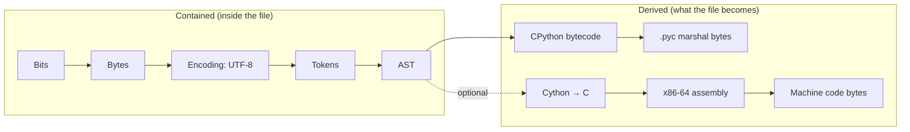
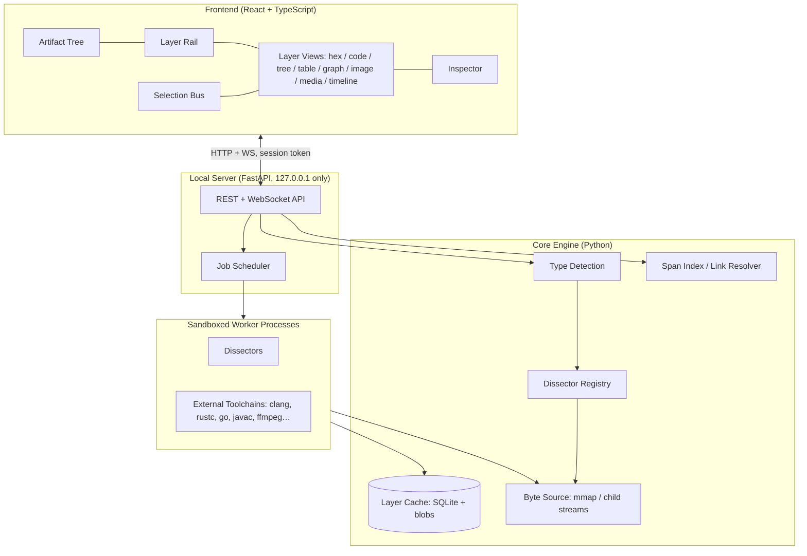

# Strata — A Universal File Layer Viewer

## Implementation Plan

> **Working name:** *Strata*, because files have layers the way rock does.
> **Goal:** Drop in any file and look at every layer of it, from what a person sees at the top down to the raw bits. Selecting something in one layer highlights the matching part in every other layer.

---

## Table of Contents

1. [Vision & Core Idea](#1-vision--core-idea)
2. [The Layer Model (the most important design decision)](#2-the-layer-model)
3. [Worked Examples: Python, SQL, Video](#3-worked-examples)
4. [Layer Catalog for Other File Families](#4-layer-catalog-for-other-file-families)
5. [System Architecture](#5-system-architecture)
6. [Technology Stack](#6-technology-stack)
7. [Core Engine Design](#7-core-engine-design)
8. [Dissector Plugin System](#8-dissector-plugin-system)
9. [Frontend / UI Design](#9-frontend--ui-design)
10. [Security & Safety](#10-security--safety)
11. [Performance & Large Files](#11-performance--large-files)
12. [Project Structure](#12-project-structure)
13. [Phased Roadmap with Acceptance Criteria](#13-phased-roadmap)
14. [Testing Strategy](#14-testing-strategy)
15. [Packaging & Distribution](#15-packaging--distribution)
16. [Risks & Mitigations](#16-risks--mitigations)
17. [Stretch Features](#17-stretch-features)
18. [Open Questions](#18-open-questions)
19. [Appendix: Library Reference](#19-appendix-library-reference)

---

## 1. Vision & Core Idea

Every file is a stack of representations:

```
What you experience   →  a playing video, highlighted code, a rendered table
What it means         →  decoded frames, an AST, a query plan
How it's structured   →  MP4 boxes, tokens, SQL grammar
How it's encoded      →  H.264 bitstream, UTF-8, zlib
What's on disk        →  bytes (hex)
What the bytes are    →  bits
```

Most tools only show one of these levels. A video player shows the top, a hex editor shows the bottom, and a disassembler shows one level in between. Strata shows all of them together and keeps them linked:

- Click a **bytecode instruction**. The **source line**, the **AST node** and the **bytes on disk** it came from all highlight.
- Click a **video frame**. Its **packet**, its **H.264 NAL units**, the **MP4 box** that holds it and its **hex bytes** all highlight.
- Click a **SQL `WHERE` clause**. Its **tokens**, its **AST node** and the **query-plan step** that evaluates it all highlight.

### Design principles

| Principle | What it means in practice |
|---|---|
| **Every file gets something** | Unknown files still get metadata, hashes, hex, bits, entropy, strings, a byte histogram and an embedded-file scan. |
| **Layers are linked** | Every element in every layer records the byte range it came from, so selecting in one layer can highlight in all the others. |
| **Nothing executes the file** | Strata inspects, parses and compiles. It never runs the user's program, SQL or macros (see §10). |
| **Lazy and streaming** | Opening a 20 GB video is instant. A layer is computed only when you look at it, one page at a time. |
| **Plugins over special cases** | Each format is a self-contained *dissector*. Adding a format should not require touching the core. |
| **Generic views** | Dissectors output data for a small set of standard views (tree, table, hex, code, graph, image, timeline…), so most new formats need no frontend work. |
| **Honest about depth** | The UI separates layers that are *inside* the file from layers that are *derived* from it (see §2.2). |

---

## 2. The Layer Model

### 2.1 Normalized depth scale

Each layer gets a **depth** so that very different formats line up on the same vertical "ladder" in the UI:

| Depth | Name | Question it answers | Examples |
|---|---|---|---|
| **D0** | Experience | "What does a human see or hear?" | Rendered image, playing video, highlighted source, formatted table |
| **D1** | Semantics | "What does it mean?" | AST, symbol table, query plan, DOM, decoded frames, PDF object graph |
| **D2** | Structure | "How is the format organized?" | Tokens, MP4 boxes, PNG chunks, PE headers, ZIP entries, SQLite pages |
| **D3** | Encoding | "How are values turned into bytes?" | UTF-8 code units, zlib streams, H.264 NAL bitstream, varints, Huffman tables |
| **D4** | Bytes | "What's physically in the file?" | Hex view, data inspector |
| **D5** | Bits | "What are the bytes made of?" | Bit view, bit-planes, bit-level field boundaries |
| **M** | Metadata | "What's *about* the file?" | FS timestamps, NTFS alternate data streams, hashes, EXIF, type detection |

### 2.2 Contained layers vs. derived layers

This distinction answers the "Python → machine code" part of the request, and the UI should show it clearly.

- **Contained layers** are physically present in the file. They break its bytes down into parts (MP4 → boxes → H.264 → frames). Every element maps exactly to a byte range.
- **Derived layers** are produced by running a transformation *on* the file: compiling, explaining or transcoding. They are not in the file, but they are what the file *becomes*. Their elements map back to source elements, and through those to bytes.



> **An important correction about Python:** A `.py` file has **no machine-code layer**. CPython compiles source to **bytecode**, and the interpreter runs that bytecode. The interpreter (`python313.dll`) is the part that is machine code. So Strata's deepest *real* derived layer for Python is bytecode plus the `.pyc` bytes. As an optional, clearly labelled "hypothetical native translation", Strata can run the file through Cython → C → Clang to show what machine code the logic *could* become. Compiled languages (C, C++, Rust, Go, Zig) do have a true source → IR → assembly → machine-code chain, and Strata shows all of it.

### 2.3 Layer lineage graph

Each layer declares its parents, so the layers of a file form a DAG, not a flat list:

```
python.source ─► python.tokens ─► python.ast ─► python.symtable
      │                               │
      └─► text.unicode ─► text.bytes  └─► python.bytecode ─► python.pyc
```

The UI draws this as the **Layer Rail** (§9). A file can have several branches. For example, an HTML file's `<script>` becomes a child artifact that gets its own JavaScript layers.

### 2.4 Child artifacts (recursion)

When a layer finds a complete embedded object, it emits a **child artifact**. Examples: a file inside a ZIP, a JPEG inside a PDF, an H.264 elementary stream inside an MP4, a `.pyc` inside a PyInstaller EXE, the XML parts of a `.docx`. Child artifacts are dissected with the same pipeline, which builds an **artifact tree**:

```
report.docx
├── [Content_Types].xml
├── word/document.xml         → XML tree, text runs
├── word/media/image1.png     → pixels, chunks, zlib, hex…
└── docProps/core.xml         → author, dates
```

Recursion is limited by depth, total decompressed size and item count (see §10 on decompression bombs).

---

## 3. Worked Examples

These show exactly what the user sees for the three file types named in the request.

### 3.1 `example.py`

```python
def add(a, b):
    return a + b
```

| # | Layer | Depth | Kind | Source of truth | Shows |
|---|---|---|---|---|---|
| 1 | Highlighted source | D0 | contained | file | Monaco editor with syntax colours |
| 2 | Unicode / encoding | D3 | contained | `charset-normalizer` | Encoding, BOM, line endings, each character → code point → UTF-8 bytes |
| 3 | Tokens | D2 | contained | `tokenize` | `NAME 'def'`, `NAME 'add'`, `OP '('`, … with exact byte spans |
| 4 | Concrete syntax tree | D2 | contained | `tree-sitter` | Full-fidelity tree, including comments and whitespace |
| 5 | Abstract syntax tree | D1 | contained | `ast` | `FunctionDef(name='add', body=[Return(BinOp(Name('a'), Add(), Name('b')))])` shown as a collapsible tree and as a graph |
| 6 | Scopes & symbols | D1 | derived | `symtable` | `add`: global; `a`, `b`: parameters/local |
| 7 | Code objects | D1 | derived | `compile()` | Module code object → nested `add` code object; constants, names, varnames, flags, stack size |
| 8 | Bytecode | — | derived | `dis` | See below. Each instruction links back to its source span via `co_positions()` |
| 9 | `.pyc` file | D3/D4 | derived | `importlib` + `marshal` | 16-byte header (magic number, flags, mtime/hash), then the marshalled code object as annotated hex |
| 10 | *(optional)* Native translation | derived | derived | Cython + Clang | Generated C → x86-64 asm → machine-code bytes, labelled "hypothetical" |
| 11 | Hex / bits | D4/D5 | contained | raw | Byte view with highlights synced to every layer above |

Bytecode for `add` (CPython 3.13; the output differs between Python versions):

```
  2           RESUME                   0
  3           LOAD_FAST_LOAD_FAST     1 (a, b)
              BINARY_OP                0 (+)
              RETURN_VALUE
```

**Extra feature:** a *Python version selector* recompiles the file with any other interpreter found on the machine (`py -3.11`, `py -3.12`, `py -3.14`) so you can compare bytecode side by side. For `.pyc` files from other versions, the `xdis` library disassembles bytecode across versions.

**Linked selection:** clicking `BINARY_OP` highlights `a + b` in the source, the `BinOp` node in the AST, the tokens `a`, `+`, `b`, and bytes `0x1A–0x1E` in hex.

### 3.2 `query.sql`

```sql
CREATE TABLE users (id INTEGER PRIMARY KEY, name TEXT, age INT);
CREATE INDEX idx_age ON users(age);
SELECT name FROM users WHERE age > 30 ORDER BY name;
```

| # | Layer | Depth | Source | Shows |
|---|---|---|---|---|
| 1 | Highlighted SQL | D0 | Monaco | Statement boundaries, dialect badge (detected or chosen by the user) |
| 2 | Statements | D2 | `sqlglot` | Statement list with type (DDL / DML / query) and byte ranges |
| 3 | Tokens | D2 | `sqlglot.tokenize` | Keyword / identifier / literal / operator tokens |
| 4 | AST | D1 | `sqlglot.parse` | `Select(expressions=[Column(name)], from=Table(users), where=GT(Column(age), Literal(30)), order=…)` |
| 5 | Schema model | D1 | derived | Tables, columns, types, indexes and foreign keys found in the DDL, drawn as an ER diagram |
| 6 | Dialect translations | derived | `sqlglot.transpile` | The same query rewritten for Postgres, MySQL, SQLite, DuckDB, T-SQL, BigQuery, Snowflake… |
| 7 | Optimized logical plan | derived | `sqlglot.optimizer` | Qualified columns, pushed-down predicates, normalized form |
| 8 | Query plan (SQLite) | derived | `EXPLAIN QUERY PLAN` | `SEARCH users USING INDEX idx_age (age>?)` drawn as a tree |
| 9 | **VDBE bytecode (SQLite)** | derived | `EXPLAIN` | SQLite's own virtual-machine program: `Init`, `OpenRead`, `SeekGT`, `Column`, `ResultRow`, `Next`, `Halt`… with P1–P5 operands and comments. This is SQL's equivalent of Python bytecode. |
| 10 | Physical plan (DuckDB) | derived | `EXPLAIN` | Operator tree: `PROJECTION ← ORDER_BY ← FILTER ← SEQ_SCAN` |
| 11 | Unicode / hex / bits | D3–D5 | raw | Same as for any text file |

**How plans are produced without touching real data:**

1. Create a fresh **in-memory** SQLite (and DuckDB) database.
2. Run **only DDL** statements from the file (`CREATE TABLE/INDEX/VIEW`).
3. For tables that are referenced but never created, infer **stub tables** from the AST (every referenced column becomes an untyped column). The UI labels these "inferred schema".
4. Run `EXPLAIN` / `EXPLAIN QUERY PLAN` on each query or DML statement. This compiles the statement but does not execute it.
5. When the dialect differs, transpile to SQLite or DuckDB first and label the plan "approximate".
6. Optional: let the user pick a `.db` / `.sqlite` file as the schema source. It is opened read-only and immutable.

**SQLite database files (`.db`, `.sqlite`)** get their own layer stack: rendered table browser (D0) → schema (D1) → **B-tree page map** (D2: page type, cells, overflow chains, freelist) → record format (D3: serial types, varints) → hex (D4). This is one of the best teaching layer stacks available, because most people never see how a database is laid out on disk.

### 3.3 `clip.mp4`

| # | Layer | Depth | Source | Shows |
|---|---|---|---|---|
| 1 | Playback | D0 | `<video>` / transcoded preview | Player synced with every layer below (scrubbing moves the selection) |
| 2 | Metadata | M | PyAV / MP4 `udta`, `meta` | Duration, creation time, encoder, GPS (if present), rotation, colour info |
| 3 | Tracks / streams | D1 | PyAV | Video: codec, profile/level, resolution, fps, bit depth, pixel format, colour primaries. Audio: codec, sample rate, channels. Plus subtitles and data tracks |
| 4 | **Container structure** | D2 | custom box parser | Box tree `ftyp → moov → trak → mdia → minf → stbl → {stsd, stts, stss, stsc, stsz, stco}` and `mdat`, with offsets, sizes and decoded fields. Matroska/WebM uses EBML elements; AVI uses RIFF chunks |
| 5 | Sample / packet index | D2 | PyAV packets | Virtualized table: pts, dts, duration, size, **byte offset in file**, keyframe flag |
| 6 | GOP & bitrate timeline | D1 | derived | Chart of packet sizes over time, coloured I/P/B, GOP boundaries, keyframe markers |
| 7 | **Codec bitstream** | D3 | custom H.264/HEVC parser | NAL units per packet (SPS, PPS, SEI, IDR slice, non-IDR slice), decoded SPS/PPS fields (profile_idc, level_idc, width in macroblocks…), slice headers (slice_type, frame_num, QP) |
| 8 | Decoded frames | D1 | PyAV decode | Frame scrubber. Each frame as an image with type (I/P/B), pts and size |
| 9 | Frame internals | D1 | PyAV + numpy | Separate **Y / U / V planes**, **motion-vector overlay** (FFmpeg `export_mvs`), frame-difference view, histogram |
| 10 | Audio track | D0–D3 | PyAV | Waveform, spectrogram, audio packets/frames, AAC details |
| 11 | Subtitles | D1 | PyAV | Timed text list |
| 12 | Hex / bits | D4/D5 | raw | The selected box, packet or NAL unit is highlighted |

**Linked selection:** pause on frame 142. The packet row highlights, its NAL units expand, the `mdat` region scrolls into view, and the hex view jumps to the frame's first byte (from `packet.pos`).

**Codec support note:** browsers play H.264, VP9, AV1 and (on some systems) HEVC. For anything else (ProRes, MPEG-2, and so on), the backend transcodes a low-resolution preview on demand. The analysis layers work for every codec FFmpeg can demux.

---

## 4. Layer Catalog for Other File Families

The goal is "support for any file". The catalog is ordered roughly by priority.

### 4.1 Universal layers (every file, no exceptions)

| Layer | Details |
|---|---|
| File-system metadata | Size, created/modified/accessed times, attributes, **NTFS alternate data streams** (e.g. `Zone.Identifier`, which records the URL a file was downloaded from) |
| Type detection | Extension, magic bytes (`puremagic`), ML classifier (Google **Magika**), MIME type, confidence. Several candidates appear when a file is a polyglot |
| Hashes | MD5, SHA-1, SHA-256, BLAKE3; optional fuzzy hashes (TLSH / ssdeep) |
| Hex view | Virtualized, handles any size, with a data inspector (int8–64 LE/BE, float16/32/64, varint, timestamps, GUID, colour) |
| Bits view | Binary digits with field-boundary overlays |
| Entropy map | Sliding-window Shannon entropy chart. Picks out compressed, encrypted or packed regions |
| Byte histogram | Distribution of all 256 byte values |
| Strings | ASCII and UTF-16LE strings with offsets and minimum length filter |
| Embedded-object scan | binwalk-style carving: finds signatures of PNG, JPEG, ZIP, PE, ELF, zlib, gzip, PDF and others at any offset, and offers each hit as a child artifact |
| Binary visualization | Hilbert-curve / "digraph" images of the whole file, so its structure is visible at a glance |
| Text sniff | If the bytes decode cleanly as text, the text and Unicode layers are added, and tree-sitter tries to guess a language |

### 4.2 Source code (any language)

- **Generic (100+ languages):** tree-sitter CST, token stream, outline (functions/classes), and a Unicode layer.
- **Language-specific derived layers** (only when a toolchain is installed; see the Toolchain Manager in §7.6):

| Language | Derived layers |
|---|---|
| Python | tokens, AST, symtable, code objects, bytecode, .pyc (§3.1) |
| C / C++ | preprocessed source (`clang -E`), Clang AST dump, LLVM IR (`-emit-llvm`), optimization passes (-O0 vs -O2 diff), assembly (`-S`), object file → disassembly with source-line mapping (DWARF / `-g`) |
| Rust | HIR / MIR (`--emit=mir`), LLVM IR, assembly |
| Go | SSA (`GOSSAFUNC`), Plan 9 assembly (`-gcflags=-S`), `go tool objdump` |
| Zig | ZIR / AIR (where available), LLVM IR, assembly |
| Java / Kotlin | `javac` → `.class` structure (constant pool, methods) → `javap -c -v` JVM bytecode |
| C# | Roslyn → IL (via `ilspycmd` / `dotnet` build output) → optional decompile back to C# |
| JavaScript / TypeScript | TS → emitted JS; V8 Ignition bytecode (`node --print-bytecode`) |
| WebAssembly | `.wasm` sections, WAT text (`wasm2wat`), function bodies |
| Shell / PowerShell / Batch | tokens, AST (PowerShell has a real AST API via `pwsh`) |
| Lua | `luac -l` bytecode listing |

Line-mapping between assembly and source comes from debug info (DWARF, or PDB on Windows), using the same mechanism Compiler Explorer uses.

### 4.3 Executables & object files

| Format | Layers |
|---|---|
| PE (`.exe`, `.dll`, `.sys`) | Resources (icons, version info, manifest), Authenticode signature, DOS header + DOS stub, **Rich header**, COFF/optional headers, data directories, section table with per-section entropy (packer detection), imports/exports, TLS callbacks, relocations, disassembly (Capstone), function list, control-flow graph, optional decompilation (Ghidra headless / rizin) |
| .NET assemblies | CLR header, metadata tables, IL disassembly, optional C# decompile |
| ELF / Mach-O | Headers, segments/sections, symbols, dynamic linking, disassembly, CFG |
| PyInstaller / Nuitka EXEs | Detect the bundle → extract embedded `.pyc` files as child artifacts → the full Python layer stack |
| `.pyc` | Header, marshal structure, cross-version disassembly (`xdis`), optional decompile (e.g. `pycdc`, where it supports that version) |
| `.class`, `.jar` | Constant pool, methods, bytecode; JAR → ZIP → classes |

### 4.4 Images

- **All:** rendered image with a pixel inspector (zoom until each pixel shows its RGBA value), channel split, **bit-planes** (useful for spotting steganography), histogram, EXIF/XMP/IPTC/ICC metadata.
- **PNG:** chunk list (IHDR, PLTE, IDAT…, IEND) with CRCs → concatenated **zlib-inflated IDAT stream** → **filter type per scanline** → reconstructed pixels.
- **JPEG:** marker segments (SOI, APPn, DQT, SOF, DHT, SOS, EOI) → **quantization tables** → **Huffman tables** → **DCT coefficients per 8×8 block** (via `jpeglib`) → YCbCr planes → RGB.
- **GIF:** frames, palettes, LZW-compressed blocks. **WebP / AVIF / HEIC:** RIFF / ISOBMFF boxes, then codec info.
- **SVG:** rendered view, XML tree, path commands.
- **ICO / BMP / TIFF / PSD:** headers, IFDs, layers (PSD).

### 4.5 Audio

Playback, waveform, **spectrogram**, tags (ID3/Vorbis/MP4, via `mutagen`), container (RIFF/WAV chunks, Ogg pages, FLAC metadata blocks), codec frames (MP3 frame headers with bitrate/sample rate per frame), and for PCM, each sample value lined up with its bytes.

### 4.6 Documents

| Format | Layers |
|---|---|
| PDF | Rendered pages (pypdfium2) → extracted text → object graph (pikepdf) → **decompressed content streams** (drawing operators such as `BT /F1 12 Tf (Hello) Tj ET`) → fonts, images and embedded files (child artifacts) → xref table / trailer → incremental updates → hex. Flags JavaScript and auto-actions (display only, never run) |
| DOCX / XLSX / PPTX | Rendered text/table preview → part list (ZIP) → XML parts as trees → relationships graph → styles → embedded media. Macros (`vbaProject.bin`) → OLE streams → VBA source (`oletools`), never executed |
| Legacy DOC/XLS/PPT | OLE2 / Compound File Binary: directory, streams, sectors (`olefile`) |
| ODT / ODS, EPUB | ZIP → XML/XHTML → rendered |
| HTML | Sandboxed rendered preview (no scripts) → DOM tree → CSS rules → embedded `<script>` / `<style>` as child artifacts |
| Markdown | Rendered → markdown AST → HTML output |
| RTF | Control-word tree, rendered text |

### 4.7 Archives & compression

ZIP (local headers, central directory, per-entry compression, extra fields), TAR, GZIP / BZ2 / XZ / Zstandard / Brotli, 7z, RAR (listing only; extraction needs `unrar`), CAB, ISO 9660. Every entry becomes a child artifact. For compressed streams there is a special **DEFLATE layer**: block types, and the literal/length/distance codes behind the decompressed data.

### 4.8 Data & serialization formats

| Format | Layers |
|---|---|
| JSON / YAML / TOML / XML | Pretty view, tree, inferred schema, token stream |
| CSV / TSV | Table (virtualized), sniffed dialect, column type inference, column statistics |
| **Parquet** | Table preview → schema → row groups → column chunks → pages → encodings (dictionary / RLE / bit-packed) → compression (a very good layered format) |
| Avro / ORC / Arrow / Feather | Schema, blocks, record batches |
| Protobuf (no schema) | Raw wire-format decode: field numbers, wire types, varints, nested guesses |
| MessagePack / CBOR / BSON | Decoded tree with byte spans |
| **Pickle** | `pickletools` opcode disassembly. **Never unpickled**, because unpickling runs code |
| NumPy `.npy` / `.npz` | Header, dtype, shape, array preview/heatmap |
| HDF5 | Groups, datasets, attributes |

### 4.9 Other families (later phases)

- **Databases:** SQLite (§3.2), DuckDB files, LevelDB/RocksDB SST (via Kaitai / custom), Access `.mdb` (listing).
- **Fonts:** TTF/OTF/WOFF tables (`fontTools`), glyph renderer, glyph outline points, hinting bytecode (TrueType fonts contain their own VM instructions).
- **Certificates & keys:** PEM → base64 → DER → **ASN.1 tree** → X.509 fields. Private keys are shown structurally with values **masked by default**.
- **ML model files:** `.safetensors` (JSON header + tensor table), **GGUF** (metadata KV + tensor info + quantization types), ONNX (graph viewer), `.pt`/`.pth` (ZIP + pickle opcodes, **never loaded**).
- **Disk & filesystem images:** partition tables (MBR/GPT), FAT/NTFS/ext directory trees (via `pytsk3`). Stretch goal.
- **Network captures:** `.pcap` / `.pcapng` → packets → protocol layers (Ethernet → IP → TCP → HTTP), which follows the same layer idea. Uses `scapy` / `dpkt`.
- **Windows-specific:** `.lnk` shortcuts, registry hives, `.evtx` event logs, `.msi` (OLE), prefetch files.
- **Long tail:** the **Kaitai Struct format gallery** (~200 formats) gives generic byte-accurate structure trees for formats with no dedicated dissector (§8.4).

---

## 5. System Architecture



**Request flow when a file is opened:**

1. The UI sends a path (desktop mode) or uploads the file (browser mode). The server registers an **Artifact** backed by a memory-mapped byte source.
2. **Detection** runs: extension, magic bytes, Magika and a text sniff. It returns ranked type candidates.
3. The **registry** asks each dissector whether it matches (a confidence score). Matching dissectors return a **layer manifest**: cheap stubs with name, depth, kind and parents. No heavy work happens yet.
4. The UI draws the Layer Rail right away from the manifest.
5. When the user opens a layer, the server checks the **cache**. On a miss it schedules a **job** in a worker process and streams progress over WebSocket.
6. Results come back as **paged payloads**, a **span index** and any **child artifacts**.
7. Selections go through the **Link Resolver**, which maps an element in layer A to byte ranges and then to the overlapping elements in layers B, C and so on.

---

## 6. Technology Stack

### 6.1 Why a Python engine with a web UI

| Option | Pros | Cons | Verdict |
|---|---|---|---|
| **Python engine + React UI** | Unmatched parsing ecosystem (`ast`, `dis`, sqlglot, PyAV, LIEF, Capstone, pikepdf, fontTools, Kaitai, tree-sitter). A web UI gives Monaco, graph layout, charts and native media playback | Two languages; packaging takes some effort | ✅ **Chosen** |
| Rust + Tauri | Fast, small binaries | Far fewer format libraries; Python/SQL introspection would have to be rebuilt | ❌ |
| Electron + Node | One language | Weak binary and media analysis libraries | ❌ |
| Python + Qt (PySide6) | One language | Custom hex/graph/code widgets are a lot of work; weaker editor and graph components | ❌ |

### 6.2 Stack

**Backend / engine**
- Python **3.13** (move to 3.14 once all native wheels, especially PyAV, LIEF and Capstone, support it; check this in Phase 0)
- `uv` for environments and dependency locking
- FastAPI + Uvicorn (REST + WebSocket), Pydantic v2 for all models
- `concurrent.futures.ProcessPoolExecutor` for sandboxed dissector workers
- SQLite for cache metadata, with content-addressed blob files for payloads
- Typer for the CLI

**Frontend**
- React 19 + TypeScript + Vite
- **Monaco Editor** for code and text layers (decorations drive cross-layer highlights)
- **Custom canvas-based virtualized hex view** (existing React hex components can't handle multi-GB files)
- `react-arborist` for large trees (AST, box trees, PDF objects)
- **React Flow + ELK.js** for graphs (AST graphs, CFGs, query plans, lineage)
- **uPlot** for high-density charts (entropy, bitrate, waveforms)
- `@tanstack/react-virtual` for huge tables (packets, tokens, instructions)
- Zustand for state, TanStack Query for server data
- Native `<video>` / `<audio>` elements, plus a canvas for frames and pixels

**Desktop shell**
- MVP: runs at `http://127.0.0.1:<port>` in the default browser, started by `strata` on the CLI
- v1: **pywebview** window (native WebView2 on Windows), which provides **real file paths from drag-and-drop**, so multi-GB files are never uploaded or copied
- Packaging: PyInstaller (or Nuitka) → single folder / installer (§15)

---

## 7. Core Engine Design

### 7.1 Core data model

```python
# core/model.py (sketch)
class ByteSpan(BaseModel):
    artifact_id: str
    start: int            # inclusive byte offset
    end: int              # exclusive
    bit_start: int | None = None   # for bit-level fields (H.264 Exp-Golomb, DEFLATE)
    bit_end: int | None = None

class Artifact(BaseModel):
    id: str               # content hash prefix + path hash
    name: str
    size: int
    origin: FileOrigin | ChildOrigin   # disk path, or (parent_id, layer_id, how-extracted)
    detection: list[TypeCandidate]     # ranked
    hashes: dict[str, str]             # computed lazily

class LayerStub(BaseModel):            # cheap: goes into the manifest
    id: str                            # f"{artifact_id}:{kind}"
    kind: str                          # "python.bytecode", "mp4.boxes", ...
    title: str
    depth: Depth                       # D0..D5, M
    relation: Literal["contained", "derived"]
    parents: list[str]                 # lineage DAG
    view: ViewType                     # hex|text|code|tree|table|graph|image|media|timeline|chart|kv|disasm
    requires: list[str] = []           # external tools / optional packages
    available: bool                    # False if requirements are missing (UI explains how to fix)

class LayerElement(BaseModel):         # a node/row/instruction in a layer
    id: str
    label: str
    spans: list[ByteSpan]              # where it lives in the bytes (contained layers)
    links: list[ElementRef] = []       # e.g. bytecode instr → AST node (derived layers)
    fields: dict[str, Any] = {}        # decoded properties shown in the Inspector

class LayerResult(BaseModel):
    stub: LayerStub
    payload_ref: str                   # cache key; payload is paged separately
    element_count: int
    children: list[ChildArtifactSpec]  # embedded objects discovered
    diagnostics: list[Diagnostic]      # warnings, partial-parse errors, truncation notices
```

### 7.2 Byte sources

- `FileByteSource` uses `mmap` for files on disk. It works at any size and never reads the whole file into memory.
- `SliceByteSource` is a zero-copy window into a parent (e.g. a stored ZIP entry, a PNG chunk).
- `DecodedByteSource` holds a decompressed or decoded stream (zlib, base64, gzip). It spills to a temp file above a threshold and keeps a **coarse span mapping** back to the compressed range in the parent. Byte-exact mapping through compression isn't possible, so the UI says so.

### 7.3 Span index & Link Resolver (the core feature)

- Each computed layer builds an **interval tree** over the `ByteSpan`s of its elements, stored with the cache entry.
- **Forward query:** element → its spans, plus the elements reachable through its `links`.
- **Reverse query:** byte range → the overlapping elements in every other computed layer.
- **Derived layers** have no byte spans of their own. They reach bytes through links (bytecode instruction → `co_positions()` → source line/col → UTF-8 byte offset).
- **Text coordinates:** text layers store a line-start table, so `(line, column)` converts to a byte offset in either direction. Python `ast` column offsets are already in UTF-8 bytes, and tree-sitter uses byte offsets, which keeps this straightforward.
- API: `POST /api/resolve {layer_id, element_id}` → `{spans, related: {layer_id: [element_ids]}}`

### 7.4 Type detection pipeline

```
1. Extension map                       (weak signal)
2. Magic bytes (puremagic)             (strong signal)
3. Magika ML classifier                (strong for text/code types, where magic bytes don't help)
4. Structural probes by dissectors     (e.g. "does the SQLite header parse?")
5. Text sniff (charset-normalizer)     (is it text? which encoding?)
6. User override                       (always available: "treat as…")
```

All candidates above a threshold are kept. Polyglot files (e.g. a valid PDF that is also a ZIP) show both layer stacks.

### 7.5 Job scheduler & cache

- Jobs run in a **process pool** so that a crashing parser (for example a native library segfault on a malformed file) cannot bring down the server. The pool restarts the worker, and the layer shows as an **error layer** with the diagnostic.
- Each job has a **timeout**, a **memory ceiling** (a Windows Job Object via `pywin32`, or `psutil` monitoring) and **cancellation**, which the UI triggers when the user closes a layer.
- Progress events go over WebSocket: `{job_id, layer_id, pct, message}`.
- **Cache key:** `(content_hash, dissector_id, dissector_version, options_hash)`.
  - `content_hash` = BLAKE3 of the content. For huge files a provisional key `(path, size, mtime)` is used right away while the full hash computes in the background.
- Cache location: `%LOCALAPPDATA%\Strata\cache`, LRU eviction, size limit configurable (default 5 GB).

### 7.6 Toolchain Manager

Derived layers often need external tools. The Toolchain Manager:
- Detects tools on `PATH` and in common install folders: `clang`, `gcc`, `rustc`, `go`, `javac`/`javap`, `dotnet`, `node`, `luac`, `wasm2wat`, `ffprobe`, `cython`, `ghidra`/`analyzeHeadless`, `rizin`, `pwsh`, and every Python interpreter reachable through `py -0p`.
- Records versions and reports them per layer ("compiled with clang 19.1.0, -O2").
- On a **Toolchains** page it lists what's missing, with one-line install commands (`winget install LLVM.LLVM`, `winget install GoLang.Go`, …).
- Makes compile flags user-configurable per layer (e.g. `-O0` / `-O2` / `-O3`, target triple).

---

## 8. Dissector Plugin System

### 8.1 Interface

```python
# core/dissector.py (sketch)
class Dissector(ABC):
    id: ClassVar[str]                  # "python"
    version: ClassVar[str]             # bump to invalidate the cache
    handles: ClassVar[list[str]]       # type ids, e.g. ["text/x-python", "ext:.py", "ext:.pyw"]
    requires: ClassVar[Requirements]   # python packages, external tools (optional per layer)

    @abstractmethod
    def match(self, art: Artifact, det: Detection) -> float:
        """0.0–1.0 confidence. Must be cheap (read at most a few KB)."""

    @abstractmethod
    def manifest(self, art: Artifact, det: Detection) -> list[LayerStub]:
        """Declare the layers this dissector can produce. No heavy work."""

    @abstractmethod
    def build(self, art: Artifact, layer: LayerStub, ctx: BuildContext) -> LayerResult:
        """Compute one layer. Runs in a worker process. Use ctx.progress(), ctx.check_cancelled(),
        ctx.read(span), ctx.layer(parent_kind) to get parent layer results, ctx.emit_child(...)."""
```

- Built-in dissectors are registered through a decorator. Third-party ones load through **Python entry points** (`[project.entry-points."strata.dissectors"]`), so a plugin can be a separate `pip install strata-plugin-foo`.
- Each layer declares a `view` type and returns a payload in that view's schema, so **most new formats need zero frontend code**.

### 8.2 Standard view payload schemas

| View | Payload shape | Used by |
|---|---|---|
| `hex` | byte source + highlight spans | universal |
| `bits` | byte source + bit-field overlays | universal, bitstreams |
| `text` / `code` | text + language id + decorations | sources, decompressed streams |
| `tree` | nodes `{id, label, fields, spans, children}` paged by subtree | AST, boxes, PDF objects, JSON, ASN.1 |
| `table` | columns + paged rows (each row has spans) | tokens, packets, instructions, strings |
| `disasm` | instructions `{addr, bytes, mnemonic, operands, comment, links}` + optional source interleave | bytecode, VDBE, asm |
| `graph` | nodes + edges + layout hint | CFG, AST graph, query plan, lineage, ER diagram |
| `image` | tiled image / pixel accessor | pictures, frames, planes, binvis |
| `media` | stream URL + time mapping | audio/video playback |
| `timeline` | time-indexed events | packets, GOP, subtitles |
| `chart` | series | entropy, histogram, bitrate, waveform, spectrogram |
| `kv` | grouped key-value sections | metadata, headers |
| `custom` | named React component + JSON | escape hatch for special cases (e.g. B-tree page map) |

### 8.3 Dissector composition

Dissectors can ask for other layers through `ctx.layer("text.decoded")`. For example, `python.ast` depends on `text.decoded`. The scheduler resolves these dependencies, so shared work is done once.

### 8.4 Kaitai Struct integration (for the long tail)

- Kaitai Struct is a declarative binary-format language with a public gallery of ~200 format specs (archives, executables, images, network, filesystems, game formats).
- **At build time**, the `.ksy` specs are compiled to Python with `kaitai-struct-compiler` (needs a Java runtime, but only on the build machine) and the generated parsers are vendored into `dissectors/kaitai/generated/`.
- The generic `KaitaiDissector` runs the parser with **debug mode** on, which records the byte position of every field and so produces a byte-accurate `tree` layer for free.
- **Licensing:** each gallery spec has its own license (most are CC0 or MIT, some are GPL). Record the license per spec and include only compatible ones in the default bundle.
- Users can drop their own `.ksy` files into a plugins folder. They are compiled on first use if a JRE is present.

---

## 9. Frontend / UI Design

### 9.1 Layout

```
┌──────────────────────────────────────────────────────────────────────────────┐
│  ☰ Strata   [Open…]  [⌘K Command palette]  [Search all layers 🔍]  [Toolchains]│
├───────────────┬──────────────────────────────────────────────┬───────────────┤
│ ARTIFACTS     │  LAYER RAIL (depth ladder)                   │  INSPECTOR     │
│ ▾ clip.mp4    │  D0 ● Playback                               │  Selected:     │
│   ▸ video.h264│  M  ● Metadata                               │  NAL unit #3   │
│   ▸ audio.aac │  D1 ● Streams   ● Frames   ● GOP timeline    │  type: IDR (5) │
│ ▸ query.sql   │  D2 ● Box tree  ● Packet index               │  offset: 0x4A2F│
│               │  D3 ● H.264 NAL units                        │  size: 18 422  │
│               │  D4 ● Hex       D5 ● Bits                    │  ── fields ──  │
│               ├──────────────────────┬───────────────────────┤  nal_ref_idc 3│
│               │  [ Split A: Frames ] │ [ Split B: Box tree ] │  first_mb 0    │
│               │                      │                       │  slice_type I  │
│               │                      │                       │  ── as bytes ──│
│               ├──────────────────────┴───────────────────────┤  u32 LE …      │
│               │  HEX (always docked, synced highlights)      │  f32 …         │
└───────────────┴──────────────────────────────────────────────┴───────────────┘
```

### 9.2 Key interactions

- **Layer Rail:** a vertical ladder from D0 (top) to D5 (bottom). Derived layers branch off to the side, and the lineage edges are drawn. Unavailable layers (missing toolchain) appear greyed out with a "how to enable" tooltip.
- **Split views:** show any two (or more) layers side by side, e.g. *Source | Bytecode* or *Frames | Hex*.
- **Selection bus:** one global selection (`{layer_id, element_id}` or a byte range). Every open view subscribes and highlights the overlapping elements, and the Inspector shows details.
- **Depth scrubbing:** with an element selected, `Alt+↑` / `Alt+↓` moves to the same element one layer shallower or deeper, e.g. `BINARY_OP` → `BinOp` → `+` token → bytes `2B` → bits `00101011`.
- **Data inspector:** in any byte view, shows the selection interpreted as every numeric type, in both endiannesses, plus timestamps, GUIDs and colours.
- **Search:** text, regex, hex patterns (`4D 5A ?? 00`) and structured queries (`layer:python.bytecode opcode:CALL`), across all layers of all open artifacts.
- **Bookmarks & annotations:** label byte ranges or elements. Saved per file hash in a project file (`.strata.json`).
- **Export:** any layer to JSON / CSV / TXT / PNG / SVG. A selection's bytes to a file.
- **Explain panel (learning mode):** each layer kind ships a short built-in explanation ("What is a NAL unit? Why does H.264 use them?") with links to specs. Useful for tutorial-style use.
- **Themes:** light/dark, colour-blind-safe highlight palette, full keyboard navigation.

### 9.3 Hex view requirements

- Canvas rendering. Only visible rows are fetched (`GET /bytes?offset&length`) and cached in a ring buffer.
- 60 fps scrolling on multi-GB files, with jump-to-offset.
- Overlay layers: structure colouring (from the active layer's spans), entropy gutter, bookmarks, search hits.
- Configurable columns (8/16/32), grouping and ASCII / UTF-8 / UTF-16 / EBCDIC side panel.

---

## 10. Security & Safety

Files can be malicious, and Strata will open *anything*. The rule is: **parse, compile or explain. Never execute.**

| Threat | Mitigation |
|---|---|
| Running user code | Python: only `compile()` / `ast.parse()` / `dis`. **Never** `exec`, `eval` or `import`. No other language's program is ever run. |
| Pickle / `.pt` / `.pth` | Only `pickletools.dis` (opcode listing). **Never** `pickle.load` or `torch.load`. |
| `marshal` / `.pyc` | `marshal.loads` is unsafe on hostile data (it can crash the interpreter), so it runs only in an isolated worker with a timeout. Prefer `xdis`. |
| SQL side effects | In-memory DBs only. SQLite: `set_authorizer` denies `ATTACH`, `DETACH` and PRAGMAs that write, `enable_load_extension(False)`, progress-handler timeout, and statements go through `EXPLAIN` only (DDL is the single exception, run only against the throwaway in-memory DB). DuckDB: `enable_external_access=false`, `lock_configuration=true`. User-supplied `.db` files open as `file:…?mode=ro&immutable=1`. |
| Compiler abuse | Compiling C/C++ runs the preprocessor, which can `#include` local files. That's acceptable locally, but run compilers in a temp working directory with timeouts and no network. Never *run* compiled output. |
| Office macros / PDF JavaScript | Extract and display as text only. |
| HTML / SVG preview | Sandboxed `<iframe sandbox>` with a strict CSP (`script-src 'none'`), no network access, and external resources blocked. |
| Decompression bombs | Limits on decompressed bytes (e.g. 2 GB total, 100× ratio warning), recursion depth (default 8), and child-artifact count. The UI offers "continue anyway". |
| Parser crashes / hangs | Worker process isolation, per-job timeouts and memory ceilings. Fuzz testing (§14). |
| Local server exposure | Bind to `127.0.0.1` only, use a random per-session **auth token** (in the URL fragment / pywebview bridge, required on every API call) and check `Host`/`Origin` to block CSRF and DNS-rebinding attacks from websites in the user's browser. |
| Path traversal | ZIP/TAR entries (`../../evil`) are never written to disk under their own names. Child artifacts are read through byte sources, or written to temp files with generated names. |
| Privacy | Fully offline by default. Optional networked features (for example an "Explain with Claude" button) are **opt-in per use** and show exactly what will be sent. |

---

## 11. Performance & Large Files

| Concern | Approach |
|---|---|
| Opening a 20 GB file | mmap plus a lazy manifest. Nothing is parsed until a layer is opened, and time-to-first-view stays under 500 ms. |
| Hashing large files | BLAKE3 (multithreaded, streaming) in the background. The provisional cache key is used meanwhile. |
| Huge layers (10M packets, 1M tokens) | Server-side paging (`?offset&limit`), virtualized tables and trees, subtree-on-demand for trees. |
| Entropy / histogram over GBs | numpy on mmap'd chunks with coarse levels first (whole file at 4096 buckets), refined when zoomed in. |
| Video frames | Decode on demand around the playhead. Seek to the nearest keyframe (accurate seeking), keep an LRU frame cache, JPEG/WebP thumbnails for the scrubber strip. |
| Graph layout | ELK.js in a Web Worker. Cap visible nodes with collapse/expand, e.g. for CFGs with thousands of blocks. |
| Repeated opens | Content-addressed layer cache, so re-opening a file is instant. |
| Cancellation | Closing a layer cancels its job. The worker checks `ctx.check_cancelled()` periodically. |

**Performance budgets (acceptance targets):** open any file → manifest in < 500 ms. Hex view on a 10 GB file scrolls at 60 fps. Python layers for a 5,000-line file in < 2 s. Box tree for a 4 GB MP4 in < 1 s (only the `moov` box is parsed; `mdat` is not scanned).

---

## 12. Project Structure

> Recommendation: put the code in its own folder/repo (e.g. `H:\Current\Projects\Strata`), not inside this Obsidian vault, so the vault doesn't index `node_modules` and virtual environments.

```
strata/
├── pyproject.toml                 # uv-managed; entry point `strata`
├── uv.lock
├── README.md
├── docs/
│   ├── architecture.md
│   ├── writing-a-dissector.md
│   └── layer-explanations/        # "Explain panel" content, one .md per layer kind
├── backend/strata/
│   ├── __main__.py                # CLI: strata [open|inspect|layers|export|serve]
│   ├── config.py
│   ├── server/
│   │   ├── app.py                 # FastAPI app, auth token, CORS/Host checks
│   │   ├── routes_artifacts.py
│   │   ├── routes_layers.py
│   │   ├── routes_bytes.py
│   │   ├── routes_media.py        # range requests, transcoded previews, frame PNGs
│   │   ├── routes_toolchains.py
│   │   └── ws.py                  # progress events
│   ├── core/
│   │   ├── model.py               # Artifact, LayerStub, LayerElement, ByteSpan…
│   │   ├── bytesource.py          # File/Slice/Decoded byte sources
│   │   ├── detection.py
│   │   ├── registry.py
│   │   ├── dissector.py           # ABC + BuildContext
│   │   ├── spans.py               # interval trees, link resolver
│   │   ├── jobs.py                # process pool, timeouts, cancellation
│   │   ├── cache.py
│   │   ├── sandbox.py             # resource limits, subprocess wrappers
│   │   ├── limits.py              # bomb/recursion limits
│   │   └── toolchains.py
│   └── dissectors/
│       ├── universal/             # fsmeta, ads, hashes, hex, bits, entropy, histogram, strings, carve, binvis
│       ├── text/                  # encoding, unicode, line table
│       ├── code/
│       │   ├── treesitter.py
│       │   ├── python/            # tokens, ast, symtable, codeobj, bytecode, pyc, native_hypothetical
│       │   ├── c_family.py  rust.py  go.py  java.py  dotnet.py  javascript.py  wasm.py  lua.py
│       ├── sql/                   # statements, tokens, ast, transpile, optimizer, sqlite_explain, duckdb_explain, stub_schema
│       ├── database/              # sqlite_file (header, btree pages, records)
│       ├── binary/                # pe, elf, macho, dotnet_meta, disasm, cfg, pyinstaller, decompile_ghidra
│       ├── media/
│       │   ├── image/             # common, png, jpeg (+dct), gif, webp, svg, exif
│       │   ├── audio/             # common, waveform, spectrogram, mp3_frames, flac, ogg
│       │   └── video/             # streams, packets, gop, frames, planes, motion_vectors,
│       │                          # mp4_boxes, ebml, riff_avi, h264, hevc, bitreader (Exp-Golomb)
│       ├── documents/             # pdf, ooxml, ole, vba, odf, epub, html, markdown, rtf
│       ├── archives/              # zip, tar, compressed, deflate_blocks, sevenz, rar, iso
│       ├── data/                  # json, yaml, toml, xml, csv, parquet, avro, protobuf_raw, msgpack, cbor, pickle, npy, hdf5
│       ├── crypto/                # pem, asn1, x509
│       ├── fonts/
│       ├── ml/                    # safetensors, gguf, onnx, torch_zip
│       ├── network/               # pcap
│       └── kaitai/                # runner + generated/ (vendored parsers + LICENSES)
├── backend/tests/
│   ├── fixtures/                  # tiny generated samples (see §14)
│   ├── golden/                    # snapshot outputs
│   └── fuzz/
├── frontend/
│   ├── package.json  vite.config.ts  tsconfig.json
│   └── src/
│       ├── main.tsx  App.tsx
│       ├── api/                   # typed client (generated from FastAPI OpenAPI schema)
│       ├── state/                 # zustand stores: artifacts, layers, selection, ui
│       ├── components/
│       │   ├── ArtifactTree/  LayerRail/  SplitPane/  Inspector/  CommandPalette/  SearchPanel/
│       │   └── DataInspector/
│       └── views/                 # one component per ViewType
│           ├── HexView/  BitsView/  CodeView/  TreeView/  TableView/  DisasmView/
│           ├── GraphView/  ImageView/  MediaView/  TimelineView/  ChartView/  KVView/
│           └── custom/            # SqliteBtreeMap, MotionVectorOverlay, …
├── scripts/
│   ├── make_fixtures.py           # generates test files (ffmpeg testsrc, sample PE via clang, etc.)
│   └── build_kaitai.py            # compiles .ksy → Python at build time
└── packaging/
    ├── strata.spec                # PyInstaller
    └── installer.iss              # Inno Setup (optional)
```

---

## 13. Phased Roadmap

Each phase ends with something usable.

### Phase 0: Environment & skeleton (½–1 day)

Currently **Python, Node and Git are not installed** on this machine (the `python` command only points to the Microsoft Store stub). Install them:

```powershell
winget install Python.Python.3.13
winget install astral-sh.uv
winget install OpenJS.NodeJS.LTS
winget install Git.Git
# Optional, for derived layers later:
winget install LLVM.LLVM
winget install Gyan.FFmpeg          # ffprobe CLI is handy for cross-checking; PyAV bundles its own FFmpeg libs
winget install Microsoft.OpenJDK.21 # only needed to compile Kaitai specs at build time
```

- [ ] Create the repo, `uv init`, Vite React-TS app, pre-commit (ruff, mypy, eslint, prettier)
- [ ] Check that wheels for PyAV, LIEF, Capstone, tree-sitter-language-pack, duckdb and pikepdf install on the chosen Python version
- [ ] CI (GitHub Actions, Windows + Linux runners): lint + tests

**Done when:** `uv run strata --version` and `npm run dev` both work.

### Phase 1: Core engine + universal layers + CLI (1–2 weeks)

- [ ] Data model, byte sources (mmap), detection (puremagic + Magika + charset-normalizer)
- [ ] Registry, dissector ABC, BuildContext, process-pool job runner with timeouts
- [ ] Cache (SQLite + blobs)
- [ ] Universal dissectors: fsmeta (+ NTFS ADS), hashes, hex, bits, entropy, histogram, strings, signature carving
- [ ] Text dissector: encoding, Unicode code point table, line table
- [ ] CLI: `strata inspect <file>` (manifest), `strata layer <file> <kind> [--json]`, `strata export`

**Done when:** every file in a mixed test folder (including a 4 GB file and a zero-byte file) produces a manifest and universal layers without crashing or using more than 300 MB RAM.

### Phase 2: Web UI shell & linked selection (2 weeks)

- [ ] FastAPI server with token auth, byte-range endpoint, layer paging, WebSocket progress
- [ ] UI: open file (path + upload), artifact tree, Layer Rail, split panes, Inspector
- [ ] Views: **HexView (canvas, virtualized)**, BitsView, CodeView (Monaco), KVView, TableView, ChartView
- [ ] **Selection bus + span index + link resolver** from end to end
- [ ] Data inspector, go-to-offset, hex/text search

**Done when:** selecting a string in the Strings layer highlights its bytes in hex, and selecting bytes in hex highlights the matching character range in the text view.

### Phase 3: Code layers & the full Python stack (2 weeks)

- [ ] tree-sitter generic CST + outline for 100+ languages
- [ ] Python: tokens, AST (tree + graph views), symtable, code objects, bytecode with `co_positions` links, `.pyc` generation and annotated structure
- [ ] Python version selector (compile through other installed interpreters in a subprocess)
- [ ] `.pyc` input: header + `xdis` cross-version disassembly
- [ ] TreeView, GraphView (React Flow + ELK), DisasmView
- [ ] Depth scrubbing (`Alt+↑/↓`)
- [ ] Explain panel content for the Python layers

**Done when:** the §3.1 walkthrough works exactly as described, including clicking `BINARY_OP` → source/AST/tokens/hex highlights.

### Phase 4: SQL & SQLite (1–1.5 weeks)

- [ ] sqlglot statements / tokens / AST / dialect detection & selection / transpile / optimizer
- [ ] Stub-schema inference, sandboxed SQLite `EXPLAIN` + `EXPLAIN QUERY PLAN`, DuckDB `EXPLAIN`
- [ ] ER diagram from DDL
- [ ] SQLite **database file** dissector: header, page map, B-tree visualization, record decoding, read-only table browser
- [ ] Security tests: `ATTACH`, `load_extension`, `COPY … TO`, `read_csv('C:/…')` are all blocked

**Done when:** the §3.2 walkthrough works, and a hostile `.sql` file cannot read or write any file.

### Phase 5: Media: images, audio, video (3–4 weeks, the largest phase)

- [ ] Images: rendering + pixel inspector, channels, bit-planes, EXIF/ICC, PNG chunks + IDAT inflate + scanline filters, JPEG markers + tables + DCT coefficients
- [ ] Audio: playback, waveform, spectrogram, tags, container chunks, MP3 frame headers
- [ ] Video: PyAV streams & packets (with `pos`), **MP4 box parser**, EBML (MKV/WebM) parser, RIFF (AVI)
- [ ] Bit reader (Exp-Golomb) + **H.264 NAL / SPS / PPS / slice header** parser (AVCC & Annex B); HEVC basics
- [ ] Frame decoding service, frame scrubber, YUV planes, **motion-vector overlay**, GOP/bitrate timeline
- [ ] Media route with HTTP range requests + on-demand transcoded preview for unsupported codecs
- [ ] MediaView, ImageView (tiled), TimelineView

**Done when:** the §3.3 walkthrough works on H.264 MP4, VP9 WebM and one unsupported-in-browser codec (e.g. ProRes MOV via preview).

### Phase 6: Containers, documents & recursion (2 weeks)

- [ ] Child-artifact pipeline with limits; ZIP/TAR/GZIP/XZ/ZSTD/7z; DEFLATE block layer
- [ ] OOXML (DOCX/XLSX/PPTX), OLE2 + VBA extraction, ODF, EPUB
- [ ] PDF: rendering, object graph, decompressed content streams, fonts/images as children, xref, incremental updates
- [ ] HTML (sandboxed preview, DOM, CSS, script children), Markdown

**Done when:** a `.docx` containing a PNG goes docx → ZIP entry → PNG → IDAT → pixels, with linked highlighting at every level.

### Phase 7: Native binaries & compiler toolchains (2–3 weeks)

- [ ] LIEF-based PE/ELF/Mach-O structure + pefile extras (Rich header, resources, Authenticode)
- [ ] Capstone disassembly, function discovery, basic-block CFG
- [ ] .NET metadata + IL; PyInstaller extraction → Python stack
- [ ] Toolchain Manager page
- [ ] Derived layers for C/C++ (preprocess, AST, LLVM IR, asm, object disasm, with source-line mapping), Rust, Go, Java, JS (V8 bytecode), WASM, Lua
- [ ] Optional Ghidra/rizin decompilation plugin
- [ ] Optional "hypothetical native" Python layer (Cython → Clang)

**Done when:** a `hello.c` shows source ↔ LLVM IR ↔ assembly ↔ machine-code bytes with line-linked highlighting at `-O0` and `-O2`.

### Phase 8: Long tail (ongoing, 2+ weeks)

- [ ] Kaitai build pipeline + generic Kaitai dissector (license-filtered gallery)
- [ ] Data formats: Parquet, Avro, Arrow, Protobuf-raw, MessagePack, CBOR, Pickle (opcodes), NumPy, HDF5
- [ ] Fonts, certificates/ASN.1, ML formats (safetensors, GGUF, ONNX, torch-zip), pcap, Windows artefacts (.lnk, .evtx, registry)

**Done when:** a 100-file mixed corpus of 50+ formats gives every file at least one format-specific layer beyond the universal ones.

### Phase 9: Polish & ship (2 weeks)

- [ ] Global search, bookmarks/annotations, export everywhere, command palette
- [ ] Layer diff (§17), settings, themes, accessibility pass
- [ ] pywebview desktop shell + drag-and-drop with real paths
- [ ] PyInstaller build + installer, first-run toolchain check
- [ ] Docs: user guide, "writing a dissector" guide, layer explanations

**Rough total:** ~4–5 months for one developer working part time at a steady pace. The MVP (Phases 0–3) is ~5–6 weeks and already delivers the core experience for any file plus the full Python stack.

---

## 14. Testing Strategy

| Type | What | Tools |
|---|---|---|
| Unit | Each dissector against tiny fixtures; bit reader; span index; link resolver | pytest |
| Golden / snapshot | Layer outputs serialized and compared (updated on purpose after reviewing the diff) | pytest + syrupy |
| Generated fixtures | `scripts/make_fixtures.py` builds samples on demand: `ffmpeg -f lavfi -i testsrc` videos in several codecs/containers, PNG/JPEG via Pillow, SQLite DBs via `sqlite3`, PE/ELF via clang, ZIP/TAR bombs (small, for limit tests), PDFs via pikepdf. This keeps binary blobs out of git | custom script |
| Robustness / fuzz | Every dissector must turn arbitrary bytes into either a result or a diagnostic, never a crash or hang | Hypothesis (random bytes, mutated fixtures), Atheris for the custom parsers (MP4, EBML, H.264, SQLite pages) |
| Security | Hostile SQL, zip-slip paths, decompression bombs, malicious pickles/pyc, HTML with scripts, DNS-rebinding requests to the server | pytest security suite |
| Performance | Budgets from §11 tracked in CI on a large synthetic file | pytest-benchmark |
| Frontend unit | Hex view virtualization math, selection bus, view reducers | Vitest + Testing Library |
| End to end | Open file → navigate layers → linked highlight | Playwright |
| Cross-check | Compare own parsers with reference tools (ffprobe `-show_packets`, `sqlite3_analyzer`, `dumpbin` / `objdump`) | scripted |

---

## 15. Packaging & Distribution

- **Dev:** `uv run strata serve --dev` (backend with reload) + `npm run dev` (Vite dev server proxying `/api`).
- **Single command:** `strata open <file>` starts the server on a random port with a token and opens the pywebview window (or the browser with `--browser`).
- **Windows build:** `npm run build` → static assets embedded in the Python package → **PyInstaller** one-folder build (one-file mode unpacks slowly for an app this size) → optional Inno Setup installer that adds an **"Open with Strata"** Explorer context-menu entry and a `strata` command on PATH.
- **Bundled:** PyAV (includes FFmpeg libraries), LIEF, Capstone, tree-sitter grammars, vendored Kaitai parsers, Magika model.
- **Not bundled (detected at runtime):** compilers, Ghidra, rizin, JDK.
- **Size estimate:** ~250–400 MB installed, mostly FFmpeg, tree-sitter grammars, Magika's model and Python itself.
- **Updates:** manual at first. Later, a GitHub Releases check (opt-in).
- **License audit:** keep a `THIRD_PARTY_LICENSES` file. FFmpeg (as shipped by PyAV) is LGPL, so dynamic linking is fine. Ghidra is Apache-2.0 but not bundled. Some Kaitai specs are GPL, so exclude them or make the whole distribution GPL-compatible. If the project is released publicly, pick a project license such as MIT or Apache-2.0.

---

## 16. Risks & Mitigations

| Risk | Likelihood | Impact | Mitigation |
|---|---|---|---|
| **Scope creep** ("every file" never ends) | High | High | Universal layers guarantee a baseline for all files. Strict phase gates. Kaitai covers the long tail cheaply. The plugin API lets formats be added over time |
| Custom parsers (MP4, H.264, SQLite pages) are subtle | Medium | Medium | Cross-check against ffprobe / `sqlite3_analyzer`. Fuzz them. Start with the common subset (H.264 High profile, MP4 non-fragmented) and add fragmented MP4, HEVC and the rest after that |
| Large-file performance | Medium | High | mmap, lazy manifest, paging, and budgets enforced in CI from Phase 1 |
| Native library crash on a hostile file | Medium | Medium | Worker process isolation + restart |
| Toolchain availability varies by machine | High | Low | Derived layers degrade gracefully (greyed out with install hints); contained layers never need external tools |
| Python version skew (bytecode differs per version) | Certain | Low | Always label the interpreter version; version selector; xdis for foreign `.pyc` |
| Wheel availability on newest Python | Medium | Medium | Pin 3.13 until the Phase 0 check passes on a newer version |
| Frontend complexity (many view types) | Medium | Medium | A small fixed set of generic views plus a `custom` escape hatch. Build views only as phases need them |
| Licensing conflicts | Low | High | License check per dependency and per Kaitai spec; `THIRD_PARTY_LICENSES` generated in CI |

---

## 17. Stretch Features

- **Layer diff:** compare two files *at a chosen layer*. Examples: two SQL files' query plans, bytecode of the same function across Python versions, `-O0` vs `-O2` assembly, two MP4s' box trees, two DLL versions' imports. This is usually far more useful than a byte diff.
- **"Explain this" with Claude (opt-in):** send the selected element plus its surrounding layers to the Claude API (e.g. `claude-sonnet-5-5`) for a plain-English explanation. Off by default, shows exactly what will be sent, and sends excerpts, never whole files, unless the user confirms.
- **Live edit & re-dissect:** edit the source (or patch bytes) and watch every layer update. For example, change `a + b` to `a * b` and watch `BINARY_OP 0 (+)` become `BINARY_OP 5 (*)`.
- **Byte provenance heatmap:** colour the hex view by which layer or structure "owns" each byte, and flag unclaimed bytes (a common place for hidden or appended data).
- **Steganography helpers:** LSB extraction, appended-data detection after EOF markers (JPEG `FFD9`, PNG `IEND`, ZIP end-of-central-directory).
- **Timeline sync across artifacts:** e.g. subtitles + audio + video tracks aligned.
- **Plugin marketplace:** a curated index of third-party dissectors (pip-installable).
- **Headless API / Python library:** `import strata; strata.open("x.mp4").layer("h264.nal").elements()` for scripting and notebooks.
- **VS Code extension:** "Open in Strata" and a mini layer view inside the editor.

---

## 18. Open Questions

These don't block the start. The defaults in brackets are what this plan assumes.

1. **Primary purpose:** learning/teaching, reverse engineering/security, or media/data debugging? This changes how much effort goes into the Explain panel versus decompilers. [*Learning first, with enough depth for real debugging*]
2. **Desktop app or browser tab?** [*Browser for the MVP, pywebview desktop window for v1*]
3. **Fully offline?** [*Yes. Any network feature is opt-in*]
4. **Which compiled languages first?** [*C/C++ via Clang, then Rust, then Java/C#*]
5. **Open source?** This affects the license choice and Kaitai spec selection. [*Undecided; keep dependencies permissive*]
6. **Editing:** view-only, or should Strata also patch bytes and save (a hex editor too)? [*View-only until Phase 9; editing is a stretch goal*]

---

## 19. Appendix: Library Reference

| Area | Library | Purpose | License |
|---|---|---|---|
| Web server | FastAPI, Uvicorn, Pydantic | API + models | MIT / BSD |
| CLI | Typer | Command line | MIT |
| Detection | puremagic, **magika**, charset-normalizer | Magic bytes, ML type detection, encoding | MIT / Apache-2.0 / MIT |
| Hashing | blake3, (tlsh, ppdeep) | Hashes, fuzzy hashes | Apache-2.0 / various |
| Numeric | numpy | Entropy, histograms, planes, spectrograms | BSD |
| Source code | **tree-sitter**, tree-sitter-language-pack, pygments | CST for 100+ languages, lexing fallback | MIT / BSD |
| Python | stdlib `tokenize`, `ast`, `symtable`, `dis`, `marshal`, `pickletools`; **xdis** | Python layers; cross-version bytecode | PSF / GPL-2.0 (xdis, optional plugin) |
| SQL | **sqlglot**, sqlite3 (stdlib), **duckdb**, sqlparse | Parse/transpile/optimize, EXPLAIN | MIT / PD / MIT / BSD |
| Binaries | **LIEF**, **capstone**, pefile, pyelftools, dnfile | Executable structure, disassembly, .NET | Apache-2.0 / BSD / MIT / PD / MIT |
| Decompilation (optional) | Ghidra headless, rizin (rzpipe) | Pseudocode, analysis | Apache-2.0 / LGPL |
| Media | **PyAV** (FFmpeg), Pillow, mutagen, jpeglib | Demux/decode, images, tags, DCT coefficients | BSD (+LGPL FFmpeg) / HPND / GPL-2.0 (mutagen; isolate or substitute) / MPL |
| Documents | **pikepdf**, pypdfium2, lxml, olefile, oletools | PDF, rendering, XML, OLE, VBA | MPL-2.0 / Apache/BSD / BSD / BSD / BSD |
| Archives | zipfile/tarfile/gzip/bz2/lzma (stdlib), py7zr, zstandard, brotli, rarfile | Containers & compression | various permissive (py7zr LGPL) |
| Data formats | pyarrow, fastavro, msgpack, cbor2, ruamel.yaml, h5py | Parquet/Arrow, Avro, etc. | Apache / MIT / Apache / MIT / MIT / BSD |
| Crypto | asn1crypto, cryptography | ASN.1, X.509 | MIT / Apache/BSD |
| Fonts | fontTools | Font tables, glyphs | MIT |
| Structure specs | **kaitaistruct** + format gallery | Generic long-tail parsing | MIT (runtime) / per-spec |
| Windows | pywin32, psutil | ADS, Job Objects, resource limits | PSF / BSD |
| Desktop | pywebview, PyInstaller | Native window, packaging | BSD / GPL + exception (bundling allowed) |
| Frontend | React, Vite, TypeScript, **Monaco**, react-arborist, **React Flow**, **elkjs**, **uPlot**, @tanstack/react-virtual, Zustand, TanStack Query | UI | MIT / EPL-2.0 (elkjs) |
| Testing | pytest, syrupy, Hypothesis, Atheris, pytest-benchmark, Vitest, Playwright | Tests | MIT / Apache |

> **License notes to resolve before distribution:** `xdis` (GPL) and `mutagen` (GPL) should be optional plugins or replaced if the project is released under a permissive license. Check `jpeglib` and `py7zr` terms too.

---

### Next step

Start **Phase 0**: install the toolchain, create the repo, and verify the native wheels. Then Phase 1, which builds the engine and the universal layers, the base every other layer depends on.
