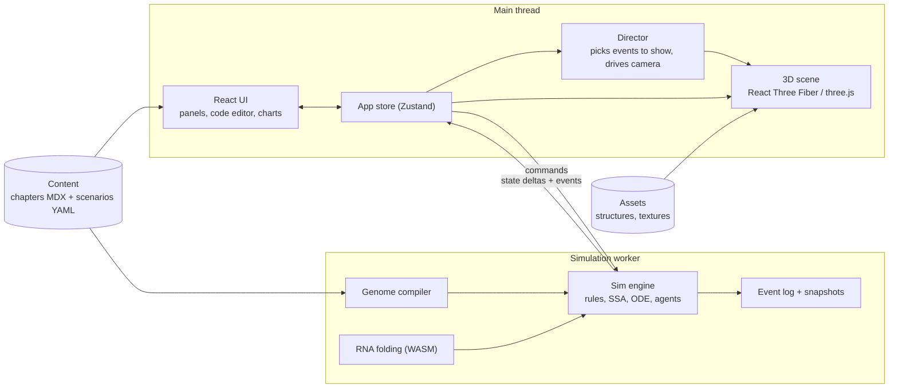

# Primordia: Implementation Plan

> **Working title.** Primordia is an interactive 3D app for looking at genetic "code" (DNA, RNA and the proteins they encode) and **watching it run**. It starts with single molecules, moves through the RNA world and the first protocells, and ends with a living minimal cell that grows and divides.

**Status:** Draft v1, 2026-09-30
**Scope of this doc:** the product vision, how honest the science needs to be, the architecture, the modeling approach, a phased roadmap with acceptance criteria, risks, and the open questions I need answered.

---

## Table of contents

0. [TL;DR](#0-tldr)
1. [The science: what "running the code" really means](#1-the-science-what-running-the-code-really-means)
2. [Product vision](#2-product-vision)
3. [Recommendations: things worth adding](#3-recommendations-things-worth-adding)
4. [UX and visual design](#4-ux-and-visual-design)
5. [Technical architecture](#5-technical-architecture)
6. [Scientific modeling: the hard parts](#6-scientific-modeling-the-hard-parts)
7. [Content and education framework](#7-content-and-education-framework)
8. [Roadmap](#8-roadmap)
9. [Testing and quality](#9-testing-and-quality)
10. [Risks and mitigations](#10-risks-and-mitigations)
11. [Open questions for you](#11-open-questions-for-you)
12. [Next steps (first two weeks)](#12-next-steps-first-two-weeks)
- [Appendix A: Reference numbers](#appendix-a-reference-numbers)
- [Appendix B: Key scientific references](#appendix-b-key-scientific-references)
- [Appendix C: Prior art and inspiration](#appendix-c-prior-art-and-inspiration)

---

## 0. TL;DR

**Can this go all the way up to a single-celled organism?** **Yes**, if it's an *educational simulation built in layers* and not a from-first-principles physics simulation. Three facts shape the design:

1. **Nobody can simulate life from atoms up, and we don't need to.** The most complete computer model of a living cell so far is a 2026 "4D" whole-cell simulation of the minimal bacterium JCVI-syn3A. It covers all 493 genes and a full 105-minute cell cycle, and it's a major research effort run on high-performance computing. It still works by giving each process its own simplified model and stitching those models together. We'll use the same approach at much lower resolution, tuned for understanding and frame rate rather than prediction.
2. **DNA on its own doesn't build anything.** DNA is code that needs a computer that's already running (a cell) to execute it. Put a genome in empty space and nothing happens, apart from slow decay. That is the chicken-and-egg problem your RNA idea points at. **RNA can be both the code and the machine** (ribozymes). So the *RNA world* is the natural "boot sequence" for the app's story. The app should show this directly instead of hiding it.
3. **Evolution does the building.** Running one sequence once produces molecules. Complexity comes from many copies, copying errors and selection over time. The app needs a **population/evolution view** as well as single-genome playback.

**What I recommend:**

- **Platform:** a web app (TypeScript + React + three.js via React Three Fiber). It runs in any modern browser, is easy to share, can be installed as a desktop/PWA app later, and has the best tools for the text-heavy educational UI.
- **Architecture:** the simulation runs deterministically in a Web Worker and is **separate from the 3D view**. A "Director" picks which simulated events to show up close. Everything else appears as crowds, charts and counters.
- **Three modes:** **Journey** (guided story in 4 acts, 13 chapters), **Lab** (sandbox: edit, run, compare) and **Challenges** (puzzles in the style of Eterna and Foldit).
- **Honesty layer:** every scene carries an *evidence level* (Established / Demonstrated in lab / Hypothesis / Speculative) and a "What we simplified" note.
- **First milestone ("Run a gene"):** paste DNA → see a 3D helix → press ▶ → watch RNA polymerase transcribe it and a ribosome translate the message into a glowing GFP protein. Then mutate one letter and replay.

---

## 1. The science: what "running the code" really means

Getting this right is what makes the app *educational* and not just pretty, so it comes first.

### 1.1 Genome as program, cell as computer

The analogy is a great teaching tool, and the app should lean on it with its own UI (see the "genome debugger" in §4.2):

| Computing | Biology |
|---|---|
| Source code | DNA sequence |
| Keywords / syntax | Promoters, ribosome binding sites, start/stop codons, terminators |
| Compiler + interpreter | Transcription (DNA→RNA) and translation (RNA→protein) machinery |
| Program counter | Position of RNA polymerase or ribosome on the strand |
| Program output | Proteins and functional RNAs |
| Operating system / hardware | The cell that's already running: membrane, metabolism, ribosomes, polymerases |
| Booting a new OS | Genome transplantation: a synthetic genome placed in a recipient cell "boots up" (JCVI, 2010) |
| Self-modifying code | Mutation, recombination |
| Fork() | Cell division |

**Where the analogy breaks** (the app should say so, e.g. in the chapter 3 epilogue): thousands of "programs" run at once in parallel; execution is random, not deterministic; there's no clean line between hardware and software (especially with RNA); the "code" is never designed, only selected; and most of what a genome "means" depends on the cell it's in.

### 1.2 The bootstrapping problem and the RNA world

Reading DNA needs proteins (polymerases). Making proteins needs RNA (messenger, transfer and ribosomal RNA) and proteins. Copying DNA needs proteins. So which came first?

The **RNA world hypothesis** says that early life used RNA for *both* storing information and doing catalysis:

- **Ribozymes exist.** RNA enzymes were discovered by Cech (self-splicing intron, 1982) and Altman (RNase P), who shared the 1989 Nobel Prize.
- **The ribosome is a ribozyme.** Its catalytic heart, which joins amino acids together, is RNA, not protein (ribosome structures from 2000).
- **The idea fits von Neumann's theory of self-reproducing machines.** A self-copier needs a *description* (code), a *constructor* (machine) and a *copier*. In RNA, one molecule can be all three.

This directly answers your parenthetical ("RNA at some point was able to create a code that created itself"). That idea is the RNA world hypothesis. It's **widely supported but not proven**, and some pieces of it have been demonstrated in the lab (see below).

### 1.3 "RNA that makes itself": what's actually real

| Result | When | What it shows | Evidence level |
|---|---|---|---|
| Spiegelman's "monster" | 1960s | A protein enzyme (Qβ replicase) copies viral RNA in a test tube. When selected for speed, the RNA shrinks dramatically: evolution of molecules outside cells. | Demonstrated |
| Non-enzymatic template copying (Orgel and many others) | 1970s → today | Activated nucleotides can copy short RNA templates with no enzyme at all, but slowly and with errors. | Demonstrated (limited) |
| Prebiotic nucleotide synthesis (e.g. Powner, Gerland & Sutherland) | 2009 → today | Plausible chemical routes to RNA building blocks. | Demonstrated (pieces) |
| Cross-replicating RNA ligases (Lincoln & Joyce) | 2009 | Two RNA enzymes, E and E′, each assemble the *other* from pre-made halves. This gives self-sustained exponential replication, and variants compete. | Demonstrated |
| RNA polymerase ribozymes (Bartel lab 2001 → Holliger and Joyce labs) | 2001 → 2020s | RNA that copies other RNAs, now up to roughly 200 nt under special conditions. | Demonstrated |
| **QT45** (Holliger lab, *Science*) | 2025–26 | A **45-nucleotide** polymerase ribozyme that makes its complementary strand (94.1% accuracy per nucleotide) *and* a copy of itself, using 3-letter RNA building blocks in slightly alkaline ice. Yields are about 0.2% over 72 days. **This is the closest anyone has come to an RNA that copies itself.** | Demonstrated (partial) |
| An RNA that copies itself **repeatedly and open-endedly**, without help | — | **Not yet achieved.** | — |
| Life actually began this way | ~4 billion years ago | Still a hypothesis. Competing and complementary ideas: metabolism-first (hydrothermal vents), lipid world, RNA and peptides evolving together. | Hypothesis |

For the app: the E/E′ cross-replicator and the QT45 story make excellent, *honest* centerpieces for Act II.

### 1.4 How far up can a simulation go? The precedents

- **Karr et al., 2012:** first "whole-cell" model (*Mycoplasma genitalium*, 525 genes), built from 28 sub-models of different kinds.
- **Thornburg et al., 2022:** minimal cell JCVI-syn3A, a hybrid model that mixes random (stochastic) and smooth (deterministic) methods and tracks space.
- **Thornburg, Maytin et al., *Cell*, 2026:** 4D whole-cell model covering the **full 105-minute cell cycle**, all 493 genes, metabolism, ribosome assembly, DNA replication, growth and division. Across 50 replicate runs, the predicted doubling time was within about 2 minutes of the lab measurement. The simulation code is public (Luthey-Schulten Lab, `Minimal_Cell` on GitHub).

**What we take from this:** a "genome → living cell" simulation is *scientifically legitimate* when it's layered: one appropriate model per process, stitched together. We copy that *architecture* at much lower resolution and pull parameters from these papers where we can. We never claim to predict anything.

### 1.5 Evidence levels (shown everywhere in the app)

| Label | Meaning | Example |
|---|---|---|
| **Established** | Textbook consensus, observed directly | Base pairing, translation, the genetic code |
| **Demonstrated** | Shown in lab experiments; whether it happened on early Earth is unknown | Cross-replicating ligases, protocell competition |
| **Hypothesis** | Widely discussed, supported by indirect evidence | The RNA world |
| **Speculative** | One of several competing ideas | Specific routes to the genetic code |
| *Simplified* (a separate flag) | This visual or model deliberately simplifies. Tap to see how and why. | Sped-up reaction rates; shortened sequences |

---

## 2. Product vision

### 2.1 Audience and goals (assumed; see [Open questions](#11-open-questions-for-you))

- **Primary:** curious teens and adults, roughly high school to intro-college biology level.
- **Secondary:** teachers (as a classroom demo tool) and enthusiasts who want the sandbox.
- **Learning goals:** understand (1) how a sequence becomes structure and function, (2) why DNA needs a cell and why RNA might have come first, (3) how copying + errors + selection builds complexity, and (4) how a genome keeps a cell alive and lets it reproduce.

### 2.2 Design principles

1. **See it → Run it → Break it → Fix it.** Every chapter ends with the user changing something and seeing what happens.
2. **Honest by default.** Evidence badges, "What we simplified" notes and references are always one tap away.
3. **Progressive disclosure.** It looks simple at first; expert panels (rates, raw sequence, plots) open on demand.
4. **Every number has units and a scale.** A permanent scale bar and time-scale readout ("1 s on screen ≈ 3 min of cell time").
5. **Deterministic and shareable.** The same scenario + seed + edits gives the same run, so anyone can share a link to "watch what I saw".
6. **Beautiful, but clear before pretty.** An art direction inspired by David Goodsell's molecular illustrations: color-coded, readable, uncluttered.

### 2.3 Three modes

| Mode | What it is | Unlocks |
|---|---|---|
| **Journey** | A guided story in 4 acts (below). Each chapter is a scene + narration + interactive "Try it" steps + a short check. | From the start |
| **Lab** | A sandbox. Build or import sequences; fold, translate, run, evolve, put in a protocell or cell; compare runs A/B. | Parts unlock per chapter (all available via a toggle) |
| **Challenges** | Goal-based puzzles: "design an RNA that folds into this shape", "fix the broken gene", "keep the replicator alive at a higher mutation rate", "build an oscillator", "remove genes and keep the cell alive". | After the matching chapters |

### 2.4 The Journey

| # | Chapter | What you see and do | What's simulated vs. narrated | Evidence |
|---|---|---|---|---|
| P | **Powers of Ten** (prologue) | Zoom from a bacterium to its DNA and back out, which sets up the scales. | Scripted cinematic | Established |
| **Act I: The Code** |||||
| 1 | **Letters** | Nucleotides, base pairing, DNA vs. RNA (T↔U, ribose 2′-OH, single vs. double strand). Type a strand; its complement snaps on. | Exact sequence rules; 3D built from the sequence | Established |
| 2 | **Shapes** | RNA folds into hairpins, stems and loops. Edit the letters and watch it refold live. Compare with a real tRNA structure. | Structure prediction (MFE folding); real PDB structure | Established (prediction is approximate) |
| 3 | **Running the code** | Transcription + translation step by step in the "genome debugger". Mutate: silent / missense / nonsense / frameshift. Fun fact: *Mycoplasma* reads UGA as tryptophan, not "stop". | Genome compiler + event engine | Established |
| **Act II: The RNA World** |||||
| 4 | **Chicken and egg** | *Experiment:* drop a genome into the void and press Run. **Nothing happens.** Why? Ribozymes; the ribosome's RNA core. | Mostly narrated; real structures | Established facts, Hypothesis framing |
| 5 | **Primordial soup** | Nucleotides link up; copying without enzymes; strands must separate before they can be copied again (heat-cycle slider). | Stochastic reactions + particle visuals | Demonstrated (pieces) |
| 6 | **RNA that builds RNA** | The E/E′ cross-replicator grows exponentially; polymerase ribozymes; the QT45 story. | Stochastic/ODE + visual proxies | Demonstrated |
| 7 | **Evolution in a tube** | Mutation + selection; a fidelity slider shows the error threshold (information collapses); parasites appear; lineage tree. | Population simulation with a toy fitness model | Demonstrated + theory |
| **Act III: Becoming a Cell** |||||
| 8 | **Bubbles** | Fatty-acid vesicles self-assemble, trap RNA, grow by stealing membrane from their neighbors, and divide. | Agent-based vesicles | Demonstrated (pieces) |
| 9 | **Parasites and teamwork** | Without compartments, parasites win. With compartments, cooperating replicators survive. | Population in two levels (molecules within vesicles) | Demonstrated + theory |
| 10 | **The great handoff** | The origin of translation and the genetic code; proteins take over catalysis, DNA takes over storage; LUCA. Branching cinematic with competing hypotheses. | Narrated, not simulated in detail | Hypothesis / Speculative |
| **Act IV: A Living Cell** |||||
| 11 | **Meet the minimal cell** | Tour JCVI-syn3A's genome by function. Nearly a third of the genes had *unknown function* when the minimal cell was first published. | Explorer | Established |
| 12 | **Booting a genome** | Genome transplantation: the same DNA that did nothing in the void comes alive inside a cell. | Cinematic + simulation | Established |
| 13 | **One cell becomes two** | A full cell cycle: gene expression, metabolism, DNA replication, growth and division. Knock out genes and see what breaks. | Simplified whole-cell hybrid model | Established (heavily simplified) |
| E | **Epilogue** | "Now it's your turn." The full Lab unlocks. | — | — |

> **Key scoping decision:** we **simulate what's well understood** (chapters 1–9 and 11–13) and **narrate what's speculative** (chapter 10), with clear labels.

### 2.5 The core interaction loop

```
Observe  →  Run  →  Inspect  →  Edit  →  Re-run / Compare
  3D         ▶       click any     mutate,     A/B view with
  scene    step,     molecule,     insert,     sequence diff +
           speed     read card     knock out   outcome diff
```

### 2.6 Non-goals (at least for v1)

- Atom-level physics (molecular dynamics) or life "emerging" from raw chemistry without guidance.
- Predicting the 3D structure or function of *arbitrary new* proteins (we use a curated parts library plus clearly labeled heuristics; see §6.5).
- Eukaryotic cells (nucleus, organelles) and multicellular development.
- Wet-lab functionality (primer design, codon optimization for synthesis, ordering DNA). Editing in Primordia acts on **simulated, curated/toy models** and is for learning.
- Multiplayer or real-time collaboration.

---

## 3. Recommendations: things worth adding

You covered the core vision. These are gaps I'd fill, roughly in order of importance:

1. **Proteins and membranes are half the story.** DNA/RNA are the code, but proteins and lipids are most of the "output". The plan treats them as first-class.
2. **Evolution as its own mode.** Running one genome doesn't build complexity; populations do. Chapter 7, chapter 9 and the Lab's "Evolve" tool cover this.
3. **An honesty layer.** Origin-of-life science is contested, and misconceptions spread easily (e.g. "DNA is a blueprint that builds the body"). Evidence labels + "What we simplified" + references fix this.
4. **The "naked DNA does nothing" moment.** One scene that directly confronts the most common misconception and sets up the RNA world.
5. **Scale and time awareness.** Molecules move in nanoseconds; a cell cycle takes ~2 hours. A permanent scale bar and time readout keep users oriented, with a "Powers of Ten" zoom ladder.
6. **Compare mode (A/B).** The best way to learn what an edit did is to see both runs side by side.
7. **Standard file formats:** FASTA, GenBank, dot-bracket (RNA structure), PDB/mmCIF (3D structures), SBOL Visual glyphs (genetic parts). These connect the app to real science and let advanced users bring their own data.
8. **Deterministic seeds + shareable links.** Great for classrooms ("everyone press Run with seed 42").
9. **Accessibility and low-end devices.** School Chromebooks and tablets are a big audience. Quality tiers, reduced motion, colorblind-safe palettes and screen-reader narration of events.
10. **An expert reviewer.** Recruit a biology teacher or grad student to check each chapter. Cheap, and a big boost to credibility.
11. **Start with a vertical slice.** One polished end-to-end experience ("Run a gene") before breadth. The ceiling is unlimited, and a thin polished slice is how you avoid drowning.
12. **Optional AI tutor (later).** "Ask about what you're seeing": a contextual Q&A grounded in the current chapter's content and references. It needs a small backend (to keep the API key private), rate limiting and extra privacy care if minors use it.
13. **Sound design (later).** Subtle audio cues for events (bonds forming, divisions); maybe sonification of sequences. A cheap way to feel "modern".
14. **Keep strings translatable from day one (i18n).** Nearly free now, expensive later.
15. **Privacy-first analytics.** If schools or minors are a target, avoid invasive tracking (COPPA/FERPA-style concerns); use aggregate, cookie-less analytics or none.

---

## 4. UX and visual design

### 4.1 Layout (desktop)

```
+---------------------------------------------------------------------------+
| (o) Primordia   Journey > Act II > 6. RNA that builds RNA    [Cmd-K] [?]  |
+-----------+-------------------------------------------+-------------------+
| Chapter   |                                           | Inspector         |
| outline   |              3D VIEWPORT                  | ----------------- |
| --------- |       (the void + molecules)              | E' ligase         |
| [x] Intro |                                           | RNA - 61 nt       |
| [>] Try it|                                           | Evidence: LAB     |
| [ ] Check |                               +-------+   | What is this?     |
|           |          scale ladder ->      | 10 nm |   | [Fold] [Edit]     |
|           |                               +-------+   | References (2)    |
+-----------+-------------------------------------------+-------------------+
| |<<  >  ||  >| step    speed o------  1 s = 3 min sim   t = 00:41:07      |
+---------------------------------------------------------------------------+
| 5'-GGAC|UUCG|GUCC-AUG GCU ...   [ code panel: sequence + features + PC ^ ]|
| E 1,204 ._-=#   E' 1,187 ._-=#   substrates 8.1k #=-_.   [plots v]        |
+---------------------------------------------------------------------------+
```

- **Tablet/phone:** the side panels become bottom sheets; the transport bar stays pinned; the code panel collapses into a swipeable strip.
- **Command palette (Cmd/Ctrl-K)** for everything: "fold", "mutate position 42 to A", "go to chapter 6", "reset camera".

### 4.2 The "genome debugger" metaphor

This is the signature interaction, and it maps directly onto "run the code":

- **Code panel:** the sequence rendered like source code with *syntax highlighting* for features (promoter, RBS, CDS, terminator, operator), codon grouping and both strands.
- **Program counter:** a caret in the code panel that follows the RNA polymerase or ribosome in 3D. Clicking either one selects the other.
- **Breakpoints:** click a feature or codon to pause when the machinery reaches it.
- **Step granularity:** *event* / *nucleotide* / *codon* / *gene* / *N seconds*.
- **Watch panel:** live counts (mRNA, protein, replicators) with sparklines.
- **Process list** (like a thread list): every active polymerase or ribosome and where it is.
- **Source map:** every simulated event links back to sequence coordinates, so "what line is running" is always visible.

### 4.3 Scale and time: "semantic zoom"

The scales run from ångströms to micrometers (4+ orders of magnitude) and from nanoseconds to hours. Instead of one continuous zoom, the app uses **discrete semantic levels**. Each level changes what's drawn *and* which model is shown:

| Level | Typical size | What you see | Driven by |
|---|---|---|---|
| Atomic | 0.1–1 nm | Atoms, hydrogen bonds | Real PDB coordinates / idealized templates |
| Molecular | 1–10 nm | Nucleotides, residues, helices, folds | Geometry built from the sequence + a simple chain physics model |
| Machine | 10–50 nm | Polymerases, ribosomes, ribozymes at work | Event-driven animation from simulation events |
| Network | abstract | Circuits, pathways, plots | ODE / stochastic simulation (SSA) state |
| Cell | 0.1–1 µm | Membrane, crowded cytoplasm, chromosome | Counts + agents + coarse polymer |
| Population | µm–mm | Many protocells or cells | Agent-based evolution |

The **scale ladder** (right edge) shows the current level and the neighboring ones; click to jump. Transitions cross-fade detail in and out.

**Time:** the HUD always shows `simulated time`, `speed` (sim seconds per real second) and a **slow-motion** badge when the Director slows things down to show a single event.

### 4.4 Art direction

- **The void:** a deep, near-black gradient with subtle depth fog and very faint drifting "solvent" particles (densest at molecular zoom, so there's a sense of water). Optional reference grid and scale bar.
- **Style:** inspired by Goodsell. Flat-to-soft shading, strong silhouettes, ambient occlusion for depth, gentle bloom only on "active" things (catalysis, bond formation). Glass-like membranes with a fresnel edge.
- **Color semantics (consistent across the whole app):**
  - Bases use the **Okabe–Ito** colorblind-safe palette, and are *always* paired with a letter glyph at close zoom: A `#009E73` (green), T/U `#D55E00` (vermillion), G `#E69F00` (orange), C `#0072B2` (blue).
  - Backbones are neutral warm grey. Proteins are colored by role (polymerases, ribosome, regulators, metabolic enzymes). Lipids are pale cream.
  - UI accent colors never reuse base colors.
- **Typography:** Inter (UI) + JetBrains Mono or IBM Plex Mono (sequences).
- **Motion:** purposeful easing. The Director camera glides to frame events but can always be overridden. Reduced-motion mode swaps glides for cuts.

### 4.5 Controls

| Action | Mouse / touch | Keyboard |
|---|---|---|
| Orbit / pan / zoom | drag / right-drag / wheel; 1-finger / 2-finger / pinch | arrows, +/- |
| Focus selection | double-click / double-tap | `F` |
| Play / pause | ▶ button | `Space` |
| Step | step button | `→` (with Shift for bigger step) |
| Speed | slider | `[` / `]` |
| Toggle Director camera | camera icon | `C` |
| Undo / redo edits | — | `Cmd/Ctrl-Z` / `Shift-Cmd/Ctrl-Z` |
| Command palette | — | `Cmd/Ctrl-K` |

### 4.6 Accessibility

- WCAG 2.2 AA for all 2D UI; full keyboard navigation, including **selecting 3D entities from an accessible list** (Tab through "things in view").
- An **event narration** live region ("Ligation: a new E′ molecule was formed") for screen readers, with a verbosity setting.
- Colorblind-safe palette plus glyphs; reduced motion; text scaling; captions for any audio.
- Performance tiers so low-end devices get a smooth experience (see §5.10).

---

## 5. Technical architecture

### 5.1 Platform decision

| Option | Pros | Cons | Verdict |
|---|---|---|---|
| **Web: TypeScript + React + three.js (React Three Fiber)** | Runs everywhere, shareable links, best UI/text/accessibility tools, huge ecosystem, installable as PWA, can be wrapped as desktop app (Tauri) later, WebXR for VR later | Must manage performance carefully; GPU compute is newer on the web | **Recommended** |
| Unity (C#) | Great 3D tools and editor | Heavy web builds, weaker for rich text/UI and accessibility | Consider only if you already know Unity |
| Godot (GDScript/C#) | Open source, light | Smaller UI ecosystem; web export less polished | Viable alternative |
| Unreal | Top visuals | Overkill; poor fit for web; steep learning curve | No |
| Native (Swift/Kotlin/C++) | Maximum performance | Several platforms to maintain | No |

### 5.2 Stack

Use current stable versions when the project starts.

| Concern | Choice | Notes |
|---|---|---|
| Language | **TypeScript** (strict) | Shared types between UI, simulation and content |
| Build | **Vite** + **pnpm workspaces** | Fast dev server; a monorepo keeps packages cleanly separated |
| UI | **React** + **Radix UI** primitives + **Tailwind CSS** (shadcn/ui style) | Accessible, modern, themeable |
| UI motion | Motion (formerly Framer Motion) | Panel and card transitions |
| 3D | **three.js** via **React Three Fiber** + **drei** | `CameraControls` for smooth Director moves; `Instances` for crowds |
| Renderer | **WebGL2 baseline, WebGPU as progressive enhancement** | Decide with a 1–2 day spike in Phase 0 (ADR-001). WebGPU unlocks GPU compute for particles and chain physics |
| Post-processing | `@react-three/postprocessing` (N8AO ambient occlusion, bloom, depth of field, selection outline) | Disabled per quality tier |
| App state | **Zustand** | UI state only; simulation state lives in the worker |
| Worker bridge | **Comlink** + transferable `ArrayBuffer`s | Zero-copy frame updates |
| Sequence editor | **CodeMirror 6** with a custom DNA/RNA language mode | Handles very long documents; decorations for features and program counter |
| Charts | **uPlot** (live time series) + small custom SVG sparklines | Fast enough for streaming simulation data |
| Content | **MDX** (narration with embedded interactive components) + **YAML** scenarios, validated with **Zod** | Authors can write chapters without touching engine code |
| RNA folding | Own **Nussinov** (teaching) → **ViennaRNA compiled to WebAssembly** (accuracy) | Check the ViennaRNA license terms first (free for research/education; check terms for other uses) |
| Hot loops (if needed) | **Rust → WebAssembly** (`wasm-bindgen`) | Only when benchmarks demand it; also gives bit-identical results across platforms |
| Storage | IndexedDB (Dexie) for local projects; compressed URL for sharing | No backend needed until accounts/classrooms |
| Testing | **Vitest** (+ fast-check property tests), **Playwright** (end-to-end + visual snapshots) | See §9 |
| Lint/format | ESLint + Prettier (or Biome) | — |
| CI/CD | GitHub Actions → static hosting (Cloudflare Pages / Vercel / GitHub Pages) | Preview deploy per PR |
| Offline | `vite-plugin-pwa` | Classrooms with bad Wi-Fi |

### 5.3 High-level architecture



**The key idea is to keep simulation and view apart.** The simulation is the source of truth and knows nothing about rendering. The view shows **visual proxies** for a sample of simulation entities near the camera, and shows everything else in aggregate. That's how one app can cover "one ribosome up close" and "500 ribosomes in a cell" (§6.3).

### 5.4 Repository layout

```
primordia/
  apps/
    web/                       # the React + R3F app
      src/
        app/                   # routes, layout, providers
        features/
          viewer/              # 3D viewport, camera, selection
          code-panel/          # CodeMirror sequence editor, features, program counter
          transport/           # play/pause/step/speed/seek, time HUD
          inspector/           # entity cards, evidence badges, references
          journey/             # chapter runner (MDX + scenario + goals)
          lab/                 # sandbox benches, compare mode
          challenges/
        scene/                 # R3F components: helix, strands, proteins, membranes, crowds
        workers/sim.worker.ts  # hosts sim-engine
  packages/
    bio-core/                  # pure TS, no dependencies: alphabets, genetic codes, pairing,
                               # reverse complement, translation, ORF/promoter/RBS finding,
                               # FASTA/GenBank/dot-bracket parsers
    fold/                      # nussinov.ts, energy model, vienna-wasm/ (build + bindings)
    sim-engine/                # entity store, rules, SSA/tau-leap/ODE/PBD, RNG, snapshots,
                               # event log, worker protocol, genome compiler
    render-kit/                # helix geometry, instanced nucleotide meshes, impostor shaders,
                               # LOD, membrane shader, crowd renderer
    content/                   # chapters/*.mdx, scenarios/*.yaml, glossary, references.bib
    ui/                        # design system (tokens, components)
  tools/
    pdb-import/                # build-time: download mmCIF -> compact binary + coarse beads
    content-lint/              # checks every chapter has objectives, evidence, references
  docs/
    adr/                       # Architecture Decision Records (ADR-001 renderer, ...)
    science/                   # per-chapter notes, parameter sources, reviewer sign-offs
```

> This repo (`personal`) currently holds only this plan. I suggest giving Primordia its own repository once coding starts.

### 5.5 Threading and message protocol

- **Main thread:** UI, rendering, the Director, and interpolation between simulation frames.
- **Sim worker:** everything deterministic. It runs ahead of the view by a small buffer and sends compact updates at ~30 Hz.
- **Optional second worker:** folding and heavy analysis (alignment, lineage trees), so they never block the simulation.

```ts
// packages/sim-engine/src/protocol.ts
export type Command =
  | { type: 'load'; scenario: ScenarioSpec; seed: number }
  | { type: 'play' }
  | { type: 'pause' }
  | { type: 'step'; by: 'event' | 'nucleotide' | 'codon' | 'gene' | { seconds: number } }
  | { type: 'setSpeed'; simSecondsPerRealSecond: number }
  | { type: 'edit'; edit: SequenceEdit }            // mutate / insert / delete / knockout
  | { type: 'seek'; t: number }                     // time travel (snapshot + replay)
  | { type: 'setBreakpoints'; breakpoints: Breakpoint[] }
  | { type: 'inspect'; id: EntityId };

export type Update =
  | { type: 'frame'; t: number; proxies: ProxyBuffer; events: SimEvent[] }  // ProxyBuffer = typed arrays
  | { type: 'series'; t: number; values: Record<string, number> }         // for charts
  | { type: 'paused'; reason: 'user' | 'breakpoint' | 'goal'; at?: SourceRef }
  | { type: 'inspect'; id: EntityId; detail: EntityDetail }
  | { type: 'error'; message: string };
```

### 5.6 Core data model

```ts
// packages/bio-core/src/types.ts
export type Alphabet = 'DNA' | 'RNA' | 'PROTEIN';

export interface Sequence {
  id: string;
  alphabet: Alphabet;
  residues: string;                  // uppercase, 5'→3' (N→C for protein). Uint8Array for genome-scale.
  topology: 'linear' | 'circular';
}

export interface Feature {           // GenBank-like annotation
  id: string;
  kind: 'promoter' | 'rbs' | 'cds' | 'terminator' | 'operator'
      | 'ncRNA' | 'ribozyme' | 'origin' | 'misc';
  start: number;                     // 0-based, inclusive
  end: number;                       // exclusive
  strand: 1 | -1;
  label?: string;
  props: Record<string, string | number>;   // strength, product, partId, ...
}

export interface Genome {
  id: string;
  name: string;
  chromosome: Sequence;              // DNA
  features: Feature[];
  geneticCode: 1 | 4 | 11;           // NCBI translation tables (4 = Mycoplasma: UGA = Trp)
}

export interface RnaStructure {
  dotBracket: string;                // e.g. "((((....))))"
  pairs: Int32Array;                 // pairs[i] = j or -1
  energy?: number;                   // kcal/mol (when computed with an energy model)
}
```

```ts
// packages/sim-engine/src/types.ts
export type Evidence = 'established' | 'demonstrated' | 'hypothesis' | 'speculative';

export interface SimEvent {
  t: number;                         // simulated seconds
  rule: string;                      // e.g. 'ligation', 'transcription.initiate'
  reactants: EntityId[];
  products: EntityId[];
  compartment?: CompartmentId;
  source?: SourceRef;                // sequence coordinates → code panel highlight
  salience: number;                  // 0..1: how interesting for the Director
  caption?: ContentKey;              // optional narration hook
}

export interface Rule<S> {
  id: string;
  evidence: Evidence;
  /** Total rate (events per simulated second) in the current state. */
  propensity(state: S): number;
  /** Choose concrete reactants and apply the change. May only use ctx.rng for randomness. */
  fire(state: S, ctx: FireContext): SimEvent;
}
```

### 5.7 Scenario format

Scenarios are declarative, so content authors can create and tune chapters without engine changes. Example for chapter 6. The rules follow the Lincoln & Joyce scheme: **E′ joins A + B into a new E; E joins A′ + B′ into a new E′; the resulting pair then separates.**

```yaml
# packages/content/scenarios/rna-world/cross-replicators.yaml
id: rna-world/cross-replicators
title: Two RNAs that build each other
chapter: 6
evidence: demonstrated
references: [lincoln-joyce-2009]
simplifications:
  - Sequences are shortened stand-ins, not the published ones.
  - Rates are sped up so growth is visible in minutes; the HUD shows real-time equivalents.
compartment: { kind: well-mixed, volumeFemtoliters: 1 }
species:
  E:    { kind: rna, role: ligase, display: { length: 61 } }
  Ep:   { kind: rna, role: ligase, display: { length: 61 } }
  A:    { kind: rna, role: substrate, fragmentOf: E }
  B:    { kind: rna, role: substrate, fragmentOf: E }
  Ap:   { kind: rna, role: substrate, fragmentOf: Ep }
  Bp:   { kind: rna, role: substrate, fragmentOf: Ep }
  E_Ep: { kind: complex, of: [E, Ep] }
initial: { E: 10, Ep: 10, A: 5000, B: 5000, Ap: 5000, Bp: 5000 }
rules:                                   # illustrative rate constants; fit to published curves in Phase 3
  - { id: build-E,  reactants: [Ep, A, B],  products: [E_Ep], rate: 1.0e-6, salience: 0.9 }
  - { id: build-Ep, reactants: [E, Ap, Bp], products: [E_Ep], rate: 1.0e-6, salience: 0.9 }
  - { id: separate, reactants: [E_Ep],      products: [E, Ep], rate: 0.05,  salience: 0.3 }
view:
  camera: { focus: E, preset: close-up }
  charts: [[E, Ep], [A, B, Ap, Bp]]
goals:
  - when: "count(E) >= 1000"
    say: chapter6.exponential           # key into the MDX narration
    unlock: lab.replicator-bench
```

### 5.8 Rendering

**a) Helices from the sequence (DNA/RNA at any length).** Each nucleotide is an *instance*. Its transform is computed from the helix parameters, ideally in the vertex shader from `instanceIndex`, so millions of nucleotides cost almost no CPU:

```
B-DNA (per base pair i, in Å):
  twist θ = 2π / 10.5     (~34.3° per bp)
  rise  h = 3.38
  phosphate radius r ≈ 8.9
  strand 1 phosphate:  P1(i) = ( r·cos(iθ),       r·sin(iθ),       i·h )
  strand 2 phosphate:  P2(i) = ( r·cos(iθ + φ),   r·sin(iθ + φ),   i·h )
  φ ≈ 140–160° instead of 180° produces the major and minor grooves (tune by eye against 1BNA)
  base-pair slab: spans P1→P2 through the axis region, colored per base, with a glyph at close zoom

A-RNA (double-stranded stems): ~11 bp/turn, rise ~2.6–2.8 Å, base pairs pushed off-axis (hollow core)
ssRNA: a chain of beads, shaped by folding (below) and animated by chain physics
```

**b) Level of detail (LOD):**

| Zoom | DNA/RNA representation |
|---|---|
| Far | Colored tube/ribbon; genes as color bands |
| Mid | "Ladder": backbone ribbons + base-pair rungs colored by base |
| Near | Nucleotide blocks with letter glyphs |
| Atomic | Ball-and-stick / space-filling via **ray-cast sphere impostors** (idealized nucleotide templates taken from real structures and placed with helix transforms) |

**c) Flexible strands.** Single strands, mRNA leaving a polymerase and growing protein chains are **chains of beads simulated with position-based dynamics** (distance + bending constraints, gentle Brownian noise). CPU for hundreds of strands; GPU compute (WebGPU) for thousands.

**d) RNA folds in 3D.** 2D structure (dot-bracket) → "schematic 3D": stems become A-form helices, loops become arcs, and a short force-layout relax removes overlaps. It's clearly labeled *schematic*. Real 3D structures (tRNA, ribozymes, ribosome) come from the PDB.

**e) Proteins.** Library proteins use real structures (PDB or AlphaFold DB) that are pre-processed at build time. Rendered as cartoon or surface at mid zoom, and as impostor spheres at atomic zoom. **Folding is shown as a morph** from the extended chain to the known structure, labeled "folding shown schematically".

**f) Membranes and protocells.** A translucent fresnel shell. At close zoom, instanced lipid "sprites" suggest the bilayer. Growth and division use signed-distance-field (SDF) blending, so one vesicle smoothly becomes two.

**g) Crowds (cell interior).** Goodsell-style crowded cytoplasm: thousands of instanced impostors (ribosomes, proteins, metabolites), each class with its own color. Only the proxies near the camera are "live"; the rest are procedural Brownian motion.

**h) Structure pipeline.** `tools/pdb-import` downloads selected entries from RCSB at *build time* and turns them into compact binaries (Float32 positions, element, residue, chain + a coarse bead model). Nothing hits the network at runtime, so the app works offline. Starter set (verify each ID when importing): **1BNA** (B-DNA), **1EHZ** (tRNA-Phe), **1EMA/1GFL** (GFP), plus a hammerhead ribozyme, the class I ligase ribozyme and a bacterial ribosome. PDB data is CC0; AlphaFold DB is CC-BY 4.0 (needs attribution).

**i) Post-processing.** Ambient occlusion (N8AO), subtle bloom for "active" events, depth of field for the Director's focus, selection outlines, AgX/ACES tone mapping. Each effect belongs to a quality tier.

### 5.9 Persistence and sharing

- **Local:** projects (sequences, scenario edits, saved runs) in IndexedDB, autosaved, with undo/redo history.
- **Share link:** `scenario id + seed + edit list`, compressed into the URL. Replaying rebuilds the exact run (determinism, §6.2).
- **Files:** import/export FASTA, GenBank, dot-bracket; export images/video clips of the viewport (MediaRecorder); `.primordia` JSON project files.
- **Later (only if needed):** accounts, class codes and a teacher dashboard on a small backend (e.g. Supabase or similar).

### 5.10 Performance budgets

| Budget | Target |
|---|---|
| Frame rate | 60 fps on a reference laptop (Apple M1 / Intel Iris Xe class); 30 fps on "Low" tier (2020-era iPad / Chromebook) |
| Initial load | < 1 MB gzipped JS for the shell; chapters, WASM and structures lazy-loaded |
| Draw calls | < 300 per frame (instancing everywhere) |
| Visible nucleotides | ~100k at "Near" LOD; ~1–2M aggregated at "Far" |
| Sim throughput | ≥ 100k SSA events/s in TS for count-based chapters; if not met → move the hot loop to Rust/WASM |
| Quality tiers | Low / Medium / High / Ultra, chosen automatically from GPU tier + measured frame time, overridable |

### 5.11 Security and privacy

- A static site by default, with no personal data collected.
- If the optional AI tutor ships: calls go through a serverless proxy (the key is never in the client), with rate limits, a content policy and extra care if minors use it.
- Imported files are parsed in a worker with size limits.
- `SharedArrayBuffer` (if used) needs COOP/COEP headers on the host.

---

## 6. Scientific modeling: the hard parts

### 6.1 Simulation engine

- **Entity store:** Structure-of-Arrays typed arrays (fast, easy to transfer) plus a **species registry** that stores each distinct sequence once, keyed by a hash.
- **Rules** (§5.6) with several schedulers:
  - **Gillespie SSA** (the direct method, then the next-reaction method), for low-count random events. This is correct for small numbers, where randomness *matters* (one ribozyme, one gene).
  - **Tau-leaping**, for medium counts.
  - **ODE** (adaptive RK45), for large-count, smooth processes (metabolite pools).
  - **Fixed-step agents / chain physics**, for vesicles and visual polymers.
  - **Hybrid partitioning:** each rule is assigned to a scheduler based on its counts and speed. This is the same idea the whole-cell models use.
- **Network-free mode** for evolution: when new sequences keep appearing, we don't pre-build a reaction network. Each molecule is an agent with a sequence, and rules compute propensities over classes. (Inspired by NFsim/Kappa rule-based modeling.)

### 6.2 Determinism and time travel

- All randomness comes from a seeded PRNG (e.g. xoshiro128\*\*) that lives in the worker. `Math.random` is never used.
- **Caveat:** `Math.exp`/`Math.log` can differ slightly between browser engines. So: deterministic *within* a browser in TS; bit-identical *across* browsers if the hot loop moves to Rust/WASM with `libm` (decided in Phase 3).
- **Snapshots** every N events + an **event log**. Seeking = restore the nearest snapshot + replay. This powers the scrubbable timeline, "rewind 10 seconds", breakpoints and shareable runs.

### 6.3 Visual proxies and the Director

- The simulation can hold millions of molecules, but only a few hundred can be *meaningfully* animated.
- The **focus region** is a sphere around the camera target. Simulation entities inside it get 1:1 **visual proxies**. Outside it they're drawn as aggregated instancing or density; further out, only as counters and charts.
- The **Director** scores incoming events (salience × novelty × distance to focus) and chooses what to show. It can **slow down (bullet-time)** to animate a single ligation or codon read while the HUD says so. It also offers "follow this molecule", picture-in-picture, and "skip to the next interesting thing".
- **Choreography:** each rule type has an animation recipe (e.g. `ligation`: substrates diffuse in → align on the template → a flash at the new bond → the pair drifts apart). The recipe gets the event's real participants, so what you see is always *true to the simulation*, just slowed down.

### 6.4 The genome compiler ("run the code")

```
source (FASTA / GenBank / Lab editor)
  → parse                        → Genome
  → annotate                     keep existing features; otherwise detect:
                                   promoters (position weight matrix scoring for -35 TTGACA /
                                   -10 TATAAT with a 15–19 bp spacer), RBS (Shine–Dalgarno-like
                                   motif ~5–9 nt upstream of a start codon), ORFs (6 frames,
                                   ATG/GTG/TTG starts), terminators (GC-rich hairpin + U-tract)
  → transcription units          promoter → first terminator downstream
  → expression program           units, genes, regulatory links (repressor protein ↔ operator site)
  → rules                        initiation rates from promoter/RBS scores, elongation at real
                                   speeds, termination, decay, binding (Hill functions from
                                   operator match scores)
  → runtime + source map         every event points back to sequence coordinates
```

Details that make it feel real and teach well:

- **Coupled transcription and translation.** In bacteria, ribosomes start translating mRNA *while it's still being made*. The 3D scene shows ribosomes "chasing" the polymerase.
- **The genetic code is a lookup table the user can inspect.** Include NCBI tables 1, 4 and 11. Chapter 3 highlights UGA = Trp in *Mycoplasma* (table 4) to show the code isn't perfectly universal.
- **Mutation classes** are computed and explained live: silent, missense, nonsense, frameshift, promoter/RBS damage (expression drops), operator damage (regulation lost).

### 6.5 Function from sequence (the honest workaround)

Predicting what an *arbitrary* sequence does is an unsolved research problem. We use clearly labeled **toy models** grounded in real theory:

**RNA ("does my ribozyme work?")**, inspired by RNA folding-landscape research (Schuster, Fontana et al.):

```
activity(seq) = a_max · exp( −d_bp( fold(seq), targetStructure ) / λ ) · coreMatch(seq)

  fold      = predicted minimum-free-energy (MFE) structure (ViennaRNA)
  d_bp      = base-pair distance between structures
  coreMatch = 1 if the catalytic core nucleotides are kept, otherwise a heavy penalty
```

In words: the ribozyme works if it still folds into the right shape and keeps its catalytic core. This gives real *neutral networks* (many sequences, same shape) and realistic *fitness landscapes*, which is exactly the right intuition for Chapter 7. It's labeled "toy function model".

**Proteins:** a curated **parts library** (polymerase, ribosomal proteins, repressors, GFP, metabolic enzymes...) with real structures, annotated key residues and kinetic parameters. An edited coding sequence is translated, aligned to its library parent (Smith–Waterman, BLOSUM62), and classified:

| Change | Activity factor (toy heuristic) |
|---|---|
| Synonymous | 1.0 |
| Missense at an annotated key residue | ~0–0.1 |
| Missense elsewhere | scaled by BLOSUM62 score (conservative swaps are mild) |
| Early nonsense (premature stop) | 0 |
| Frameshift | 0 |
| In-frame insertion or deletion | reduced, depending on length and location |

A brand-new protein with no library parent is shown as an unstructured chain with "function unknown", which is itself a true and teachable result. (Server-side structure prediction could be a much later, feature-flagged add-on.)

### 6.6 RNA-world models (Chapters 5–7)

- **Template-directed copying:** a template + monomers (or short oligos) → complementary strand. Each nucleotide is added with **error rate ε**. Without enzymes the rate is slow and ε is high; with a polymerase ribozyme present, both improve.
- **The strand-separation problem:** a finished duplex has to melt before it can be copied again. A **temperature-cycling slider** (think day/night or hydrothermal cycles) lets users discover this for themselves.
- **Cross-replicator (E/E′):** the scenario in §5.7. Validate exponential growth against the ODE solution.
- **Error threshold:** Eigen's rough limit, `L_max ≈ ln(σ) / ε`, where σ is the master sequence's growth advantage. A nice built-in "aha": at **QT45's 94.1% fidelity (ε ≈ 0.059)** and σ = 10, `L_max ≈ 2.3 / 0.059 ≈ 39 nt`, right around QT45's own 45 nt. (Illustrative; the app will show this as a live calculator.)
- **Spiegelman-style selection:** under selection for speed, shorter variants win. Users watch "genomes" shrink.
- **Parasites:** short sequences that get copied but don't catalyze anything. In a well-mixed pool they take over.

### 6.7 Protocell models (Chapters 8–9)

- **Vesicle state:** membrane amount (surface area A), volume V, and contents (RNA counts by species).
- **Growth by competition:** vesicles with more RNA inside (higher osmotic pressure) pull fatty acids from their neighbors (Chen, Roberts & Szostak 2004).
- **Division:** when A exceeds what a sphere of volume V needs, the vesicle stretches into a filament and divides under gentle shear (Zhu & Szostak 2009). Contents are split randomly (binomially).
- **Multilevel selection:** the stochastic corrector model (Szathmáry & Demeter 1987) and transient compartmentalization (Matsumura et al. 2016). Compartments let cooperating replicators outcompete parasites.

### 6.8 Minimal-cell model (Chapters 11–13)

Target organism: **JCVI-syn3A** (~543 kbp, 493 genes, ~105-minute doubling time, ~400 nm diameter). Parameters come from Breuer et al. 2019, Thornburg et al. 2022/2026 and the public `Minimal_Cell` repository (**check its license before reusing data**).

| Module | State | Method | Notes |
|---|---|---|---|
| Gene expression (~500 genes) | mRNA + protein counts per gene | SSA for mRNA; tau-leap/ODE for proteins | Promoter strengths from data where available |
| Ribosome assembly | rRNA, ribosomal proteins, ribosome count | SSA/ODE | Growth rate depends on ribosome count, a good teaching point |
| Metabolism | ~10–20 lumped pools (ATP/GTP, NTPs, dNTPs, amino acids, lipids) | ODE | Lumped from the published network; not full flux balance analysis |
| DNA replication | Replication fork positions | Deterministic + noise | Bidirectional from the origin |
| Chromosome | Coarse polymer (~1–5 kbp per bead) | Chain physics / Brownian | Mostly visual; roughly constrains segregation |
| Membrane growth + division | Area, volume, shape | Geometric rules | Divide when replication is complete and area passes a threshold |
| Crowd (visual) | Positions of ribosomes, proteins | Procedural Brownian | Visual proxies only |

**Gene knockouts:** every gene has a function category and an essentiality flag (from the minimal-cell papers). Turning off an essential gene breaks the matching module (e.g. a ribosomal protein → no new ribosomes → growth stalls), and the app explains *which* process failed and why.

**The "naked genome" and "boot" scenes** (Chapters 4 and 12) reuse this model: the same genome, with no cell machinery, produces zero events. Placed in a recipient cell, it takes over.

---

## 7. Content and education framework

### 7.1 Chapter template (MDX + scenario)

Every chapter has:

1. **Learning objectives** (2–4, phrased as "You'll be able to explain...").
2. **Hook:** a 10–20 second cinematic or question.
3. **Explore:** a free look at the scene with hotspots.
4. **Try it:** 2–4 guided interactions with goals the scenario detects (`goals:`).
5. **Check:** 2–3 quick questions (multiple choice, "predict what happens, then run it", or ordering).
6. **Go deeper:** references (with plain-language summaries) and Lab links.
7. **What we simplified:** a required section.
8. **Evidence badge(s):** required.

### 7.2 Writing guidelines

- Avoid teleology: RNA doesn't "want" to replicate. Say "copies that copy faster become more common".
- Separate *what happened in a lab* from *what might have happened 4 billion years ago*.
- Numbers always come with units and sources.
- A glossary with hover definitions. First use of a term in a chapter links to it.

### 7.3 Curriculum alignment (if targeting schools)

Map chapters to standards, e.g. NGSS **HS-LS1-1** (DNA structure → proteins → functions), heredity and natural-selection standards, and AP Biology units on gene expression and evolution. Add this as metadata in each chapter's frontmatter.

### 7.4 Science review workflow

`docs/science/<chapter>.md` records parameter sources, simplifications and a reviewer sign-off. `tools/content-lint` fails CI if a chapter lacks objectives, an evidence label, references or a "What we simplified" section.

---

## 8. Roadmap

Estimates are rough. They assume familiarity with TypeScript (3D can be learned along the way) and include content writing, which often takes as long as the code. AI-assisted development can shorten the coding portions.

| Phase | Theme | Chapters | Solo, part-time (~12 h/week) | Solo, full-time |
|---|---|---|---|---|
| 0 | Foundations | — | 2–3 weeks | ~1 week |
| 1 | Molecule viewer | (1, 2 partly) | 6–8 weeks | ~3 weeks |
| 2 | **Run the code (MVP / public alpha)** | P, 1, 2, 3 | 8–10 weeks | ~4 weeks |
| 3 | **The RNA world** | 4, 5, 6, 7 | 10–14 weeks | 5–6 weeks |
| 4 | Protocells | 8, 9, 10 | 8–10 weeks | ~4 weeks |
| 5 | The minimal cell | 11, 12, 13 | 16–24 weeks | 8–10 weeks |
| 6 | Lab & Challenges (full) | Epilogue | ongoing | ongoing |
| 7 | Extras (AI tutor, classroom, VR, localization) | — | as desired | as desired |

**Up to a living, dividing cell: ~12–18 months part-time, ~6–8 months full-time.**

### Phase 0: Foundations

**Goal:** a skeleton where everything later plugs in cleanly.

- [ ] Monorepo (pnpm + Vite + TS strict), packages as in §5.4, lint/format, Vitest, Playwright
- [ ] GitHub Actions: typecheck, lint, test, build, preview deploy per PR
- [ ] **Spike → ADR-001:** R3F with WebGL2 vs. WebGPU renderer on your target devices (1–2 days)
- [ ] **Spike → ADR-002:** render 100k bp of instanced B-DNA at 60 fps (1–2 days)
- [ ] **Spike → ADR-003:** build ViennaRNA to WASM + review its license (1 day)
- [ ] App shell: the void scene, camera controls, quality tiers, performance overlay, layout panels, design tokens, dark theme, i18n scaffold
- [ ] `bio-core` v0: alphabets, validation, reverse complement, transcription, translation (tables 1/4/11), FASTA parser, with tests

**Done when:** CI is green; the deployed preview shows an empty void you can orbit; `bio-core` passes known-answer tests.

### Phase 1: Molecule viewer

**Goal:** "Look at any sequence in 3D."

- [ ] Helix generator (B-DNA, A-RNA stems, ssRNA chains) + 4-level LOD
- [ ] Instanced nucleotide rendering; hover/selection picking
- [ ] Code panel (CodeMirror 6): DNA/RNA mode, feature highlighting, **two-way hover sync with 3D**
- [ ] Folding: Nussinov (teaching) → ViennaRNA WASM; 2D structure diagram; schematic 3D fold
- [ ] `tools/pdb-import` + viewer for real structures (tRNA, B-DNA, GFP)
- [ ] Inspector cards, evidence badges, glossary tooltips
- [ ] Scale bar + scale ladder + time HUD (static for now)

**Done when:** pasting a 10k-nt sequence renders at 60 fps on the reference laptop; hovering a nucleotide in 3D highlights it in the code panel (and vice versa); a 200-nt RNA folds in < 1 s; 1EHZ (tRNA) loads and renders offline.

### Phase 2: Run the code (MVP / public alpha)

**Goal:** "Press ▶ on a gene and watch a protein get made."

- [ ] `sim-engine` v1: entity store, event-driven scheduler, seeded RNG, snapshots, seek, worker + protocol
- [ ] Genome compiler (§6.4) with source maps
- [ ] Choreography: RNA polymerase (binding, a 12–14 bp opening "bubble", elongation, terminator hairpin, release); ribosome (RBS binding, tRNAs delivering amino acids, peptide growth, release); coupled transcription–translation; protein folding morph
- [ ] Genome debugger UI: program counter, breakpoints, step granularities, watch panel, process list
- [ ] Mutation tools + live mutation-class explanations; A/B compare (basic)
- [ ] **Hero demo:** a GFP gene. Run it → the protein glows. Nonsense mutation → no glow.
- [ ] Journey runner + Prologue + Chapters 1–3 (MDX, goals, checks)
- [ ] Accessibility pass (keyboard, narration region, reduced motion), save/load, share link
- [ ] First usability test: 5 people from the target audience, thinking aloud

**Done when:** a new user completes Chapters 1–3 unaided in about 20 minutes; the same seed + edits replays identically; a GFP nonsense mutation truncates the protein, and the app explains why.

### Phase 3: The RNA world

**Goal:** "Watch self-replicating RNA appear and evolve."

- [ ] SSA (direct + next-reaction), tau-leaping, ODE solver; hybrid partitioning; network-free mode
- [ ] Decide whether to port the hot loop to Rust/WASM (benchmark-driven) → ADR
- [ ] Director v1: salience scoring, bullet-time, follow-molecule, "skip to interesting"
- [ ] Soup visuals: thousands of nucleotides, chain-physics strands, template copying, ligation flashes, duplex melting with the temperature slider
- [ ] Scenarios: non-enzymatic copying, E/E′ cross-replicator, polymerase ribozyme, Spiegelman selection, error threshold, parasites
- [ ] Toy RNA function model (§6.5) + lineage tree + live charts (uPlot)
- [ ] Chapters 4–7; Lab: Replicator bench; first Challenges ("fold this shape", "beat the error threshold")

**Done when:** the cross-replicator's growth curve matches the ODE solution within tolerance; the error-threshold demo collapses above the critical ε in ≥ 95% of seeds; a science reviewer signs off on Chapters 4–7.

### Phase 4: Protocells

**Goal:** "Watch RNA get packaged into bubbles that grow, compete and divide."

- [ ] Vesicle agents: self-assembly, encapsulation, osmotic competition, filament growth, division
- [ ] Membrane rendering (fresnel shell, lipid sprites, SDF division)
- [ ] Population level: many protocells; stochastic corrector; parasites vs. compartments
- [ ] Chapters 8–10 (10 is mostly cinematic with branching hypotheses)
- [ ] Lab: Protocell bench

**Done when:** the "parasites vs. compartments" outcome reproduces qualitatively across seeds; division looks continuous at every LOD; 60 fps with 200 protocells on the reference laptop.

### Phase 5: The minimal cell

**Goal:** "Genome + cell → one cell cycle → two cells."

- [ ] Import the syn3A genome + annotations; function categories; essentiality flags
- [ ] Modules from §6.8 with parameters from the literature (documented in `docs/science/`)
- [ ] Cell-scale rendering: crowded cytoplasm, ~500 ribosomes, coarse chromosome, polymerases on DNA, membrane growth, division
- [ ] "Naked genome" and "genome transplantation" scenes
- [ ] Gene knockout tool with failure explanations
- [ ] Chapters 11–13; Lab: Cell bench; Challenge: "minimal genome" puzzle

**Done when:** simulated doubling time lands within ±10% of the tuned target (~105 min of simulated time); knocking out a ribosomal protein gene stalls growth with the right explanation; a reviewer signs off.

### Phase 6: Lab & Challenges (full)

- Parts-based construct builder (SBOL Visual glyphs); circuit bench (toggle switch, repressilator, lac operon); full compare mode; challenge editor; import/export everywhere.

### Phase 7: Extras (pick what you want)

- AI tutor · teacher/classroom mode · localization · WebXR (VR) · desktop app (Tauri) · sound design and sonification · a community gallery of shared scenarios.

---

## 9. Testing and quality

| Layer | What | How |
|---|---|---|
| `bio-core` | Reverse complement undoes itself; translation of known genes (e.g. GFP) matches the expected protein; all 64 codons × tables 1/4/11; parsers against GenBank fixtures | Vitest + fast-check property tests |
| Folding | Nussinov matches brute force for small n; ViennaRNA WASM matches native `RNAfold` on a fixture set | Golden tests |
| Simulation | Birth–death process mean = k/γ and Poisson variance; SSA vs. ODE agree at high counts; replicator growth rate; **deterministic replay hash** | Statistical tests with fixed seeds + tolerance |
| Geometry | Phosphate spacing, helix pitch and groove widths within tolerance of 1BNA | Unit tests |
| Rendering | Key scenes at fixed seed and camera | Playwright screenshots (headless Chromium, software GL) |
| Performance | Simulation throughput; frame-time checklist on reference devices before each release | `vitest bench` in CI + manual checklist |
| Content | Objectives, evidence, references and simplifications present; glossary links resolve | `tools/content-lint` in CI |
| Accessibility | axe-core on 2D UI; keyboard-only walkthrough per chapter | Playwright + manual |
| Science | Reviewer sign-off per chapter | `docs/science/` checklist |
| Users | Think-aloud sessions after Phases 2, 3 and 5; quick pre/post quiz to measure learning | Manual |

---

## 10. Risks and mitigations

| Risk | Likelihood | Impact | Mitigation |
|---|---|---|---|
| **Scope creep** (the ceiling is unlimited) | High | High | Vertical slices; explicit non-goals; every phase ships something usable |
| **Misrepresenting science** (e.g. "DNA builds life", teleology) | Medium | High | Evidence labels, "What we simplified", reviewer sign-off, writing guidelines |
| **Emergence is hard to tune** (replicators die out or explode; nothing interesting happens in watchable time) | High | Medium | Sped-up rates with disclosure; pre-validated seeds; Director "skip to interesting"; parameter sweeps in CI |
| **Performance on low-end devices** | Medium | High | Quality tiers, instancing, LOD, visual proxies, WebGL2 fallback, test on a real Chromebook |
| **Getting lost in 3D** | Medium | Medium | Director camera, "reset view", scale ladder, focus-on-select, onboarding |
| **WASM toolchain complexity** | Medium | Low | Start in pure TS behind interfaces; port only what benchmarks require |
| **Third-party licenses** (ViennaRNA, datasets, fonts) | Medium | Medium | License review in Phase 0 spikes; record in `docs/adr/` |
| **Solo-developer burnout** | Medium | High | Small milestones, public alpha early for motivation, cut scope before cutting quality |
| **AI tutor makes things up** (if added) | Medium | Medium | Ground it in chapter content + references; show sources; "I'm not sure" behavior; feature flag |

---

## 11. Open questions for you

Each question has the default I'll assume if you don't answer.

1. **Who is the primary audience?** (Middle school / high school / college / general public / researchers?)
   *Default: curious teens and adults, roughly high school to intro-college.*
2. **What's your programming background, and are you building this yourself?** This most affects the stack.
   *Default: comfortable with (or willing to learn) TypeScript; solo; AI-assisted.*
3. **Platform priority:** web browser, installable desktop app, tablet, or VR?
   *Default: web, desktop-first, tablet-friendly; VR later.*
4. **What order excites you most?** I recommend "Run the code" (central dogma) *first*: it's well defined, and it builds the viewer, debugger and engine that everything else needs. The RNA world follows immediately. If the RNA world is what motivates you, we can swap Phases 2 and 3 (the engine work just moves earlier).
   *Default: central dogma first.*
5. **Where on the accuracy ↔ spectacle dial?**
   *Default: accuracy first, with openly stated simplifications; cinematic only where it clarifies.*
6. **Open source or not? Any plan to monetize?**
   *Default: open source (MIT for code, CC BY for written content).*
7. **Editing scope:** should users be able to import *real* genomes (e.g. from GenBank) to view and annotate them, with simulation limited to curated models? Or only toy/curated genomes?
   *Default: import real sequences for viewing and annotation; simulate only curated models.*
8. **Classroom features** (teacher dashboards, assignments, accounts): in scope, and when?
   *Default: not before Phase 6; static site until then.*
9. **Budget for hosting/backend** (only matters for accounts, cloud saves, the AI tutor)?
   *Default: $0: static hosting only.*
10. **Timeline or deadline?** (Science fair, class, portfolio, launch date?)
    *Default: none; phase-by-phase.*
11. **Name:** keep "Primordia" or pick another? (Other ideas: *Helix Lab*, *Origin*, *Codon*, *Bootstrap*.)

---

## 12. Next steps (first two weeks)

1. **You:** answer the open questions (at least 1–4).
2. Create the `primordia` repository (or keep it here) and scaffold the monorepo as in §5.4.
3. Run the three Phase 0 spikes (renderer, 100k-bp helix, ViennaRNA WASM + license) and write ADR-001 to ADR-003.
4. Build `bio-core` v0 with tests (genetic codes, translation, reverse complement, FASTA).
5. Make a low-fidelity mockup (Figma or paper) of the layout in §4.1 and show it to 2–3 people from the target audience.
6. Look for a science reviewer (a biology teacher, grad student or professor).

---

## Appendix A: Reference numbers

Approximate values for tuning and for the time/scale HUD. Verify against primary sources before shipping any chapter.

| Quantity | Value |
|---|---|
| B-DNA | ~10.5 bp/turn, ~3.4 Å rise, ~20 Å diameter |
| A-form RNA duplex | ~11 bp/turn, ~2.6–2.8 Å rise, wider and with a hollow core |
| Transcription bubble | ~12–14 bp |
| RNA polymerase speed (*E. coli*) | ~40–80 nt/s |
| Ribosome speed (*E. coli*) | ~10–20 amino acids/s |
| Replicative DNA polymerase speed (*E. coli*) | ~1,000 nt/s |
| Error rates | DNA replication ~10⁻⁹–10⁻¹⁰ per bp (with proofreading and repair); transcription ~10⁻⁵–10⁻⁴; translation ~10⁻⁴–10⁻³ per residue |
| QT45 ribozyme | 45 nt; 94.1% per-nucleotide fidelity; ~0.2% yield over 72 days; 3-letter building blocks; alkaline eutectic ice |
| Promoter consensus (σ70, bacteria) | −35 `TTGACA`, −10 `TATAAT`, spacer ~17 bp (15–19) |
| Shine–Dalgarno (RBS) | ~`AGGAGG`, ~5–9 nt upstream of the start codon |
| Genetic code tables (NCBI) | 1 = standard; 11 = bacterial; 4 = *Mycoplasma* (UGA = Trp) |
| JCVI-syn3.0 | 473 genes, ~531 kbp (2016); 149 genes of unknown function at publication |
| JCVI-syn3A | 493 genes, ~543 kbp, ~105 min doubling, ~400 nm diameter, ~500 ribosomes |
| *E. coli* / human genome | ~4.6 Mbp / ~3.1 Gbp (why "view the whole genome at nucleotide level" needs LOD) |
| Eigen error threshold | `L_max ≈ ln(σ) / ε` |

## Appendix B: Key scientific references

RNA world and replicators
- Kruger, K. et al. (1982). Self-splicing RNA (Tetrahymena). *Cell.* (Cech lab)
- Guerrier-Takada, C. et al. (1983). The RNA moiety of RNase P is the catalytic subunit. *Cell.* (Altman lab)
- Nissen, P. et al. (2000). The structural basis of ribosome activity in peptide bond synthesis. *Science.*
- Mills, D. R., Peterson, R. L. & Spiegelman, S. (1967). An extracellular Darwinian experiment with a self-duplicating nucleic acid molecule. *PNAS.*
- Johnston, W. K. et al. (2001). RNA-catalyzed RNA polymerization. *Science.*
- Lincoln, T. A. & Joyce, G. F. (2009). Self-sustained replication of an RNA enzyme. *Science.*
- Powner, M. W., Gerland, B. & Sutherland, J. D. (2009). Synthesis of activated pyrimidine ribonucleotides in prebiotically plausible conditions. *Nature.*
- Holliger lab (MRC LMB). A small polymerase ribozyme that can synthesize itself and its complementary strand. *Science* (2025–26). doi:10.1126/science.adt2760. Preprint: bioRxiv 10.1101/2024.10.11.617851.
- Eigen, M. (1971). Self-organization of matter and the evolution of biological macromolecules. *Naturwissenschaften.*
- Schuster, P. et al. (1994). From sequences to shapes and back. *Proc. R. Soc. B.*

Protocells
- Chen, I. A., Roberts, R. W. & Szostak, J. W. (2004). The emergence of competition between model protocells. *Science.*
- Zhu, T. F. & Szostak, J. W. (2009). Coupled growth and division of model protocell membranes. *JACS.*
- Szathmáry, E. & Demeter, L. (1987). Group selection of early replicators and the origin of life. *J. Theor. Biol.*
- Matsumura, S. et al. (2016). Transient compartmentalization of RNA replicators prevents extinction due to parasites. *Science.*

Minimal and whole cells
- Gibson, D. G. et al. (2010). Creation of a bacterial cell controlled by a chemically synthesized genome. *Science.*
- Hutchison, C. A. et al. (2016). Design and synthesis of a minimal bacterial genome. *Science.*
- Breuer, M. et al. (2019). Essential metabolism for a minimal cell. *eLife.*
- Karr, J. R. et al. (2012). A whole-cell computational model predicts phenotype from genotype. *Cell.*
- Thornburg, Z. R. et al. (2022). Fundamental behaviors emerge from simulations of a living minimal cell. *Cell.*
- Thornburg, Z. R., Maytin, A. et al. (2026). Bringing the genetically minimal cell to life on a computer in 4D. *Cell.* Code: github.com/Luthey-Schulten-Lab/Minimal_Cell

Methods
- Gillespie, D. T. (1977). Exact stochastic simulation of coupled chemical reactions. *J. Phys. Chem.*
- Nussinov, R. & Jacobson, A. B. (1980). Fast algorithm for predicting the secondary structure of single-stranded RNA. *PNAS.*
- Zuker, M. & Stiegler, P. (1981). Optimal computer folding of large RNA sequences. *Nucleic Acids Res.*
- Lorenz, R. et al. (2011). ViennaRNA Package 2.0. *Algorithms Mol. Biol.*
- Elowitz, M. B. & Leibler, S. (2000). A synthetic oscillatory network of transcriptional regulators. *Nature.*
- Gardner, T. S., Cantor, C. R. & Collins, J. J. (2000). Construction of a genetic toggle switch in *E. coli*. *Nature.*

## Appendix C: Prior art and inspiration

- **David Goodsell**: *The Machinery of Life*; molecular watercolor style (art direction).
- **cellPACK / CellPAINT / Mesoscope** (Scripps): packing and painting whole-cell mesoscale scenes.
- **Mol\*** and **PDB-101** (RCSB): structure viewing and education.
- **Eterna** and **Foldit**: citizen-science puzzle games for RNA and protein design (Challenges mode).
- **BioNetGen / NFsim / Kappa**: rule-based modeling (sim engine design).
- **SBOL Visual**: standard glyphs for genetic parts (Lab construct builder).
- **Powers of Ten** (Eames, 1977): the semantic-zoom prologue.
- **John von Neumann**, *Theory of Self-Reproducing Automata*: the "code + constructor + copier" framing.
