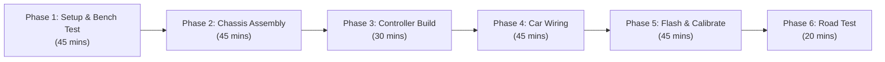
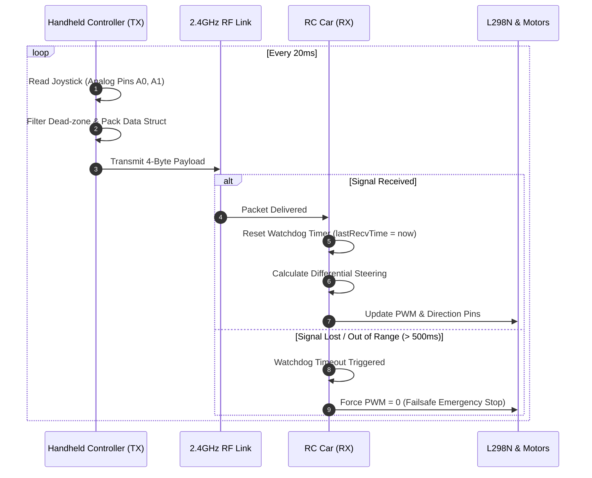

# Building a DIY Remote-Controlled Car and Custom Controller From Scratch
*A Complete, Beginner-to-Intermediate Engineering Guide to Designing, Wiring, Programming, and Calibrating an RF Robotics System.*

---

## 1. Executive Summary & Project Specifications

This tutorial guides you through building a fully functioning, two-wheel differential drive **Remote-Controlled (RC) Car** and a matching **Custom Handheld Controller** from individual off-the-shelf electronic modules and basic hardware. 

No proprietary kits or pre-assembled remote systems are used. Both the vehicle and the transmitter are built around **Arduino Nano microcontrollers** communicating over a dedicated **2.4 GHz NRF24L01 radio frequency (RF) link**, implementing custom telemetry packets, dead-zone filtering, H-bridge motor driving, and a safety failsafe system.

```
                      2.4 GHz ISM Band
  +-------------------+   RF Packets    +-------------------+
  | Custom Controller | --------------->|      RC Car       |
  |  (Transmitter)    |                 |    (Receiver)     |
  +-------------------+                 +-------------------+
```

### Key Technical Specifications
| Specification | Metric / Detail |
|---|---|
| **Architecture** | 2WD Differential Drive (Skid-Steer) with passive front caster |
| **Radio Protocol** | 2.4 GHz ISM Band via Nordic Semiconductor NRF24L01+ |
| **Operational Range** | 30–70 meters (Line-of-Sight, PCB antenna version) |
| **Microcontrollers** | 2× Arduino Nano (Atmega328P, 16 MHz, 5V) |
| **Motor Drive System** | Dual DC Gearbox Motors (TT Motors, 3–6V, ~200 RPM) via L298N Dual H-Bridge |
| **Power Source (Car)** | 7.4V (2× 18650 Rechargeable Li-Ion in series) |
| **Power Source (Remote)** | 9V standard battery or 7.4V 2S Li-Po / 18650 pack |
| **Control Interface** | 2-Axis Analog Resistive Joystick (X/Y) with push-button |
| **Safety Features** | 500 ms Radio Watchdog Failsafe (automatic motor shut-off on signal loss) |

---

## 2. Bill of Materials (BOM) & Budget

The table below details all necessary hardware, electronics, and structural components. Prices reflect typical individual retail prices (Amazon / AliExpress / Adafruit) as of current market rates.

### 2.1 Vehicle Chassis & Electronics
| Item | Description | Qty | Approx. Cost (USD) | Source Recommendation |
|---|---|---|---|---|
| **Robot Car Chassis Kit** | Acrylic/Wood plate, 2× TT DC gear motors, 2× rubber wheels, 1× ball caster, screws | 1 | $9.00 - $12.00 | Amazon / AliExpress / SparkFun |
| **Arduino Nano V3** | ATmega328P (Type-C or Mini-USB), headers pre-soldered | 1 | $4.00 - $6.00 | Generic / RobotDyn |
| **NRF24L01+ 2.4GHz Module** | Transceiver module (standard PCB antenna) | 1 | $2.00 - $3.00 | Generic Nordic clone |
| **NRF24L01 Adapter Board** *(Optional but recommended)* | 3.3V voltage regulator board with filter capacitors | 1 | $1.50 | Amazon / AliExpress |
| **L298N Motor Driver Board** | Dual H-Bridge module with integrated 5V buck regulator | 1 | $4.00 - $6.00 | Elegoo / Generic |
| **18650 Battery Holder** | 2-slot holder (wired in series for 7.4V nominal output) with leads | 1 | $2.50 | Generic |
| **18650 Li-ion Batteries** | 3.7V 2000–3000 mAh protected cells (or 6× AA battery box) | 2 | $8.00 - $12.00 | Local battery store / Amazon |
| **Mini Toggle Switch (SPST)** | Power on/off switch | 1 | $0.50 | Generic |
| **10 µF Electrolytic Capacitor** | Decoupling cap for NRF24L01 3.3V rail (if not using adapter) | 1 | $0.20 | Electronics hobby shop |
| **Jumper Wires** | Male-to-Female, Female-to-Female, Male-to-Male (20 cm) | 1 pk | $3.00 | Generic |

### 2.2 Remote Controller Hardware
| Item | Description | Qty | Approx. Cost (USD) | Source Recommendation |
|---|---|---|---|---|
| **Arduino Nano V3** | ATmega328P microcontroller | 1 | $4.00 - $6.00 | Generic |
| **NRF24L01+ 2.4GHz Module** | Transceiver module | 1 | $2.00 - $3.00 | Generic |
| **Dual-Axis Joystick Module** | KY-023 / PS2-style analog thumbstick (X, Y, button) | 1 | $2.50 - $4.00 | Generic |
| **Half-Size Solderless Breadboard** | 400 tie-points (or 5×7 cm perfboard for permanent build) | 1 | $2.50 - $4.00 | Generic |
| **9V Battery & 9V Clip Connector** | Power source for handheld controller | 1 | $3.00 | Supermarket / Hardware store |
| **Mini Toggle Switch (SPST)** | Remote power switch | 1 | $0.50 | Generic |
| **10 µF Electrolytic Capacitor** | Noise filter for NRF24L01 | 1 | $0.20 | Electronics hobby shop |
| **Handheld Base Material** | Corrugated cardboard, 3mm acrylic sheet, or 3D printed shell | 1 | $1.00 - $3.00 | Scrap / Hardware store |

### Estimated Total Project Cost
- **Budget Estimate:** ~$35.00 – $60.00 USD (depending on what tools/batteries you already possess).

---

## 3. Required Tools, Consumables & Software

### Tools & Equipment
* **Small Phillips-head screwdriver** (for chassis screws and terminal blocks on L298N).
* **Wire stripper and flush cutters** (for sizing jumper leads and power lines).
* **Soldering iron & solder** *(Optional if using screw terminals and jumper leads, but necessary to solder wires onto TT motor tabs).*
* **Multimeter** (to measure battery voltage, verify 5V/3.3V rails, and test ground continuity).
* **Hot glue gun or double-sided mounting tape** (for securing boards to chassis and remote body).
* **USB-A to USB Mini-B or USB-C cable** (depending on your Arduino Nano variant).

### Software Requirements
* **Arduino IDE** (version 2.0+ recommended from [arduino.cc](https://www.arduino.cc/en/software)).
* **RF24 Library** by TMRh20 (installable directly through Arduino IDE Library Manager).

---

## 4. Time & Difficulty Assessment

* **Difficulty:** Beginner to Intermediate (introductory Arduino, basic DC motor mechanics, SPI communication).
* **Total Estimated Time:** 3 to 5 hours.



---

## 5. System Architecture & Communication Protocol

### 5.1 Communication Topology
The remote controller acts as a continuous unidirectional transmitter (TX), polling the analog joystick every 20 milliseconds (~50 Hz refresh rate). The car operates as a continuous receiver (RX), reading packets, translating them into motor pulse-width-modulation (PWM) commands, and resetting an internal safety watchdog timer.



### 5.2 Control Packet Structure
To ensure low latency and high reliability, data is transmitted as an atomic binary payload struct across the RF link:

```cpp
struct DataPacket {
  int16_t throttle;  // Forward / Reverse speed: -255 to +255
  int16_t steering;  // Left / Right bias:        -255 to +255
  uint8_t button;    // Auxiliary button state:   0 or 1
};
```
Total payload size is only **5 bytes**, minimizing transmission time and packet collision probabilities.

---

## 6. Circuit Schematics & Pinout Mapping

> [!CAUTION]
> **CRITICAL VOLTAGE WARNING:** The NRF24L01 radio transceiver **operates strictly at 3.3V**. Connecting the NRF24L01 VCC pin to 5V will permanently destroy the RF chip! Although the SPI data pins (CSN, CE, SCK, MOSI, MISO) are 5V-tolerant, **VCC must always connect to 3.3V**.

> [!IMPORTANT]
> **NRF24L01 Power Stability:** The 3.3V output pin on cheap Arduino Nano clones often suffers from high electrical noise and inadequate current delivery during RF transmission bursts. **You must solder or place a 10 µF electrolytic capacitor directly across the NRF24L01 VCC and GND pins** (observe polarity: negative strip to GND) unless you are using an NRF24L01 dedicated regulator socket adapter.

---

### 6.1 Handheld Controller (Transmitter) Circuit

```mermaid
graph TD
    subgraph Controller Power
        Batt9V["9V Battery"] --> Switch["SPST Toggle Switch"]
        Switch --> VIN["Arduino Nano VIN (Pin 30)"]
        Batt9V --- GND1["Common Ground (GND)"]
    end

    subgraph Arduino Nano (Transmitter)
        VIN
        Nano3V3["Nano 3.3V Out"]
        Nano5V["Nano 5.0V Out"]
        GND1
        PinA0["Pin A0 (VRX / Steering)"]
        PinA1["Pin A1 (VRY / Throttle)"]
        PinD2["Pin D2 (SW / Button)"]
        PinD9["Pin D9 (CE)"]
        PinD10["Pin D10 (CSN)"]
        PinD11["Pin D11 (MOSI)"]
        PinD12["Pin D12 (MISO)"]
        PinD13["Pin D13 (SCK)"]
    end

    subgraph Joystick KY-023
        JoyVCC["VCC"] <--- Nano5V
        JoyGND["GND"] <--- GND1
        JoyVRX["VRX Pin"] ---> PinA0
        JoyVRY["VRY Pin"] ---> PinA1
        JoySW["SW Pin"] ---> PinD2
    end

    subgraph NRF24L01 Radio (TX)
        Cap["10µF Filter Cap"]
        RF_VCC["VCC (3.3V ONLY)"] <--- Nano3V3
        RF_GND["GND"] <--- GND1
        Cap --- RF_VCC
        Cap --- RF_GND
        RF_CE["CE"] <--- PinD9
        RF_CSN["CSN"] <--- PinD10
        RF_MOSI["MOSI"] <--- PinD11
        RF_MISO["MISO"] ---> PinD12
        RF_SCK["SCK"] <--- PinD13
    end
```

#### Transmitter Pin Connection Table
| Component | Component Pin | Arduino Nano Pin | Notes |
|---|---|---|---|
| **Joystick** | VCC | 5V | Power for internal potentiometers |
| **Joystick** | GND | GND | System ground |
| **Joystick** | VRX | A0 | Analog steering input (Left/Right) |
| **Joystick** | VRY | A1 | Analog throttle input (Forward/Back) |
| **Joystick** | SW | D2 | Pushbutton (active LOW with internal pull-up) |
| **NRF24L01** | VCC | 3.3V | **Do NOT connect to 5V!** Add 10 µF cap across VCC/GND |
| **NRF24L01** | GND | GND | System ground |
| **NRF24L01** | CE | D9 | Chip Enable (software controlled) |
| **NRF24L01** | CSN | D10 | SPI Chip Select Not |
| **NRF24L01** | SCK | D13 | Hardware SPI Clock |
| **NRF24L01** | MOSI | D11 | Hardware SPI Master-Out-Slave-In |
| **NRF24L01** | MISO | D12 | Hardware SPI Master-In-Slave-Out |
| **NRF24L01** | IRQ | *Not connected* | Interrupt pin not required for polled TX |
| **Power** | 9V (+) via Switch | VIN | Raw DC input (handled by onboard 5V regulator) |
| **Power** | 9V (-) | GND | Ground return |

---

### 6.2 RC Car (Receiver & Motor Driver) Circuit

```mermaid
graph TD
    subgraph Car Battery & Power
        Batt74["7.4V (2S 18650 Li-Ion)"] --> CarSwitch["Main Switch"]
        CarSwitch --> L298N_12V["L298N Power In (+12V terminal)"]
        Batt74 --- CommonGND["Common Ground (GND)"]
    end

    subgraph L298N Motor Driver
        L298N_12V
        L298N_GND["GND Terminal"] --- CommonGND
        L298N_5V["5V Out (Regulated)"]
        ENA["ENA (Left PWM)"]
        IN1["IN1 (Left Dir A)"]
        IN2["IN2 (Left Dir B)"]
        IN3["IN3 (Right Dir A)"]
        IN4["IN4 (Right Dir B)"]
        ENB["ENB (Right PWM)"]
        OUT1["OUT 1"] ---> M_Left["Left TT Motor (+)"]
        OUT2["OUT 2"] ---> M_Left_GND["Left TT Motor (-)"]
        OUT3["OUT 3"] ---> M_Right["Right TT Motor (+)"]
        OUT4["OUT 4"] ---> M_Right_GND["Right TT Motor (-)"]
    end

    subgraph Arduino Nano (Receiver)
        NanoVIN["5V Pin (Power In)"] <--- L298N_5V
        NanoGND["GND Pin"] --- CommonGND
        Nano3V3_Car["3.3V Pin"]
        CarD3["Pin D3 (PWM)"] ---> IN2
        CarD4["Pin D4"] ---> IN1
        CarD5["Pin D5 (PWM)"] ---> ENA
        CarD6["Pin D6 (PWM)"] ---> ENB
        CarD7["Pin D7"] ---> IN3
        CarD8["Pin D8 (PWM)"] ---> IN4
        CarD9["Pin D9"] ---> CarCE["NRF24L01 CE"]
        CarD10["Pin D10"] ---> CarCSN["NRF24L01 CSN"]
        CarD11["Pin D11"] ---> CarMOSI["NRF24L01 MOSI"]
        CarD12["Pin D12"] <--- CarMISO["NRF24L01 MISO"]
        CarD13["Pin D13"] ---> CarSCK["NRF24L01 SCK"]
    end

    subgraph NRF24L01 Radio (RX)
        CarCap["10µF Filter Cap"]
        CarVCC["VCC (3.3V ONLY)"] <--- Nano3V3_Car
        CarCap --- CarVCC
        CarCap --- CommonGND
    end
```

#### Receiver & Motor Driver Pin Connection Table
| Component | Component Pin | Arduino Nano / Power Pin | Notes |
|---|---|---|---|
| **L298N** | +12V Terminal | Battery Positive (+7.4V) | Primary power input for motors |
| **L298N** | GND Terminal | Battery Negative & Arduino GND | **Common ground between battery and Nano** |
| **L298N** | +5V Terminal | Arduino `5V` Pin | Uses L298N internal regulator to power Arduino |
| **L298N** | ENA | D5 (PWM capable) | Left motor speed control (remove factory jumper) |
| **L298N** | IN1 | D4 | Left motor forward control |
| **L298N** | IN2 | D3 | Left motor reverse control |
| **L298N** | IN3 | D7 | Right motor forward control |
| **L298N** | IN4 | D8 | Right motor reverse control |
| **L298N** | ENB | D6 (PWM capable) | Right motor speed control (remove factory jumper) |
| **L298N** | OUT1, OUT2 | Left DC Motor | Solder leads to motor solder lugs |
| **L298N** | OUT3, OUT4 | Right DC Motor | Solder leads to motor solder lugs |
| **NRF24L01** | VCC | 3.3V | **3.3V ONLY.** Add 10 µF capacitor across VCC/GND |
| **NRF24L01** | GND | GND | System common ground |
| **NRF24L01** | CE | D9 | Chip Enable |
| **NRF24L01** | CSN | D10 | SPI Slave Select |
| **NRF24L01** | SCK | D13 | SPI Clock |
| **NRF24L01** | MOSI | D11 | SPI MOSI |
| **NRF24L01** | MISO | D12 | SPI MISO |

> [!WARNING]
> **Remove L298N Jumpers on ENA and ENB:** Most L298N breakout modules come with small black plastic shunt jumpers connecting ENA and ENB to 5V (forcing 100% full speed). **You must pull these two jumpers off** before connecting Arduino pins D5 and D6, otherwise PWM speed modulation will not work and you risk shorting Arduino output pins to 5V!

---

## 7. Mechanical Assembly & Step-by-Step Construction

### Phase 1: Assembling the Car Chassis
1. **Prep the TT Motors:**
   - Strip ~10 cm of red and black stranded hookup wire.
   - Solder the wires to the small copper solder lugs on each of the two TT gearbox motors.
   - Secure the solder joints with a dab of hot glue or heat-shrink tubing to prevent vibrations from snapping the delicate metal lugs.
2. **Mount Motors to Chassis:**
   - Place the two DC motors into their respective slots on the bottom side of the acrylic chassis plate.
   - Insert the long machine screws through the acrylic chassis and motor body, fastening them with nuts on the opposite side.
3. **Attach the Caster Wheel:**
   - Mount the omnidirectional metal ball caster or nylon omni-wheel to the front end of the chassis plate using the provided standoffs and screws. Ensure it is leveled with the drive wheels so all three contact points touch the ground evenly.
4. **Install Rubber Drive Wheels:**
   - Press-fit the rubber wheels firmly onto the dual-flat output shafts of the two TT motors. Tighten the retaining center screw if your kit includes one.
5. **Install Battery Pack & Motor Driver:**
   - Fasten the 2-cell 18650 battery holder toward the center-rear of the chassis plate using double-sided foam tape or M3 bolts. Balancing weight over the rear drive wheels improves traction.
   - Secure the L298N module between the two motors.
   - Mount the Arduino Nano (mounted on a mini breadboard or standoffs) near the front of the chassis.

---

### Phase 2: Building the Handheld Remote Controller
1. **Prepare the Remote Baseplate:**
   - Cut a piece of rigid cardboard, thick plastic, or plywood measuring approximately **14 cm × 9 cm** (comfortable for two hands to hold like a game controller).
2. **Mount Components:**
   - Mount a mini solderless breadboard in the center.
   - Place the Arduino Nano at the top or center of the breadboard.
   - Place the analog joystick module on the left or right side (depending on whether you prefer left-thumb or right-thumb driving).
   - Mount the NRF24L01 transceiver at the top edge of the board, keeping the zig-zag PCB antenna facing outward into free air to maximize radio range.
3. **Mount the Power Source:**
   - Mount the 9V battery bracket on the underside or rear edge of the controller plate.
   - Wire the 9V red lead (+) through the SPST toggle switch, then into the Arduino Nano's `VIN` pin.
   - Wire the 9V black lead (-) directly into the Arduino Nano's `GND` pin.

---

## 8. Complete Source Code

### 8.1 Prerequisites & Library Installation
1. Open the **Arduino IDE**.
2. Navigate to **Tools** > **Manage Libraries...** (or press `Ctrl + Shift + I`).
3. In the search box, type `RF24`.
4. Locate **RF24 by TMRh20** and click **Install**.

---

### 8.2 Transmitter Firmware (`Transmitter_Remote.ino`)

Create a new sketch in the Arduino IDE, name it `Transmitter_Remote.ino`, and paste the following production code:

```cpp
/*
 * ============================================================================
 * Project: DIY RC Car - Custom Handheld Controller (Transmitter)
 * Hardware: Arduino Nano (ATmega328P), NRF24L01+ Transceiver, Analog Joystick
 * Author: Antigravity Autonomous Systems Guide
 * ============================================================================
 */

#include <SPI.h>
#include <nRF24L01.h>
#include <RF24.h>

// --- Pin Definitions ---
#define JOY_STEER_PIN   A0   // Horizontal axis (X) -> Left/Right Steering
#define JOY_THROTTLE_PIN A1   // Vertical axis (Y)   -> Forward/Reverse Throttle
#define JOY_BUTTON_PIN  2    // Thumbstick momentary button switch
#define RF_CE_PIN       9    // NRF24L01 Chip Enable
#define RF_CSN_PIN      10   // NRF24L01 Chip Select Not

// --- RF Communication Settings ---
RF24 radio(RF_CE_PIN, RF_CSN_PIN);
// Pipe address must match the receiver exactly (5 bytes)
const uint8_t pipeAddress[6] = "RCCAR";

// --- Control Packet Structure (Exact 5-byte payload) ---
struct ControlPacket {
  int16_t throttle;  // -255 (full reverse) to +255 (full forward)
  int16_t steering;  // -255 (full left)    to +255 (full right)
  uint8_t buttonState; // 1 = pressed, 0 = released
};

ControlPacket packet;

// Dead-band threshold: prevents car from creeping when joystick is centered
const int DEADZONE = 35;
const int JOY_CENTER = 512;

// Timing management (transmit at ~50 Hz)
unsigned long lastSendTime = 0;
const unsigned long SEND_INTERVAL_MS = 20;

void setup() {
  Serial.begin(115200);
  pinMode(JOY_BUTTON_PIN, INPUT_PULLUP);

  // Initialize NRF24L01
  if (!radio.begin()) {
    Serial.println(F("[ERROR] NRF24L01 hardware not detected! Check wiring."));
    while (1) {
      // Fast error flash or halt
      delay(500);
    }
  }

  // Configure Radio RF parameters
  radio.openWritingPipe(pipeAddress);
  radio.setPALevel(RF24_PA_LOW);      // PA_LOW reduces peak current draw during initial testing
  radio.setDataRate(RF24_1MBPS);      // Fast throughput with robust noise immunity
  radio.setChannel(76);               // Channel 76 (2.476 GHz), outside standard home Wi-Fi overlap
  radio.stopListening();              // Put module into Transmit (TX) mode

  Serial.println(F("[INFO] Transmitter Initialized Successfully. Starting loop..."));
}

void loop() {
  // Enforce fixed 50 Hz loop timing without blocking delays
  if (millis() - lastSendTime >= SEND_INTERVAL_MS) {
    lastSendTime = millis();

    // 1. Read Raw Analog Values (Range: 0 to 1023)
    int rawSteering = analogRead(JOY_STEER_PIN);
    int rawThrottle = analogRead(JOY_THROTTLE_PIN);
    bool buttonPressed = (digitalRead(JOY_BUTTON_PIN) == LOW);

    // 2. Map and Apply Dead-zone to Throttle
    // Invert mapping if your joystick forward reads lower resistance
    int throttleDelta = rawThrottle - JOY_CENTER;
    if (abs(throttleDelta) < DEADZONE) {
      packet.throttle = 0;
    } else {
      // Map remaining active range smoothly to -255 .. +255
      if (throttleDelta > 0) {
        packet.throttle = map(throttleDelta, DEADZONE, 511, 0, 255);
      } else {
        packet.throttle = map(throttleDelta, -512, -DEADZONE, -255, 0);
      }
    }

    // 3. Map and Apply Dead-zone to Steering
    int steerDelta = rawSteering - JOY_CENTER;
    if (abs(steerDelta) < DEADZONE) {
      packet.steering = 0;
    } else {
      if (steerDelta > 0) {
        packet.steering = map(steerDelta, DEADZONE, 511, 0, 255);
      } else {
        packet.steering = map(steerDelta, -512, -DEADZONE, -255, 0);
      }
    }

    packet.buttonState = buttonPressed ? 1 : 0;

    // 4. Transmit Payload over RF Link
    bool success = radio.write(&packet, sizeof(ControlPacket));

    // Optional serial debug telemetry
    #if 0
    Serial.print("TX Status: ");
    Serial.print(success ? "OK" : "NO_ACK");
    Serial.print(" | Thr: ");
    Serial.print(packet.throttle);
    Serial.print(" | Str: ");
    Serial.println(packet.steering);
    #endif
  }
}
```

---

### 8.3 Receiver & Motor Control Firmware (`Receiver_Car.ino`)

Create another sketch named `Receiver_Car.ino` and upload it to the Arduino Nano on the car:

```cpp
/*
 * ============================================================================
 * Project: DIY RC Car - Vehicle Receiver & Motor Control
 * Hardware: Arduino Nano, NRF24L01+, L298N Dual H-Bridge, 2x TT DC Motors
 * Author: Antigravity Autonomous Systems Guide
 * ============================================================================
 */

#include <SPI.h>
#include <nRF24L01.h>
#include <RF24.h>

// --- L298N Motor Driver Pinout ---
#define PIN_ENA  5   // PWM Left Motor Speed
#define PIN_IN1  4   // Left Motor Direction 1
#define PIN_IN2  3   // Left Motor Direction 2
#define PIN_IN3  7   // Right Motor Direction 1
#define PIN_IN4  8   // Right Motor Direction 2
#define PIN_ENB  6   // PWM Right Motor Speed

// --- RF Radio Pins ---
#define RF_CE_PIN   9
#define RF_CSN_PIN  10

RF24 radio(RF_CE_PIN, RF_CSN_PIN);
const uint8_t pipeAddress[6] = "RCCAR"; // Must match Transmitter exactly

// --- Control Packet Structure ---
struct ControlPacket {
  int16_t throttle;  // -255 to +255
  int16_t steering;  // -255 to +255
  uint8_t buttonState;
};

ControlPacket packet;

// --- Safety Watchdog Variables ---
unsigned long lastPacketTimestamp = 0;
const unsigned long FAILSAFE_TIMEOUT_MS = 500; // Stop car if no packet for 0.5s

void setup() {
  Serial.begin(115200);

  // Configure L298N control pins as outputs
  pinMode(PIN_ENA, OUTPUT);
  pinMode(PIN_IN1, OUTPUT);
  pinMode(PIN_IN2, OUTPUT);
  pinMode(PIN_IN3, OUTPUT);
  pinMode(PIN_IN4, OUTPUT);
  pinMode(PIN_ENB, OUTPUT);

  // Start with all motors stopped
  emergencyStop();

  // Initialize Radio
  if (!radio.begin()) {
    Serial.println(F("[ERROR] NRF24L01 receiver initialization failed!"));
    while (1);
  }

  radio.openReadingPipe(1, pipeAddress);
  radio.setPALevel(RF24_PA_LOW);
  radio.setDataRate(RF24_1MBPS);
  radio.setChannel(76);
  radio.startListening(); // Switch module to Receive (RX) mode

  Serial.println(F("[INFO] RC Car Receiver Ready. Waiting for transmitter..."));
}

void loop() {
  // Check if incoming RF data is available in the radio buffer
  if (radio.available()) {
    radio.read(&packet, sizeof(ControlPacket));
    lastPacketTimestamp = millis(); // Refresh watchdog timer

    // Calculate differential motor mixing
    driveMotorsDifferential(packet.throttle, packet.steering);
  }

  // Safety Failsafe: if the radio signal is lost for > 500 ms, shut down motors
  if (millis() - lastPacketTimestamp > FAILSAFE_TIMEOUT_MS) {
    emergencyStop();
  }
}

/**
 * Translates throttle (Y) and steering (X) into differential speeds for left and right wheels.
 * Uses standard skid-steer kinematics:
 *   Left Speed  = Throttle + Steering
 *   Right Speed = Throttle - Steering
 */
void driveMotorsDifferential(int16_t throttle, int16_t steering) {
  int leftMotorSpeed  = throttle + steering;
  int rightMotorSpeed = throttle - steering;

  // Clamp values strictly between -255 and +255
  leftMotorSpeed  = constrain(leftMotorSpeed, -255, 255);
  rightMotorSpeed = constrain(rightMotorSpeed, -255, 255);

  // Drive Left Motor
  setSingleMotor(PIN_ENA, PIN_IN1, PIN_IN2, leftMotorSpeed);

  // Drive Right Motor
  setSingleMotor(PIN_ENB, PIN_IN3, PIN_IN4, rightMotorSpeed);
}

/**
 * Configures direction pins and analog PWM speed for a single H-Bridge channel.
 */
void setSingleMotor(uint8_t pwmPin, uint8_t in1Pin, uint8_t in2Pin, int speed) {
  // Overcome DC motor starting friction: if speed is non-zero but below minimum stall torque,
  // ensure it has at least minimum operational PWM (~70)
  const int MIN_SPEED_THRESHOLD = 30;
  const int MIN_START_PWM = 70;

  if (abs(speed) < MIN_SPEED_THRESHOLD) {
    // Stop motor (active brake)
    digitalWrite(in1Pin, LOW);
    digitalWrite(in2Pin, LOW);
    analogWrite(pwmPin, 0);
    return;
  }

  // Scale up low speeds to prevent motor humming without movement
  int scaledPWM = map(abs(speed), MIN_SPEED_THRESHOLD, 255, MIN_START_PWM, 255);

  if (speed > 0) {
    // Forward rotation
    digitalWrite(in1Pin, HIGH);
    digitalWrite(in2Pin, LOW);
  } else {
    // Reverse rotation
    digitalWrite(in1Pin, LOW);
    digitalWrite(in2Pin, HIGH);
  }

  analogWrite(pwmPin, scaledPWM);
}

/**
 * Cuts all power to motors immediately.
 */
void emergencyStop() {
  digitalWrite(PIN_IN1, LOW);
  digitalWrite(PIN_IN2, LOW);
  digitalWrite(PIN_IN3, LOW);
  digitalWrite(PIN_IN4, LOW);
  analogWrite(PIN_ENA, 0);
  analogWrite(PIN_ENB, 0);
}
```

---

## 9. Firmware Uploading, Calibration & First Drive

### 9.1 Upload Procedure
1. Disconnect the car's 7.4V battery pack before plugging in the USB cable to prevent ground loops.
2. Connect the **Transmitter Nano** via USB. Select **Tools > Board > Arduino Nano** and **Tools > Processor > ATmega328P (or ATmega328P Old Bootloader)**. Select the appropriate COM port and click **Upload**.
3. Unplug the transmitter. Connect the **Car Receiver Nano** via USB and upload `Receiver_Car.ino`.

### 9.2 Bench Testing (Wheels Off the Ground)
Before putting the car on the floor:
1. Elevate the car chassis on a small block or cup so that both rubber wheels spin freely in mid-air.
2. Turn on the car's power switch (providing 7.4V to the L298N). Verify the red power LED on the L298N and Arduino light up.
3. Turn on the handheld controller.
4. Push the joystick forward: **Both wheels must spin in the forward direction.**
   - *If the Left wheel spins backwards:* Swap the wires plugged into the L298N `OUT1` and `OUT2` screw terminals.
   - *If the Right wheel spins backwards:* Swap the wires plugged into the L298N `OUT3` and `OUT4` screw terminals.
5. Push the joystick left: The right wheel should spin forward faster while the left wheel slows down or reverses (turning the vehicle left).
6. **Watchdog Test:** While the wheels are spinning, turn off the transmitter switch. Within half a second (500 ms), both wheels must immediately come to a complete stop.

---

## 10. Comprehensive Troubleshooting Guide

| Problem / Symptom | Probable Root Cause | Verified Remediation Step |
|---|---|---|
| **Motors hum loudly but do not spin** | 1. Battery voltage is too low.<br>2. PWM value is below the gearbox static friction torque. | • Recharge or replace the 18650 cells (ensure at least 7.0V total).<br>• Adjust `MIN_START_PWM` in `Receiver_Car.ino` from `70` to `90` or `100`. |
| **Arduino resets when motors start** | Severe voltage sag / electrical back-EMF noise from DC motor brushes. | • Ensure Arduino is powered from the L298N 5V regulator, **not** directly off the battery rail without regulation.<br>• Solder a 0.1 µF (104) ceramic capacitor across the terminals of each TT motor to suppress electrical brush sparking. |
| **`radio.begin()` returns false in Serial Monitor** | SPI wiring error or loose connection on CE / CSN / MOSI / MISO pins. | • Double-check SPI pins: SCK must be D13, MISO is D12, MOSI is D11.<br>• Replace breadboard jumper wires (cheap jumpers often have broken inner cores). |
| **Transmitter and Receiver don't link up** | 1. 3.3V power rail noise on NRF24L01.<br>2. Channel or pipe address mismatch. | • Solder a 10 µF capacitor directly across the NRF24L01 VCC & GND pins.<br>• Verify that `pipeAddress` (`"RCCAR"`) and `setChannel(76)` are identical in both sketches. |
| **Car drives in reverse when pushing forward** | Joystick Y-axis inverted in software. | In `Transmitter_Remote.ino`, invert the sign calculation: change `rawThrottle - JOY_CENTER` to `JOY_CENTER - rawThrottle`. |
| **Car veers to one side when driving straight** | Cheap DC gearbox motors have small manufacturing variances in RPM. | In `driveMotorsDifferential()`, introduce a motor trim multiplier (e.g., `leftMotorSpeed = leftMotorSpeed * 0.95;`). |
| **Radio range is only 1 or 2 meters** | High RF packet collision or weak power rail. | In both sketches, change `radio.setPALevel(RF24_PA_LOW)` to `RF24_PA_HIGH` (ensure decoupling capacitor is firmly in place). |

---

## 11. Extensions & Future Upgrades

Once your basic remote-controlled car is driving reliably, you can extend the platform with the following modular upgrades:

1. **Two-Way Telemetry Feedback:**
   - Use the bidirectional capabilities of the NRF24L01 to send the car's real-time battery voltage back to the controller, displaying it on an **I2C 0.96" OLED screen** or lighting a low-battery warning LED on the remote.
2. **Servo-Actuated Ackerman Steering:**
   - Replace differential skid-steer with a front steering rack controlled by an **SG90 micro servo**, driving both rear wheels with a single motor or differential gear.
3. **Autonomous Collision Avoidance Override:**
   - Mount an **HC-SR04 ultrasonic distance sensor** on the front bumper. If an obstacle is detected closer than 15 cm, the receiver firmware overrides the joystick command and halts the car automatically.
4. **FPV (First-Person View) Video:**
   - Mount an all-in-one 5.8 GHz analog micro camera/transmitter (such as an Eachine TX02) to the front chassis and view real-time video through FPV goggles or a phone receiver monitor.

---
*Created as part of the Hands-on Robotics & Autonomous Systems Series.*
