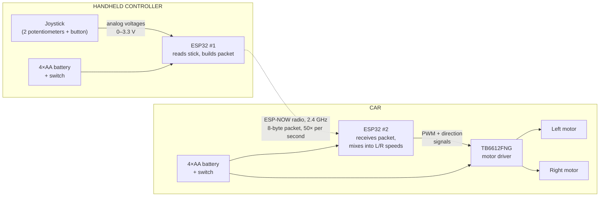
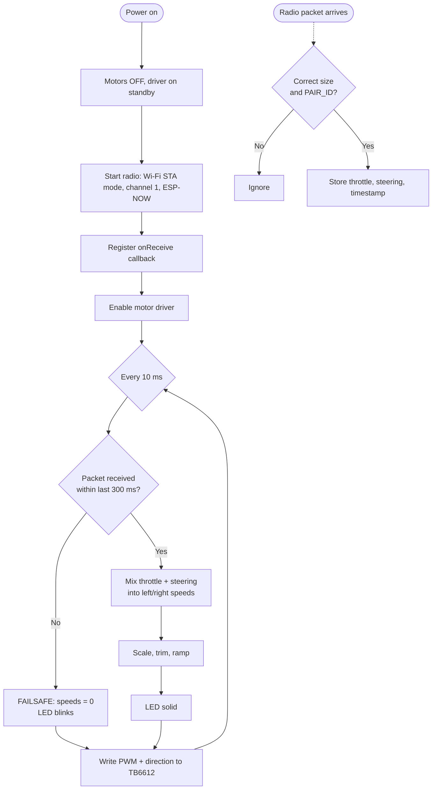

# Build a Remote-Controlled Car From Scratch

### A complete, beginner-friendly guide: a wireless car **and** its handheld controller, built by you

---

## Project at a Glance

| | |
|---|---|
| **What you'll build** | A 2-wheel-drive car and a handheld joystick controller that talk to each other wirelessly |
| **Control** | One analog joystick: push forward/back to drive, left/right to steer. Click the stick to switch between fast and slow mode |
| **Brains** | Two ESP32 microcontroller boards (one in the car, one in the controller) |
| **Radio link** | ESP-NOW, a Wi-Fi-based protocol built into the ESP32. You don't need a router or any extra radio modules |
| **Range** | Around 30 m indoors; often 100 m or more outdoors with a clear line of sight |
| **Top speed** | About 0.5 m/s (a brisk walking pace for a small robot) |
| **Run time** | About 1.5–3 h of driving on 4×AA batteries (car); about 15 h or more (controller) |
| **Difficulty** | Beginner to early intermediate (2 / 5) |
| **Hands-on time** | 4–8 hours in total (you can split it over a weekend) |
| **Cost** | About **$40–$70 USD** in parts, plus tools if you don't already have them |
| **Soldering** | Minimal: roughly 20 joints. A no-solder variant is described in [Appendix B](#appendix-b-no-solder-variant-l298n-driver) |
| **Programming** | Arduino C++. All the code is provided, so you copy, paste, and change a few settings |

> **"From scratch," defined.** In this guide, "from scratch" means you choose every part, wire every connection, write or understand every line of code, and assemble both the car and the controller yourself. You do **not** machine your own gears or etch your own circuit boards. We use off-the-shelf building blocks (motors, a microcontroller board, a motor-driver chip on a small breakout board) because that is the simplest way to get a car that actually works. If you want to go even more bare-bones, [Appendix A](#appendix-a-the-absolute-minimum-version-wired-no-microcontroller) shows a version with no microcontroller at all, made from two switches and a cable.

---

## Table of Contents

1. [How It Works (The Big Picture)](#1-how-it-works-the-big-picture)
2. [Why This Design? (Alternatives Considered)](#2-why-this-design-alternatives-considered)
3. [Safety First](#3-safety-first)
4. [Bill of Materials and Cost](#4-bill-of-materials-and-cost)
5. [Tools](#5-tools)
6. [Time Estimate](#6-time-estimate)
7. [Skills You'll Use (and Learn)](#7-skills-youll-use-and-learn)
8. [Wiring Reference (Keep This Handy)](#8-wiring-reference-keep-this-handy)
9. [Step-by-Step Build](#9-step-by-step-build)
   - [Phase 0: Set Up Your Computer](#phase-0-set-up-your-computer)
   - [Phase 1: Test Both ESP32 Boards](#phase-1-test-both-esp32-boards)
   - [Phase 2: Assemble the Chassis](#phase-2-assemble-the-chassis)
   - [Phase 3: Solder the Small Stuff](#phase-3-solder-the-small-stuff)
   - [Phase 4: Wire the Car Electronics](#phase-4-wire-the-car-electronics)
   - [Phase 5: Motor Test (No Radio Yet)](#phase-5-motor-test-no-radio-yet)
   - [Phase 6: Build the Controller](#phase-6-build-the-controller)
   - [Phase 7: Joystick Test](#phase-7-joystick-test)
   - [Phase 8: Upload the Final Controller Code](#phase-8-upload-the-final-controller-code)
   - [Phase 9: Upload the Final Car Code](#phase-9-upload-the-final-car-code)
   - [Phase 10: First Drive and Calibration](#phase-10-first-drive-and-calibration)
   - [Phase 11: Tidy Up and Make It Durable](#phase-11-tidy-up-and-make-it-durable)
10. [Full Source Code](#10-full-source-code)
11. [Troubleshooting](#11-troubleshooting)
12. [Tuning Guide](#12-tuning-guide)
13. [Upgrades and Next Steps](#13-upgrades-and-next-steps)
14. [Appendix A: The Absolute-Minimum Version (Wired, No Microcontroller)](#appendix-a-the-absolute-minimum-version-wired-no-microcontroller)
15. [Appendix B: No-Solder Variant (L298N Driver)](#appendix-b-no-solder-variant-l298n-driver)
16. [Appendix C: Power Budget and Battery Life Math](#appendix-c-power-budget-and-battery-life-math)
17. [Appendix D: Glossary](#appendix-d-glossary)
18. [Appendix E: Printable Checklists](#appendix-e-printable-checklists)

---

## 1. How It Works (The Big Picture)

### 1.1 System overview



The same diagram in plain text, for viewers that don't render Mermaid:

```
  ┌──────────── CONTROLLER ────────────┐                 ┌─────────────────── CAR ───────────────────┐
  │                                    │                 │                                           │
  │  Joystick ──analog──► ESP32 #1 ))) │ ~~ ESP-NOW ~~►  │ ((( ESP32 #2 ──signals──► TB6612FNG ──┬─► Left motor
  │                          ▲         │   2.4 GHz       │        ▲                        ▲        └─► Right motor
  │  4×AA + switch ──────────┘         │                 │        └────── 4×AA + switch ───┘          │
  └────────────────────────────────────┘                 └───────────────────────────────────────────┘
```

### 1.2 The four ideas that make it work

**1. The joystick is just two variable resistors.**
The joystick contains two potentiometers, one for each axis. Each one outputs a voltage between 0 V and 3.3 V that depends on where the stick is. The ESP32's analog-to-digital converter (ADC) turns that voltage into a number from 0 to 4095. When the stick is centered, both axes read about 1800–2000.

**2. The radio sends a tiny packet many times a second.**
Every 20 ms, the controller packs three numbers into 8 bytes and broadcasts them:

```
 byte:   0    1    2    3    4    5    6    7
       ┌────┬────┬────┬────┬────┬────┬────┬────┐
       │     pairId (uint32)│throttle │steering │
       │  e.g. 0x5EED1234   │ int16   │ int16   │
       └────┴────┴────┴────┴────┴────┴────┴────┘
                             -255..255 -255..255
```

The `pairId` works like a password. The car ignores any packet that doesn't carry its ID, so several of these cars can run in the same room without interfering with each other.

**3. An H-bridge lets a motor run both ways.**
A DC motor spins one way when current flows through it in one direction, and the other way when the current is reversed. An **H-bridge** is four switches arranged in an "H" around the motor:

```
            BATT+
              │
        ┌─────┴─────┐
       S1           S3
        │           │
        ├───( M )───┤        S1 + S4 closed → current flows left→right → FORWARD
        │           │        S3 + S2 closed → current flows right→left → REVERSE
       S2           S4       All open        → motor coasts
        │           │        Never close S1+S2 (or S3+S4) together: that shorts the battery!
        └─────┬─────┘
             GND
```

The TB6612FNG chip contains **two** H-bridges made of fast transistor switches, one bridge per motor. The ESP32 tells it which way to spin (the `IN1`/`IN2` pins) and how fast (the `PWM` pin). The chip's internal logic prevents the battery-shorting combination, so you can't cause it from software.

**4. PWM controls speed.**
The ESP32 can't output "half a volt." It can only switch a pin fully on or fully off. **Pulse-width modulation (PWM)** switches the pin on and off 1,000 times a second. The fraction of time it spends *on* (the duty cycle) sets the motor's average power:

```
  25% duty  ┌┐   ┌┐   ┌┐   ┌┐        → slow
          ──┘└───┘└───┘└───┘└───
  50% duty  ┌─┐  ┌─┐  ┌─┐  ┌─┐       → medium
          ──┘ └──┘ └──┘ └──┘ └──
  90% duty  ┌───┐┌───┐┌───┐┌───┐     → fast
          ──┘   └┘   └┘   └┘   └
```

### 1.3 Steering: differential drive (like a tank)

This car has no steering servo. It turns by running the two wheels at **different speeds**. The car's code "mixes" the joystick's throttle and steering values into a speed for each wheel:

```
left  = throttle + steering
right = throttle − steering
```

| Stick position | Throttle | Steering | Left wheel | Right wheel | Result |
|---|---|---|---|---|---|
| Center | 0 | 0 | 0 | 0 | Stopped |
| Full forward | +255 | 0 | +255 | +255 | Straight forward |
| Full back | −255 | 0 | −255 | −255 | Straight reverse |
| Full right | 0 | +255 | +255 | −255 | Spins clockwise in place |
| Forward + a little right | +200 | +80 | +255* | +120 | Arcs to the right |

\* If a value goes past ±255, the code scales both wheels down together so the turn keeps its shape.

### 1.4 Safety logic: the failsafe

If the car stops receiving packets for **300 ms** (the controller's batteries die, it goes out of range, or you switch it off), the car **stops its motors automatically**. Every real RC system has a failsafe like this. Without one, a car that loses its signal keeps doing whatever it was last told, such as "full speed ahead."

---

## 2. Why This Design? (Alternatives Considered)

The main goal was the *simplest design that is still genuinely wireless and reliable*. Here's how the common options compare:

| Approach | Extra parts for the radio | Wiring complexity | Reliability | Verdict |
|---|---|---|---|---|
| **Wired tether + switches** (no microcontroller) | None | Very low | High | Simplest, but it's tethered. See [Appendix A](#appendix-a-the-absolute-minimum-version-wired-no-microcontroller) |
| **IR remote** (TV-remote style) | IR LED + receiver | Low | Poor: needs line of sight, and sunlight interferes | Not recommended |
| **433 MHz ASK modules** | Transmitter + receiver pair | Low | Fair: noisy, one-way, and short range without antennas | Workable, but twitchy |
| **Arduino + nRF24L01** | 2 radio modules + capacitors | Medium: 7 SPI wires per side | Good *if* you power it carefully (a common source of frustration) | Classic, but fussy |
| **Arduino + HC-05 Bluetooth pair** | 2 Bluetooth modules | Medium | Good, but pairing needs AT-command configuration | Fiddly setup |
| **ESP32 + ESP-NOW** ✅ | **None.** The radio is built in | **Lowest of the wireless options** | Very good: low latency, decent range | **Chosen** |

**Why the TB6612FNG motor driver?** It uses MOSFET switches, so it wastes very little voltage (around 0.1–0.3 V). The more common **L298N** uses older bipolar transistors that waste about 2 V. On a 6 V pack, that's a third of your power turned into heat. The L298N does have one advantage: screw terminals, so you don't need to solder. That's why it's offered as a variant in [Appendix B](#appendix-b-no-solder-variant-l298n-driver).

---

## 3. Safety First

This is a low-voltage, low-risk project, but please read this section anyway.

| Hazard | How to stay safe |
|---|---|
| **Short-circuited batteries** | Even AA packs can make a wire glowing hot if + and − touch. Keep the battery **switch OFF** while you wire. Run the continuity check in [Phase 4](#phase-4-wire-the-car-electronics) before you power up for the first time. |
| **Soldering iron (~350 °C)** | Always put it back in its stand. Work in a ventilated area and don't breathe the flux smoke. Wash your hands after handling leaded solder. Wear safety glasses, because solder can spit. |
| **Electrolytic capacitor polarity** | The 470 µF capacitor has a **negative stripe**. If you install it backwards it can bulge, leak, or pop. The stripe side goes to **GND**. |
| **Wrong voltage on the ESP32** | Battery power goes **only** to the `VIN`/`5V` pin, **never** to `3V3`. More than 3.6 V on the `3V3` pin will destroy the board instantly. |
| **Runaway car** | The code includes a failsafe. Do your first tests with the **wheels off the ground** (car propped on a box or mug). |
| **Batteries** | Don't mix old and new cells, or alkaline and rechargeable cells. Never try to recharge alkaline cells. Remove the batteries when you store the car. |
| **Lithium batteries** (upgrades only) | If you later switch to Li-ion or LiPo cells, use a proper charger, never charge them unattended, and never puncture or crush them. |
| **Hair, fingers, and pets** | TT gearmotors are weak but can still pinch. Keep long hair away from the wheels. |

---

## 4. Bill of Materials and Cost

Prices are typical online prices in **USD in 2026**, from marketplaces like Amazon or AliExpress. AliExpress is usually cheaper but slower to arrive. Buying multipacks lowers the per-unit cost and gives you spares.

### 4.1 Car

| # | Part | Qty | Approx. cost | Notes / what to search for |
|---|---|---|---|---|
| C1 | **2WD robot car chassis kit** | 1 | $10–15 | Search for *"2WD smart robot car chassis kit"*. It should include an acrylic base plate, 2 × **TT gearmotors** (yellow, 3–6 V, 1:48), 2 × 65 mm wheels, 1 caster wheel, motor brackets, screws and standoffs, a 4×AA battery holder, and usually a small on/off switch. |
| C2 | **ESP32 dev board** (classic ESP32-WROOM-32) | 1 | $5–8 | Search for *"ESP32 DevKit V1 WROOM-32 30 pin"* (or the 38-pin *DevKitC*). **Buy a 2- or 3-pack** so you have one for the controller and a spare. Stick to the classic ESP32 for this build: variants like the S2, S3, and C3 use different pin numbers from this guide. |
| C3 | **TB6612FNG motor driver module** | 1 | $3–6 | Search for *"TB6612FNG motor driver module"*. Many ship with loose header pins that you solder yourself. Some sellers offer them pre-soldered. |
| C4 | **470 µF electrolytic capacitor**, 16 V or higher | 1 | $0.20 | Anything from 330 to 1000 µF works. It smooths out voltage dips when the motors start. |
| C5 | **100 nF (0.1 µF) ceramic capacitor** (marked "104") | 2 | $0.10 | One across each motor's terminals, to reduce the electrical noise that can reset the ESP32. |
| C6 | **Mini breadboard**, 170-point | 1 | $1–2 | Holds the TB6612 and acts as a power junction. Usually has a sticky back. |
| C7 | **4 × AA batteries** | 4 | $3–5 | Alkaline (6 V pack) or NiMH rechargeables (4.8 V pack). Alkaline gives slightly more speed. NiMH is cheaper over time. |

### 4.2 Controller

| # | Part | Qty | Approx. cost | Notes |
|---|---|---|---|---|
| K1 | **ESP32 dev board** (same as C2) | 1 | $5–8 | Comes from your multipack. |
| K2 | **Analog joystick module** (KY-023 or similar) | 1 | $1–3 | Search for *"KY-023 joystick module"*. It has 5 pins: GND, +5V, VRx, VRy, SW. |
| K3 | **4×AA battery holder with built-in switch** | 1 | $1–3 | Search for *"4 AA battery holder with switch and cover"*. *Alternative:* power the controller from a small USB power bank through the ESP32's USB port, which needs no wiring at all. |
| K4 | **4 × AA batteries** | 4 | $3–5 | |
| K5 | **Base or enclosure** | 1 | $0–8 | This can be as simple as stiff cardboard, a 3 mm plywood offcut, or a plastic food container. A small ABS project box looks neater. |

### 4.3 Shared consumables

| # | Part | Qty | Approx. cost | Notes |
|---|---|---|---|---|
| S1 | **Dupont jumper wire kit** (M-M, M-F, F-F, 10–20 cm) | 1 kit | $5–7 | You'll mostly use **female-to-male** (ESP32 to breadboard) and **female-to-female** (ESP32 to joystick). |
| S2 | **USB data cable** matching your ESP32 (Micro-USB or USB-C) | 1 | $0–5 | **Must be a data cable.** Many "charge-only" cables can't upload code, and this is the #1 beginner stumbling block. |
| S3 | **Zip ties, double-sided foam tape, hot glue sticks** | – | $3–5 | For mounting everything. |
| S4 | **Solder** (0.8 mm rosin-core, lead-free or 60/40) | small spool | $3–6 | Skip it if you already have some. |
| S5 | **Heat-shrink tubing or electrical tape** | a little | $1–3 | For insulating joints. |

### 4.4 Cost summary

| Category | Low | High |
|---|---|---|
| Car parts (C1–C7) | $22 | $36 |
| Controller parts (K1–K5) | $10 | $27 |
| Consumables (S1–S5) | $8 | $26 |
| **Parts total** | **≈ $40** | **≈ $70** |
| *Optional tools, if you own none (see §5)* | *+$25* | *+$60* |

> **Save money:** An ESP32 3-pack (about $15–20) plus a "sensor kit" that includes a joystick and jumper wires is usually the cheapest route. Rechargeable NiMH AAs and a charger cost about $20–25 up front but pay for themselves quickly.

---

## 5. Tools

| Tool | Required? | Approx. cost | Used for |
|---|---|---|---|
| Computer (Windows, macOS, or Linux) with a USB port | **Required** | – | Writing and uploading code |
| Small Phillips screwdriver | **Required** | $3 | Chassis assembly |
| Soldering iron (a temperature-controlled 60 W kit is ideal) | **Required** (unless you follow Appendix B) | $15–30 | Header pins, motor leads, switch |
| Wire strippers / flush cutters | **Required** | $5–10 | Stripping and trimming wires |
| Multimeter | *Strongly recommended* | $10–20 | Checking battery voltage, continuity, and shorts |
| Hot glue gun | Optional | $5–10 | Mounting parts |
| Helping hands / small vise | Optional | $5–10 | Holding parts while you solder |
| Safety glasses | Recommended | $3 | Soldering and clipping leads |

---

## 6. Time Estimate

| Phase | Beginner | Experienced |
|---|---|---|
| Ordering and waiting for parts | 2 days (fast shipping) – 3 weeks (budget shipping) | – |
| 0 · Software setup | 30–60 min | 10 min |
| 1 · Board tests | 15 min | 5 min |
| 2 · Chassis assembly | 30–60 min | 20 min |
| 3 · Soldering | 30–60 min | 15 min |
| 4 · Car wiring | 45–90 min | 20 min |
| 5 · Motor test | 15–30 min | 10 min |
| 6 · Controller build | 30–60 min | 15 min |
| 7–9 · Uploading code | 20–40 min | 10 min |
| 10 · First drive and calibration | 20–45 min | 10 min |
| 11 · Tidy up | 30–60 min | 20 min |
| **Total hands-on** | **≈ 4.5–8 hours** | **≈ 2.5 hours** |

A good plan for a first build: **Day 1** covers Phases 0–5 (the car moves on the bench). **Day 2** covers Phases 6–11 (it's wireless and drivable).

---

## 7. Skills You'll Use (and Learn)

**You need:**
- Basic computer use: installing software, copying and pasting code
- Patience and careful attention to labels. Most failures are one wire in the wrong hole.

**You'll learn:**
- Reading pinouts and wiring modules together
- Basic through-hole soldering
- DC power: common ground, decoupling capacitors, voltage drop
- Microcontroller programming: digital/analog I/O, PWM, timing without `delay()`
- Wireless communication with packets, IDs, and failsafes
- Differential-drive kinematics (tank steering)
- Systematic debugging: test each subsystem on its own before combining them

---

## 8. Wiring Reference (Keep This Handy)

> **Pin labels vary between board makers.** Always wire by the **GPIO number** printed on your ESP32 (sometimes shown as `D25`, `G25`, `IO25`, or just `25`) and by the **name** printed on your TB6612 module (`AO1` may appear as `A01`). If your board is a 38-pin DevKitC, the pins are in different physical positions but the GPIO numbers are the same.

### 8.1 Car: power wiring

```
                         ┌─────────────┐
 4×AA pack  RED   (+) ───┤  ON/OFF SW  ├── BATT+ ──┬────────────────────────► TB6612  VM
                         └─────────────┘           ├────────────────────────► ESP32   VIN  (may be labelled "5V")
                                                   │
                                                 (+)
                                                470 µF  electrolytic
                                                 (–)  ← striped side
                                                   │
 4×AA pack  BLACK (–) ───────────────────── GND ───┴──┬─────────────────────► TB6612  GND
                                                      └─────────────────────► ESP32   GND
```

### 8.2 Car: signal and motor wiring

```
 ESP32 (car)                   TB6612FNG                         Motors
 ───────────                   ─────────                         ──────
 3V3      ──────────────────►  VCC   (logic power)
 GPIO 13  ──────────────────►  STBY  (HIGH = driver enabled)
                                                    AO1  ──────► LEFT  motor terminal 1
 GPIO 25  ──────────────────►  PWMA  (left speed)   AO2  ──────► LEFT  motor terminal 2
 GPIO 26  ──────────────────►  AIN1  (left dir)
 GPIO 27  ──────────────────►  AIN2  (left dir)     BO1  ──────► RIGHT motor terminal 1
                                                    BO2  ──────► RIGHT motor terminal 2
 GPIO 33  ──────────────────►  PWMB  (right speed)
 GPIO 32  ──────────────────►  BIN1  (right dir)    Each motor also gets a 100 nF ceramic
 GPIO 14  ──────────────────►  BIN2  (right dir)    capacitor soldered across its 2 terminals.
```

On the classic 30-pin DevKit V1, **all six motor-signal pins (32, 33, 25, 26, 27, 14) plus GPIO 13, GND, and VIN are on the same side of the board**, so the wires stay tidy.

### 8.3 Car: wiring table (tick each one off as you go)

| ✔   | From                           | To                 | Suggested wire colour | Purpose                        |
| --- | ------------------------------ | ------------------ | --------------------- | ------------------------------ |
| ☐   | Battery **+** (through switch) | TB6612 **VM** row  | Red                   | Motor power                    |
| ☐   | Battery **−**                  | TB6612 **GND** row | Black                 | Ground                         |
| ☐   | TB6612 **VM** row              | ESP32 **VIN**      | Red                   | ESP32 power                    |
| ☐   | TB6612 **GND** row             | ESP32 **GND**      | Black                 | **Common ground (essential!)** |
| ☐   | 470 µF **+** leg               | **VM** row         | –                     | Smoothing                      |
| ☐   | 470 µF **−** leg (stripe)      | **GND** row        | –                     | Smoothing                      |
| ☐   | ESP32 **3V3**                  | TB6612 **VCC**     | Orange                | Logic power                    |
| ☐   | ESP32 **GPIO 13**              | TB6612 **STBY**    | White                 | Enable                         |
| ☐   | ESP32 **GPIO 25**              | TB6612 **PWMA**    | Yellow                | Left speed                     |
| ☐   | ESP32 **GPIO 26**              | TB6612 **AIN1**    | Green                 | Left direction                 |
| ☐   | ESP32 **GPIO 27**              | TB6612 **AIN2**    | Blue                  | Left direction                 |
| ☐   | ESP32 **GPIO 33**              | TB6612 **PWMB**    | Yellow                | Right speed                    |
| ☐   | ESP32 **GPIO 32**              | TB6612 **BIN1**    | Green                 | Right direction                |
| ☐   | ESP32 **GPIO 14**              | TB6612 **BIN2**    | Blue                  | Right direction                |
| ☐   | TB6612 **AO1 / AO2**           | Left motor         | Any                   | Left motor                     |
| ☐   | TB6612 **BO1 / BO2**           | Right motor        | Any                   | Right motor                    |

> Motor polarity **doesn't matter**. If a wheel spins the wrong way, you flip one setting in the code instead of rewiring.

### 8.4 Controller wiring

```
 4×AA holder RED   (+) ──► [switch built into holder] ──► ESP32 VIN  ("5V")
 4×AA holder BLACK (–) ─────────────────────────────────► ESP32 GND  (either GND pin)

 KY-023 JOYSTICK                   ESP32 (controller)
 ───────────────                   ──────────────────
 GND   ──────────────────────────► GND   (the other GND pin)
 +5V   ──────────────────────────► 3V3   ⚠ use 3V3, NOT VIN/5V (see note)
 VRx   ──────────────────────────► GPIO 34   (steering)
 VRy   ──────────────────────────► GPIO 35   (throttle)
 SW    ──────────────────────────► GPIO 32   (click = slow mode)
```

| ✔ | Joystick pin | ESP32 pin | Why |
|---|---|---|---|
| ☐ | GND | GND | Ground |
| ☐ | +5V | **3V3** | The ESP32's ADC only accepts up to 3.3 V. At 5 V, the joystick would output voltages that can damage the input pins. |
| ☐ | VRx | GPIO 34 | Uses ADC1. ADC2 pins **stop working when the radio is on**, so only ADC1 pins (32–39) are used here. |
| ☐ | VRy | GPIO 35 | ADC1 |
| ☐ | SW | GPIO 32 | Uses the internal pull-up resistor. Reads LOW when the stick is clicked. |

### 8.5 Pins we deliberately avoid (and why)

| GPIO | Reason to avoid |
|---|---|
| 0, 2, 5, 12, 15 | "Strapping" pins read at boot. **GPIO 12 is the dangerous one:** if something pulls it HIGH at boot, many boards won't start. (GPIO 2 is fine for the on-board LED.) |
| 6–11 | Connected to the internal flash memory. Never use them. |
| 1, 3 | USB serial TX/RX, used for uploading code |
| ADC2 pins (0, 2, 4, 12–15, 25–27) | Can't be used for **analog reads** while Wi-Fi/ESP-NOW is active. They still work fine as digital or PWM outputs, which is why 25–27 are OK on the car. |

---

## 9. Step-by-Step Build

### Phase 0: Set Up Your Computer

**Goal:** Your computer can compile code for the ESP32 and upload it.

1. **Install the Arduino IDE 2.x** from <https://www.arduino.cc/en/software>.
2. **Add ESP32 support:**
   1. Open **File → Preferences** (on macOS: **Arduino IDE → Settings**).
   2. In **Additional boards manager URLs**, paste:
      ```
      https://espressif.github.io/arduino-esp32/package_esp32_index.json
      ```
   3. Click OK. Open **Tools → Board → Boards Manager**, search for **esp32**, and install **"esp32 by Espressif Systems"** (version 3.x recommended). Don't install the similarly named "Arduino ESP32 Boards," which is for Arduino's own boards.
3. **Install the USB driver, if needed.** Look at the small chip near your ESP32's USB port:
   - **CP2102 / CP2104** → "Silicon Labs CP210x VCP driver"
   - **CH340 / CH9102** → "WCH CH340/CH343 driver"

   Windows 10/11 and macOS often install these automatically. Install one only if no new port appears in the next step.
4. **Select the board:** **Tools → Board → esp32 → "ESP32 Dev Module"**.
5. **Plug in one ESP32** using your data cable. **Tools → Port** should now show a new entry (`COM3`, `COM5`, etc. on Windows, `/dev/cu.usbserial-…` or `/dev/cu.SLAB_USBtoUART` on macOS, `/dev/ttyUSB0` on Linux). Select it.
   - *No new port?* Try another cable (it may be charge-only), then another USB port, then install the driver.

✅ **Checkpoint:** The board and port are selected, with no errors.

---

### Phase 1: Test Both ESP32 Boards

**Goal:** Prove that both boards work *before* you wire anything to them.

1. Create a new sketch, paste in the [Blink test](#101-blink-test-sketch), and click **Upload** (→).
2. If the upload stalls at `Connecting........_____`, **press and hold the `BOOT` button** on the ESP32 until the percentage counter starts, then release it.
3. The blue on-board LED should blink once per second. Open **Tools → Serial Monitor**, set it to **115200 baud**, and you should see `alive` printed repeatedly.
   - Some boards have no user LED on GPIO 2. If the serial text appears, the board is fine.
4. Repeat with the second ESP32.
5. **Label the boards** "CAR" and "CONTROLLER" with tape or a marker.

✅ **Checkpoint:** Both boards blink and print.

---

### Phase 2: Assemble the Chassis

**Goal:** A rolling chassis with motors, wheels, caster, and battery holder.

Kits vary a little, but the process is almost always the same:

1. **Peel the protective paper** off both sides of the acrylic parts. This is fiddly; a fingernail or the tip of a craft knife helps.
2. **Prepare the motors (important, do this before mounting!):**
   - If the motors came **without wires**, set them aside for [Phase 3](#phase-3-solder-the-small-stuff). It's much easier to solder them before they're mounted.
   - If they came **with wires already soldered**, check that the joints are solid. The little brass tabs on TT motors break off easily if the wires are yanked.
3. **Mount the motors:** each motor attaches with two small acrylic "T" brackets. Push one bracket through each slot in the base plate. Sandwich the motor between the brackets and bolt through with the two long M3 screws and nuts. Point the **motor shafts outward** and the **wire tabs inward**.
4. **Press the wheels** onto the D-shaped motor shafts. They're a tight fit, so push straight on and support the motor from behind.
5. **Attach the caster wheel** at the opposite end of the plate, using the brass standoffs so the chassis sits level.
6. **Mount the battery holder** under or on top of the plate, using the kit screws or double-sided tape. Keep it roughly centered between the wheels so the car doesn't tip.
7. *(Kit includes slotted encoder disks? Leave them off. They're for speed sensors, which this build doesn't use.)*

**Decide which end is the front.** This guide recommends **drive wheels at the front, caster at the rear**. The software can flip direction later, so any choice works.

```
                         FRONT
               ┌───────────────────────┐
     ████████  │ [L motor]   [R motor] │  ████████   ← 65 mm drive wheels
     ████████  │                       │  ████████
               │    ┌─────────────┐    │
               │    │ breadboard  │    │
               │    │ + TB6612    │    │
               │    └─────────────┘    │
               │  ┌─────────────────┐  │
               │  │   ESP32 (car)   │  │ ← antenna end sticking out past the edge
               │  └─────────────────┘  │    if possible (better range)
               │  ┌─────────────────┐  │
               │  │ 4×AA + switch   │  │ ← can go underneath instead
               │  └─────────────────┘  │
               │          (O)          │ ← caster wheel
               └───────────────────────┘
                          REAR
```

✅ **Checkpoint:** The chassis rolls freely when you push it, and both wheels spin by hand (with some gear resistance, which is normal).

---

### Phase 3: Solder the Small Stuff

**Goal:** Every connection that needs solder gets done in one session.

> **New to soldering?** The basic technique: heat the **joint**, not the solder. Touch the iron tip so it contacts both the pad and the pin for 1–2 seconds, then feed solder into the *joint* (not onto the iron). Remove the solder, then the iron. A good joint is shiny and shaped like a small volcano. A dull ball means you need more heat. Practice on a scrap first if you can.

| Job | How |
|---|---|
| **3a. TB6612 header pins** (if not pre-soldered) | Push the two 8-pin headers into the mini breadboard with the **long legs down**, spaced to match the module. Drop the module on top, **label side up**. The breadboard holds everything straight while you solder all 16 pins. |
| **3b. Motor wires** (if not pre-soldered) | Use about 15 cm of wire per motor terminal, 2 wires per motor. Tin each wire end, hook it through the brass tab, and solder. **Twist each pair of wires together** to reduce noise. |
| **3c. 100 nF capacitors on the motors** | Bend the legs of one "104" ceramic capacitor across **both tabs of each motor** and solder them alongside the wires. Polarity doesn't matter. This is the cheapest insurance against random ESP32 resets. |
| **3d. Battery switch** (if your holder has none) | Cut the battery pack's **red** wire, and solder the two cut ends to the switch's middle and one outer terminal. Insulate with heat-shrink or tape. |
| **3e. Wire ends for the breadboard** | Stranded wires (battery leads, motor leads) are unreliable in breadboard holes. For each one, either **tin the stripped end with solder** so it becomes a stiff pin, or solder it to half of a male jumper wire. |

**Strain relief:** zip-tie the motor wires to the chassis so a tug pulls on the zip tie, not on the fragile motor tabs.

```
   Motor, viewed from the tab side

      ┌──────────────────┐
      │   ┌─┐      ┌─┐   │ ← brass tabs
      │   └┬┘      └┬┘   │
      │    ├──┤104├─┤    │ ← 100 nF ceramic cap across both tabs
      │    │        │    │
      └────┼────────┼────┘
           │  ╲╱╲╱  │      ← wires twisted together
           ▼        ▼
         to AO1   to AO2   (or BO1 / BO2 for the right motor)
```

✅ **Checkpoint:** All joints are shiny and solid. Tug each wire gently: nothing moves.

---

### Phase 4: Wire the Car Electronics

**Goal:** All car wiring complete, with **no power applied yet**.

**Make sure the battery switch is OFF and no batteries are in the holder.**

#### 4a. Place the TB6612 on the mini breadboard

Seat it so it **straddles the center gap**. Each module pin then shares a breadboard row with **4 free holes** on its side, which you'll use for connections:

```
      free holes        pin          pin        free holes
     a   b   c   d  │   e    ║    f       │  g   h   i   j
     ○   ○   ○   ○  │  VM    ║  PWMA      │  ○   ○   ○   ○    row 1
     ○   ○   ○   ○  │  VCC   ║  AIN2      │  ○   ○   ○   ○    row 2
     ○   ○   ○   ○  │  GND   ║  AIN1      │  ○   ○   ○   ○    row 3
     ○   ○   ○   ○  │  AO1   ║  STBY      │  ○   ○   ○   ○    row 4
     ○   ○   ○   ○  │  AO2   ║  BIN1      │  ○   ○   ○   ○    row 5
     ○   ○   ○   ○  │  BO2   ║  BIN2      │  ○   ○   ○   ○    row 6
     ○   ○   ○   ○  │  BO1   ║  PWMB      │  ○   ○   ○   ○    row 7
     ○   ○   ○   ○  │  GND   ║  GND       │  ○   ○   ○   ○    row 8
                            ║ ← centre gap

     (This is the common SparkFun-style pin order. CHECK THE LABELS ON YOUR MODULE:
      clones sometimes order the pins differently.)
```

Stick the breadboard to the chassis using its adhesive backing.

#### 4b. Power connections

1. Battery **red (+, after the switch)** → a free hole in the **VM** row.
2. Battery **black (−)** → a free hole in a **GND** row. (Both GND pins are connected on the module, so either row works.)
3. **470 µF capacitor:** long leg (+) → **VM** row. Striped leg (−) → **GND** row. **Double-check the stripe.**
4. Jumper: **VM** row → ESP32 **VIN**.
5. Jumper: **GND** row → ESP32 **GND**.

#### 4c. Logic connections

Use **female-to-male** jumpers (female end on the ESP32 pin, male end into the breadboard). Follow [the wiring table](#83-car-wiring-table-tick-each-one-off-as-you-go) exactly: 3V3→VCC, 13→STBY, 25→PWMA, 26→AIN1, 27→AIN2, 33→PWMB, 32→BIN1, 14→BIN2.

#### 4d. Motor connections

- Left motor wires → **AO1** and **AO2** rows
- Right motor wires → **BO1** and **BO2** rows

#### 4e. Mount the ESP32

Use double-sided foam tape, with the pins pointing up so the jumper wires can reach them. **Place it so the antenna end** (the end with the zig-zag copper trace, opposite the USB port) **isn't covered by batteries or wires.**

#### 4f. Pre-power safety check (don't skip this)

With a multimeter in **continuity (beep) mode**, and batteries still out:

| Test between | Expected | If wrong |
|---|---|---|
| Battery holder **+** contact and **−** contact (switch ON) | **No continuous beep.** A brief chirp is normal while the capacitor charges. | **Stop.** Find the short before you insert batteries. |
| ESP32 **GND** and TB6612 **GND** | Beep | Common ground is missing. Fix it. |
| ESP32 **VIN** and TB6612 **VM** | Beep | The VIN jumper is loose. |
| ESP32 **3V3** and battery **+** | **No beep** | ⚠ Battery power is wired to 3V3. Fix it **now**. |

Then insert the batteries, switch **ON**, and watch: the ESP32's red power LED should light. Nothing should get warm. **Motors should not move** yet (the driver is on standby until code enables it). Switch **OFF**.

✅ **Checkpoint:** Power LED lights, no heat, no smoke, no motor movement.

---

### Phase 5: Motor Test (No Radio Yet)

**Goal:** Confirm that both motors spin both ways, fix their directions in software, and find your motors' minimum PWM.

1. **Prop the car up** so the wheels are off the ground (a mug or small box under the chassis works).
2. Connect the **CAR** ESP32 to your computer by USB. Upload the [Motor test sketch](#102-motor-test-sketch).
   > It's fine to have USB and the battery connected at the same time on standard DevKit boards, because they have a protective diode between USB and VIN. If you're unsure about your board, upload with the battery switch OFF, then switch the battery ON to run the test.
3. Switch the car battery **ON**. Open the Serial Monitor (115200 baud).
4. Watch each step and write down what happens:

| Serial Monitor says | Look at | Write down |
|---|---|---|
| `LEFT wheel FORWARD` | Left wheel | Did it roll the car **forward**? Yes / No |
| `LEFT wheel BACKWARD` | Left wheel | (should be the opposite) |
| `RIGHT wheel FORWARD` | Right wheel | Did it roll the car **forward**? Yes / No |
| `RIGHT wheel BACKWARD` | Right wheel | (should be the opposite) |
| `LEFT wheel slow ramp` | Left wheel | The **PWM value where it first starts turning** (e.g. 55) |

5. Record your results:
   - Left wheel went backward on "FORWARD" → you'll set `INVERT_LEFT = true` in the car code.
   - Right wheel went backward on "FORWARD" → you'll set `INVERT_RIGHT = true`.
   - Starting PWM from the ramp, plus about 10 → your `MIN_PWM` value (e.g. 55 + 10 = 65).
   - A wheel turning the **wrong side** (the left motor moves when the right is expected)? Swap which motor goes to A vs. B, or swap the pin numbers in code.

✅ **Checkpoint:** Both wheels spin both directions, and you have your invert and `MIN_PWM` values written down.

---

### Phase 6: Build the Controller

**Goal:** A hand-holdable controller with the joystick, ESP32, and battery on one base.

1. **Pick a base:** a piece of stiff cardboard or thin plywood about 15 × 9 cm, or a small plastic box.
2. **Wire the joystick to the ESP32** with 5 **female-to-female** jumpers, following [the controller table](#84-controller-wiring). Remember: joystick **+5V → ESP32 3V3**.
3. **Wire the battery holder:** red (+) → ESP32 **VIN**, black (−) → ESP32 **GND**. If the holder's leads are bare stranded wire, tin them with solder so they grip inside a female jumper end, or solder them to jumper wires.
   - **USB power-bank alternative:** skip this step and plug a small power bank into the ESP32's USB port.
4. **Mount the parts:**
   - Joystick on the right (for right-thumb driving) with its **header pins pointing toward you**. Hot glue or M3 screws through its mounting holes work well.
   - ESP32 in the middle, with the **antenna end pointing away from you** and not covered by your hand or the batteries.
   - Battery holder underneath (it doubles as a grip) or on the left, with its switch reachable.
5. Bundle the wires with a zip tie so they don't snag.

```
   ┌─────────────────────────────────────────────────────┐
   │  ┌──────────────────────┐                           │
   │  │ ESP32 (controller)   │ ← antenna end this way    │
   │  │  [USB]               │                           │
   │  └──────────────────────┘                  ╭─────╮  │
   │                                            │  ●  │  │ ← joystick
   │   [ON/OFF]   4×AA holder underneath        ╰─────╯  │
   │                                            │││││    │ ← pins toward you
   └─────────────────────────────────────────────────────┘
                     (you hold this edge)
```

✅ **Checkpoint:** Everything is mounted and nothing is loose. The battery switch is **OFF**.

---

### Phase 7: Joystick Test

**Goal:** Confirm the joystick wiring and find out which direction produces which numbers.

1. Connect the **CONTROLLER** ESP32 by USB. Upload the [Joystick test sketch](#103-joystick-test-sketch).
2. Open the Serial Monitor at 115200 baud. Move the stick and watch:
   - **Centered:** both values roughly 1700–2100
   - **Pushed to the extremes:** close to 0 and close to 4095
   - **Clicked:** `SW=PRESSED`
3. Write down:
   - When you push **forward (away from you)**, does **VRy (GPIO 35)** go **up** or **down**?
   - When you push **right**, does **VRx (GPIO 34)** go **up** or **down**?
   - If pushing forward changes **VRx** instead of **VRy**, the axes are swapped. You'll swap the two pin numbers in the controller code (or rotate the joystick 90°).

| Observation | Setting to change in the controller code |
|---|---|
| Forward makes VRy go **up** | `INVERT_THROTTLE = false` |
| Forward makes VRy go **down** | `INVERT_THROTTLE = true` |
| Right makes VRx go **up** | `INVERT_STEERING = false` |
| Right makes VRx go **down** | `INVERT_STEERING = true` |
| Forward moves VRx instead | Swap `JOY_THROTTLE_PIN` and `JOY_STEERING_PIN` |

> With the pins pointing toward you, most KY-023 modules read **low** when pushed forward and **low** when pushed right. That makes `true` / `true` the most likely settings, but trust your own measurements.

✅ **Checkpoint:** All three inputs respond, and you know your invert settings.

---

### Phase 8: Upload the Final Controller Code

1. Open a new sketch, save it as `rc_controller`, and paste in the [controller code](#104-final-controller-code-rc_controllerino).
2. At the top, in the **USER SETTINGS** block:
   - Set `PAIR_ID` to any number you like. Make it unique if friends are building cars too (e.g. your birthday in hex: `0x20090415`). **Write it down**, because the car must use the same number.
   - Set `INVERT_THROTTLE` and `INVERT_STEERING` using your Phase 7 results.
3. Upload it to the **CONTROLLER** ESP32. **Don't touch the joystick** while the board starts up: it measures the stick's center position during the first 0.2 seconds.
4. Open the Serial Monitor. You should see something like:
   ```
   RC controller starting. Calibrating joystick - don't touch it!
   Centers: throttle=1874 steering=1911
   Ready. Broadcasting on channel 1...
   throttle=   0  steering=   0  slow=0  send=OK
   ```
5. Push the stick **forward**: throttle should go to about **+255**. **Right**: steering about **+255**. If a sign is wrong, flip that `INVERT_…` setting and upload again.
6. Click the stick: the blue LED turns on (slow mode) and the values max out around ±127. Click again to turn it off.

✅ **Checkpoint:** Forward = positive throttle, right = positive steering, and every line shows `send=OK`.

---

### Phase 9: Upload the Final Car Code

1. Open a new sketch, save it as `rc_car`, and paste in the [car code](#105-final-car-code-rc_carino).
2. In **USER SETTINGS**:
   - `PAIR_ID` = **the same number** you used on the controller
   - `INVERT_LEFT` / `INVERT_RIGHT` = your Phase 5 results
   - `MIN_PWM` = your Phase 5 result
3. Upload it to the **CAR** ESP32.
4. Open the Serial Monitor. With the controller **off**, you should see `link=NO` and the blue LED **blinking**, meaning the car is waiting for a controller.

✅ **Checkpoint:** The car sketch runs and waits for a signal.

---

### Phase 10: First Drive and Calibration

1. **Car still propped up**, wheels off the ground.
2. **Power-on order:** switch on the **controller first**, then the **car**. When the car hears the controller, its blue LED goes **solid**. (Power-off order: car first, then controller. The failsafe makes the order non-critical, but it's a good habit.)
3. **Bench test with the stick:**

| Stick | Expected wheel motion |
|---|---|
| Forward | Both wheels roll the car forward |
| Back | Both wheels roll backward |
| Right | Left wheel forward, right wheel backward |
| Left | Right wheel forward, left wheel backward |
| Center | Both stop |
| Switch the controller OFF while the wheels spin | Wheels stop within about 0.3 s, and the car LED starts blinking |

4. If anything is wrong, see [Troubleshooting](#11-troubleshooting). The most common issue is a swapped invert setting.
5. **Floor test:** set the car on a smooth, open floor. Start in **slow mode** (click the stick), and drive gently.
6. **Straight-line trim:** push full forward. If the car drifts:
   - drifts **right** → the left motor is stronger → lower `LEFT_SCALE` (try 92)
   - drifts **left** → the right motor is stronger → lower `RIGHT_SCALE`

   Re-upload and test until it tracks roughly straight. TT motors are never perfectly matched, so "close enough" is the goal.
7. **Range test:** walk away while driving back and forth slowly. Note where it starts to stutter. Indoors, 20–40 m is typical.

🎉 **Congratulations, you've built a working RC car and controller!**

---

### Phase 11: Tidy Up and Make It Durable

- **Secure every jumper.** A dab of hot glue where each female jumper meets an ESP32 pin stops vibration from shaking it loose. (Hot glue peels off later if you need to rewire.)
- **Bundle the wires** with zip ties and keep them away from the wheels.
- **Label the switches** ("CAR PWR", "CTRL PWR").
- **Add a bumper:** a strip of foam or a bent plastic strip across the front protects the electronics from wall hits.
- **Write your settings down** (PAIR_ID, inverts, MIN_PWM, scales) in a text file next to the sketches.
- **Suggested folder structure** on your computer:
  ```
  RC_Car_Project/
  ├── test_blink/test_blink.ino
  ├── test_motors/test_motors.ino
  ├── test_joystick/test_joystick.ino
  ├── rc_controller/rc_controller.ino
  ├── rc_car/rc_car.ino
  └── my_settings.txt
  ```
  (The Arduino IDE requires each `.ino` file to be inside a folder with the same name.)

---

## 10. Full Source Code

All code works with the **Arduino-ESP32 core 3.x** (recommended) and also compiles on the older **2.x** core. The one API difference is handled automatically with `#if ESP_ARDUINO_VERSION_MAJOR >= 3`.

### 10.1 Blink test sketch

```cpp
// test_blink.ino — proves the board, cable, and upload process work.
const int LED_PIN = 2;  // on-board LED on most ESP32 DevKit boards

void setup() {
  pinMode(LED_PIN, OUTPUT);
  Serial.begin(115200);
}

void loop() {
  digitalWrite(LED_PIN, HIGH);
  delay(500);
  digitalWrite(LED_PIN, LOW);
  delay(500);
  Serial.println("alive");
}
```

### 10.2 Motor test sketch

```cpp
// test_motors.ino — runs each wheel forward/backward, then ramps the left
// wheel slowly so you can find the minimum PWM that makes it turn.
// PROP THE CAR UP SO THE WHEELS ARE OFF THE GROUND!

const int PIN_STBY = 13;
const int PIN_PWMA = 25, PIN_AIN1 = 26, PIN_AIN2 = 27;  // LEFT motor
const int PIN_PWMB = 33, PIN_BIN1 = 32, PIN_BIN2 = 14;  // RIGHT motor
const int TEST_SPEED = 200;                             // 0-255

void drive(int pwmPin, int in1Pin, int in2Pin, int speed) {
  digitalWrite(in1Pin, speed > 0 ? HIGH : LOW);
  digitalWrite(in2Pin, speed < 0 ? HIGH : LOW);
  analogWrite(pwmPin, abs(speed));
}

void stopAll() {
  drive(PIN_PWMA, PIN_AIN1, PIN_AIN2, 0);
  drive(PIN_PWMB, PIN_BIN1, PIN_BIN2, 0);
}

void runStep(const char *label, int left, int right) {
  Serial.println(label);
  drive(PIN_PWMA, PIN_AIN1, PIN_AIN2, left);
  drive(PIN_PWMB, PIN_BIN1, PIN_BIN2, right);
  delay(2000);
  stopAll();
  delay(1000);
}

void setup() {
  Serial.begin(115200);
  pinMode(PIN_STBY, OUTPUT);
  pinMode(PIN_AIN1, OUTPUT);
  pinMode(PIN_AIN2, OUTPUT);
  pinMode(PIN_BIN1, OUTPUT);
  pinMode(PIN_BIN2, OUTPUT);
  stopAll();
  digitalWrite(PIN_STBY, HIGH);  // wake the driver
  delay(1000);
  Serial.println("\nMotor test starting (battery switch must be ON).");
}

void loop() {
  runStep("LEFT wheel FORWARD",   TEST_SPEED, 0);
  runStep("LEFT wheel BACKWARD", -TEST_SPEED, 0);
  runStep("RIGHT wheel FORWARD",  0,  TEST_SPEED);
  runStep("RIGHT wheel BACKWARD", 0, -TEST_SPEED);
  runStep("BOTH wheels FORWARD",  TEST_SPEED, TEST_SPEED);

  Serial.println("LEFT wheel slow ramp - note the PWM where it STARTS turning:");
  for (int pwm = 0; pwm <= 255; pwm += 5) {
    drive(PIN_PWMA, PIN_AIN1, PIN_AIN2, pwm);
    Serial.printf("  PWM %d\n", pwm);
    delay(200);
  }
  stopAll();

  Serial.println("--- repeating in 5 s ---\n");
  delay(5000);
}
```

### 10.3 Joystick test sketch

```cpp
// test_joystick.ino — prints raw joystick readings.
const int PIN_VRX = 34;
const int PIN_VRY = 35;
const int PIN_SW  = 32;

void setup() {
  Serial.begin(115200);
  pinMode(PIN_SW, INPUT_PULLUP);
  analogReadResolution(12);  // 0..4095
}

void loop() {
  Serial.printf("VRx(GPIO34)=%4d   VRy(GPIO35)=%4d   SW=%s\n",
                analogRead(PIN_VRX), analogRead(PIN_VRY),
                digitalRead(PIN_SW) == LOW ? "PRESSED" : "-");
  delay(100);
}
```

### 10.4 Final controller code (`rc_controller.ino`)

```cpp
/*
  DIY RC Car — CONTROLLER (transmitter)
  Board: "ESP32 Dev Module" (classic ESP32-WROOM-32)

  Reads the joystick and broadcasts throttle + steering over ESP-NOW
  50 times per second. Click the stick to toggle slow mode (blue LED on).
*/
#include <WiFi.h>
#include <esp_now.h>
#include <esp_wifi.h>

// ============================ USER SETTINGS ============================
const uint32_t PAIR_ID      = 0x5EED1234; // Any number. MUST match the car sketch.
const int      WIFI_CHANNEL = 1;          // 1-13.     MUST match the car sketch.

const int JOY_THROTTLE_PIN = 35;  // joystick VRy
const int JOY_STEERING_PIN = 34;  // joystick VRx
const int JOY_BUTTON_PIN   = 32;  // joystick SW
const int LED_PIN          = 2;   // on-board LED (lit = slow mode)

const bool INVERT_THROTTLE = false; // true if "forward" shows a NEGATIVE throttle
const bool INVERT_STEERING = false; // true if "right" shows a NEGATIVE steering

const int DEADZONE         = 30;  // ignore tiny stick movements (-255..255 scale)
const int SLOW_PERCENT     = 50;  // speed limit while slow mode is on
const int SEND_INTERVAL_MS = 20;  // 20 ms => 50 packets per second
// =======================================================================

// The packet layout. MUST be identical in the car sketch.
typedef struct __attribute__((packed)) {
  uint32_t pairId;    // lets the car ignore other people's controllers
  int16_t  throttle;  // -255 = full reverse ... +255 = full forward
  int16_t  steering;  // -255 = full left    ... +255 = full right
} ControlPacket;

uint8_t broadcastAddress[6] = {0xFF, 0xFF, 0xFF, 0xFF, 0xFF, 0xFF};

int  centerThrottle = 2048;
int  centerSteering = 2048;
bool slowMode       = false;

// Average several readings with the stick untouched to find its true center.
int measureCenter(int pin) {
  long sum = 0;
  for (int i = 0; i < 32; i++) {
    sum += analogRead(pin);
    delay(5);
  }
  int center = sum / 32;
  if (center < 1000 || center > 3100) {
    Serial.printf("WARNING: GPIO %d center = %d. Check joystick wiring! Using 2048.\n",
                  pin, center);
    center = 2048;
  }
  return center;
}

// Convert a raw 0..4095 reading into -255..+255 with 0 at the measured center.
int readAxis(int pin, int center, bool invert) {
  int raw = analogRead(pin);
  int value;
  if (raw >= center) value = map(raw, center, 4095, 0, 255);
  else               value = map(raw, 0, center, -255, 0);
  value = constrain(value, -255, 255);
  if (abs(value) < DEADZONE) value = 0;
  return invert ? -value : value;
}

// Toggle slow mode on each click (with simple debouncing).
void handleButton() {
  static bool lastState = HIGH;
  static unsigned long lastChange = 0;
  bool state = digitalRead(JOY_BUTTON_PIN);
  if (state != lastState && millis() - lastChange > 50) {
    lastChange = millis();
    lastState = state;
    if (state == LOW) {  // just pressed
      slowMode = !slowMode;
      digitalWrite(LED_PIN, slowMode ? HIGH : LOW);
      Serial.println(slowMode ? "Slow mode ON" : "Slow mode OFF");
    }
  }
}

void setup() {
  Serial.begin(115200);
  pinMode(JOY_BUTTON_PIN, INPUT_PULLUP);
  pinMode(LED_PIN, OUTPUT);
  digitalWrite(LED_PIN, LOW);
  analogReadResolution(12);  // 0..4095

  Serial.println("\nRC controller starting. Calibrating joystick - don't touch it!");
  centerThrottle = measureCenter(JOY_THROTTLE_PIN);
  centerSteering = measureCenter(JOY_STEERING_PIN);
  Serial.printf("Centers: throttle=%d steering=%d\n", centerThrottle, centerSteering);

  // Start the radio in station mode on a fixed channel (no router needed).
  WiFi.mode(WIFI_STA);
  WiFi.disconnect();
  esp_wifi_set_channel(WIFI_CHANNEL, WIFI_SECOND_CHAN_NONE);

  if (esp_now_init() != ESP_OK) {
    Serial.println("ERROR: ESP-NOW init failed. Restarting...");
    delay(2000);
    ESP.restart();
  }

  // Register the broadcast address as a "peer" so we can send to it.
  esp_now_peer_info_t peer = {};
  memcpy(peer.peer_addr, broadcastAddress, 6);
  peer.channel = 0;  // 0 = use the current channel
  peer.encrypt = false;
  if (esp_now_add_peer(&peer) != ESP_OK) {
    Serial.println("ERROR: could not add broadcast peer. Restarting...");
    delay(2000);
    ESP.restart();
  }

  Serial.printf("Ready. Broadcasting on channel %d...\n", WIFI_CHANNEL);
}

void loop() {
  handleButton();

  static unsigned long lastSend = 0;
  if (millis() - lastSend < SEND_INTERVAL_MS) return;
  lastSend = millis();

  int throttle = readAxis(JOY_THROTTLE_PIN, centerThrottle, INVERT_THROTTLE);
  int steering = readAxis(JOY_STEERING_PIN, centerSteering, INVERT_STEERING);
  if (slowMode) {
    throttle = throttle * SLOW_PERCENT / 100;
    steering = steering * SLOW_PERCENT / 100;
  }

  ControlPacket packet;
  packet.pairId   = PAIR_ID;
  packet.throttle = throttle;
  packet.steering = steering;
  esp_err_t result = esp_now_send(broadcastAddress, (uint8_t *)&packet, sizeof(packet));

  static unsigned long lastPrint = 0;
  if (millis() - lastPrint > 250) {
    lastPrint = millis();
    Serial.printf("throttle=%4d  steering=%4d  slow=%d  send=%s\n",
                  throttle, steering, slowMode, result == ESP_OK ? "OK" : "FAIL");
  }
}
```

### 10.5 Final car code (`rc_car.ino`)

```cpp
/*
  DIY RC Car — CAR (receiver)
  Board: "ESP32 Dev Module" (classic ESP32-WROOM-32)
  Motor driver: TB6612FNG

  Listens for ESP-NOW packets from the controller, mixes throttle + steering
  into left/right wheel speeds, and drives the motors. Stops automatically if
  the signal is lost. Blue LED: blinking = waiting for controller, solid = linked.
*/
#include <WiFi.h>
#include <esp_now.h>
#include <esp_wifi.h>

// ============================ USER SETTINGS ============================
const uint32_t PAIR_ID      = 0x5EED1234; // MUST match the controller sketch.
const int      WIFI_CHANNEL = 1;          // MUST match the controller sketch.

// TB6612FNG wiring (GPIO numbers)
const int PIN_STBY = 13;
const int PIN_PWMA = 25, PIN_AIN1 = 26, PIN_AIN2 = 27;  // LEFT motor  (A side)
const int PIN_PWMB = 33, PIN_BIN1 = 32, PIN_BIN2 = 14;  // RIGHT motor (B side)
const int LED_PIN  = 2;

const bool INVERT_LEFT  = false; // true if the left wheel runs backwards
const bool INVERT_RIGHT = false; // true if the right wheel runs backwards

const int MAX_SPEED     = 255;   // overall speed cap, 0-255
const int MIN_PWM       = 70;    // smallest PWM that actually turns your motors
const int STEERING_GAIN = 70;    // % of stick steering used (lower = gentler turns)
const int LEFT_SCALE    = 100;   // % - reduce the STRONGER side if the car drifts
const int RIGHT_SCALE   = 100;   // %
const int ACCEL_STEP    = 25;    // max speed change per 10 ms (lower = smoother)
const unsigned long FAILSAFE_MS = 300;  // stop if no packet for this long
// =======================================================================

// The packet layout. MUST be identical in the controller sketch.
typedef struct __attribute__((packed)) {
  uint32_t pairId;
  int16_t  throttle;
  int16_t  steering;
} ControlPacket;

// Written by the radio callback, read by loop().
volatile int16_t  rxThrottle   = 0;
volatile int16_t  rxSteering   = 0;
volatile uint32_t lastPacketMs = 0;
volatile bool     everReceived = false;
volatile uint32_t packetCount  = 0;

// Called automatically every time an ESP-NOW packet arrives.
// (The callback signature changed in Arduino-ESP32 core 3.x.)
#if ESP_ARDUINO_VERSION_MAJOR >= 3
void onReceive(const esp_now_recv_info_t *info, const uint8_t *data, int len) {
#else
void onReceive(const uint8_t *mac, const uint8_t *data, int len) {
#endif
  if (len != sizeof(ControlPacket)) return;  // not our kind of packet
  ControlPacket p;
  memcpy(&p, data, sizeof(p));
  if (p.pairId != PAIR_ID) return;           // someone else's controller
  rxThrottle   = constrain(p.throttle, -255, 255);
  rxSteering   = constrain(p.steering, -255, 255);
  lastPacketMs = millis();
  everReceived = true;
  packetCount  = packetCount + 1;
}

// Move 'current' toward 'target' by at most ACCEL_STEP (gentle acceleration
// reduces current spikes that can reset the ESP32).
int rampToward(int current, int target) {
  if (target > current + ACCEL_STEP) return current + ACCEL_STEP;
  if (target < current - ACCEL_STEP) return current - ACCEL_STEP;
  return target;
}

// speed: -255..+255. Positive = forward.
void setMotor(int pwmPin, int in1Pin, int in2Pin, int speed, bool invert) {
  if (invert) speed = -speed;
  if (speed == 0) {                 // coast
    digitalWrite(in1Pin, LOW);
    digitalWrite(in2Pin, LOW);
    analogWrite(pwmPin, 0);
    return;
  }
  // Rescale 1..255 into MIN_PWM..255 so small stick movements still move the car.
  int pwm = map(abs(speed), 1, 255, MIN_PWM, 255);
  digitalWrite(in1Pin, speed > 0 ? HIGH : LOW);
  digitalWrite(in2Pin, speed > 0 ? LOW : HIGH);
  analogWrite(pwmPin, pwm);
}

void setup() {
  // Keep the motors off while booting.
  pinMode(PIN_STBY, OUTPUT);
  digitalWrite(PIN_STBY, LOW);
  pinMode(PIN_AIN1, OUTPUT);
  pinMode(PIN_AIN2, OUTPUT);
  pinMode(PIN_BIN1, OUTPUT);
  pinMode(PIN_BIN2, OUTPUT);
  pinMode(LED_PIN, OUTPUT);
  setMotor(PIN_PWMA, PIN_AIN1, PIN_AIN2, 0, false);
  setMotor(PIN_PWMB, PIN_BIN1, PIN_BIN2, 0, false);

  Serial.begin(115200);
  Serial.println("\nRC car starting...");

  WiFi.mode(WIFI_STA);
  WiFi.disconnect();
  esp_wifi_set_channel(WIFI_CHANNEL, WIFI_SECOND_CHAN_NONE);

  if (esp_now_init() != ESP_OK) {
    Serial.println("ERROR: ESP-NOW init failed. Restarting...");
    delay(2000);
    ESP.restart();
  }
  esp_now_register_recv_cb(onReceive);

  digitalWrite(PIN_STBY, HIGH);  // enable the motor driver
  Serial.println("Ready. Waiting for controller (LED blinks until linked)...");
}

void loop() {
  static unsigned long lastUpdate = 0;
  if (millis() - lastUpdate < 10) return;  // run the control loop at 100 Hz
  lastUpdate = millis();

  // Take a snapshot of the latest radio data.
  // (Read lastPacketMs BEFORE millis() so 'now - packetTime' can't underflow.)
  uint32_t packetTime = lastPacketMs;
  int throttle = rxThrottle;
  int steering = rxSteering;
  uint32_t now = millis();
  bool linked = everReceived && (now - packetTime < FAILSAFE_MS);

  static int curLeft = 0, curRight = 0;

  if (!linked) {
    // FAILSAFE: no recent packets -> stop immediately.
    curLeft = 0;
    curRight = 0;
  } else {
    // Arcade-style mixing: throttle + steering -> left/right wheel speeds.
    steering = steering * STEERING_GAIN / 100;
    int left  = throttle + steering;
    int right = throttle - steering;

    // If either side exceeds 255, scale both down to keep the turn shape.
    int biggest = max(abs(left), abs(right));
    if (biggest > 255) {
      left  = left  * 255 / biggest;
      right = right * 255 / biggest;
    }

    // Apply the overall speed cap and per-side trim.
    left  = left  * MAX_SPEED / 255 * LEFT_SCALE  / 100;
    right = right * MAX_SPEED / 255 * RIGHT_SCALE / 100;

    curLeft  = rampToward(curLeft,  left);
    curRight = rampToward(curRight, right);
  }

  setMotor(PIN_PWMA, PIN_AIN1, PIN_AIN2, curLeft,  INVERT_LEFT);
  setMotor(PIN_PWMB, PIN_BIN1, PIN_BIN2, curRight, INVERT_RIGHT);

  // Status LED: solid = linked, blinking = waiting for controller.
  digitalWrite(LED_PIN, linked ? HIGH : ((now / 250) % 2 ? HIGH : LOW));

  // Debug output (only visible when connected to a computer).
  static unsigned long lastPrint = 0;
  if (now - lastPrint > 500) {
    lastPrint = now;
    Serial.printf("link=%s  packets=%lu  thr=%4d  str=%4d  ->  L=%4d  R=%4d\n",
                  linked ? "YES" : "NO", (unsigned long)packetCount,
                  throttle, steering, curLeft, curRight);
  }
}
```

### 10.6 How the car code flows



---

## 11. Troubleshooting

Work through the problems **in order**. Most issues are power, a loose wire, or a setting.

### 11.1 Uploading and computer issues

| Symptom | Likely cause | Fix |
|---|---|---|
| No port appears under **Tools → Port** | Charge-only cable, or a missing driver | Try a different cable (the most common fix), then install the CP210x or CH340 driver (Phase 0). |
| `Failed to connect to ESP32: Timed out waiting for packet header` | Board didn't enter upload mode | Hold **BOOT** while `Connecting....` is shown, then release. Some boards need BOOT held, then EN tapped. |
| Upload fails partway through | USB cable or port is flaky | In **Tools → Upload Speed**, choose 115200. Use a different USB port (avoid unpowered hubs). |
| `esp_now_recv_info_t does not name a type` or a similar callback error | Unusual core version | Update **esp32 by Espressif Systems** to the latest 3.x in Boards Manager. |
| Serial Monitor shows gibberish | Wrong baud rate | Set it to **115200**. |

### 11.2 Car issues

| Symptom | Likely cause | Fix |
|---|---|---|
| **ESP32 resets when the motors start** (the Serial Monitor shows `Brownout detector was triggered`, or the LED flickers and the car jerks) | Motor current spikes pull the battery voltage down | ① Fresh or fully charged batteries. ② Check the 470 µF capacitor is installed with correct polarity. ③ Check the 100 nF motor capacitors. ④ Lower `ACCEL_STEP` (e.g. 10). ⑤ Last resort: power the ESP32 from its own small USB power bank. **Don't just disable the brownout detector**, because that hides the problem. |
| Nothing moves, the LED is solid (linked) | Driver not enabled or not powered | Check **STBY ← GPIO 13**, **VCC ← 3V3**, **VM ← battery**, and that the battery switch is ON. Measure VM with a multimeter: it should read 4.5–6.5 V. |
| One wheel never moves | Loose motor wire, broken motor tab, or a wrong pin | Re-seat the motor wires. Test the motor by touching its wires straight to the battery pack for a second. Verify the PWM and IN pins for that side. |
| Wheel spins the wrong way | Motor polarity | Flip `INVERT_LEFT` / `INVERT_RIGHT`. |
| Stick "left" makes the car turn right | Steering sign | Flip `INVERT_STEERING` on the **controller**. |
| Stick "forward" drives backward (both wheels) | Throttle sign | Flip `INVERT_THROTTLE` on the **controller** (only after the motor test confirmed the wheel directions). |
| Motors hum or buzz but don't turn at low stick | PWM too low for the gearbox friction | Raise `MIN_PWM` (try 80–100). |
| The car jumps at the smallest stick movement | `MIN_PWM` too high | Lower `MIN_PWM`, or raise `DEADZONE` on the controller. |
| Car creeps forward with the stick centered | Joystick center calibrated while it was being touched | Power-cycle the controller **without touching the stick**, or increase `DEADZONE`. |
| Car pulls to one side | Mismatched motors | Adjust `LEFT_SCALE` / `RIGHT_SCALE` (Phase 10, step 6). |
| Turns are too twitchy or spin too fast | Too much steering | Lower `STEERING_GAIN` (e.g. 50). |
| Random twitches while driving | Loose breadboard or jumper connection, or a missing common ground | Wiggle each wire while watching the Serial Monitor. Re-tin stranded wires. Confirm ESP32 GND and TB6612 GND are connected. |
| TB6612 chip gets hot | A stalled motor (car pushing against a wall) or a short on the outputs | Don't hold full throttle against obstacles. Check that AO1/AO2 or BO1/BO2 aren't touching each other. |
| **ESP32 gets hot within seconds** | ⚠ Battery connected to the **3V3** pin | **Switch off immediately.** Move the power wire to **VIN**. The board may already be damaged, which is where the spare comes in. |

### 11.3 Radio link issues

| Symptom | Likely cause | Fix |
|---|---|---|
| Car LED keeps blinking (never links) | `PAIR_ID` or `WIFI_CHANNEL` differs between the two sketches | Make them **identical** and re-upload **both**. |
| Controller Serial Monitor shows `send=FAIL` | ESP-NOW peer not added, or radio not started | Check for error messages at startup, then re-upload. |
| Controller shows `send=OK`, but the car's `packets=` stays at 0 | Different channel, or the car code isn't running | Confirm both sketches use the same channel and that the car's Serial Monitor shows `Ready`. |
| Link drops at short range | Antenna blocked, or weak batteries | Keep the ESP32 antenna end clear of batteries, wires, and your hand. Replace the batteries. Try another channel (e.g. 6 or 11) if the area has heavy Wi-Fi traffic. |
| Car stutters (stops and starts) at a distance | Near the edge of range, so the failsafe keeps triggering | Drive closer, or raise `FAILSAFE_MS` to 500 (at the cost of a slower safety stop). |

### 11.4 Controller issues

| Symptom | Likely cause | Fix |
|---|---|---|
| Startup warning: `center = 0` or `center = 4095` | Joystick VRx/VRy/+5V/GND not connected | Re-check the wiring. Run the joystick test sketch. |
| Values jump around randomly | Loose jumpers, or the joystick powered from VIN | Re-seat the jumpers. Confirm the joystick **+5V pin → 3V3**. |
| Works on USB but not on batteries | Battery polarity, switch, or wrong pin | Measure the battery voltage (should be 4.8–6.4 V). Confirm red → **VIN**. |
| Button does nothing | SW not connected, or the wrong pin | Joystick SW → GPIO 32. Some cheap joysticks need a firm press straight down. |

---

## 12. Tuning Guide

All tuning happens in the **USER SETTINGS** blocks at the top of each sketch. Change one thing at a time.

| Setting | Where | Default | Effect of increasing it | Typical range |
|---|---|---|---|---|
| `MAX_SPEED` | Car | 255 | Faster top speed | 120–255 |
| `MIN_PWM` | Car | 70 | Removes the dead zone at low stick, but makes the car "jumpier" | 40–110 |
| `STEERING_GAIN` | Car | 70 | Sharper, faster turns | 40–100 |
| `ACCEL_STEP` | Car | 25 | Snappier acceleration, but a higher brownout risk | 5–60 |
| `LEFT_SCALE` / `RIGHT_SCALE` | Car | 100 | Evens out mismatched motors (lower the stronger side) | 80–100 |
| `FAILSAFE_MS` | Car | 300 | More tolerant of dropouts, but stops later | 200–600 |
| `DEADZONE` | Controller | 30 | Less creeping, but a bigger "dead" area around center | 15–50 |
| `SLOW_PERCENT` | Controller | 50 | Faster slow mode | 25–70 |
| `SEND_INTERVAL_MS` | Controller | 20 | Lower = more responsive (and more radio traffic) | 10–50 |

**Beginner-friendly setup (e.g. for kids):** `MAX_SPEED = 160`, `STEERING_GAIN = 50`, `ACCEL_STEP = 10`.

**Sporty setup:** `MAX_SPEED = 255`, `STEERING_GAIN = 90`, `ACCEL_STEP = 40`. This needs fresh batteries.

**Optional: exponential throttle curve** (fine control near center, full power at the edges). In the controller's `readAxis()`, just before the `return`, add:
```cpp
value = (long)value * abs(value) / 255;   // squares the curve, keeps the sign
```

---

## 13. Upgrades and Next Steps

Rough order, from easiest to hardest:

| Upgrade | Difficulty | What's involved |
|---|---|---|
| **Headlights** | ★☆☆☆☆ | 2 white LEDs with 100 Ω resistors on a free GPIO. Toggle them with a second button on the controller. |
| **Horn** | ★☆☆☆☆ | An active buzzer on a free GPIO, driven by an extra `bool horn` field in the packet. |
| **Better power** | ★★☆☆☆ | 2 × 18650 Li-ion cells (7.4 V) plus a 5 V buck converter (e.g. MP1584) for the ESP32. More speed and run time. TT motors tolerate 7.4 V but wear faster, so cap `MAX_SPEED` at about 200. **Requires a proper Li-ion charger and holder with protection.** |
| **Battery voltage telemetry** | ★★☆☆☆ | The car measures its battery through a voltage divider (e.g. 100 k / 47 k into an ADC1 pin) and sends it back over ESP-NOW. The controller lights an LED when the battery is low. |
| **Secure pairing** | ★★☆☆☆ | Switch from broadcast to **unicast** using the car's MAC address, and enable ESP-NOW encryption (`peer.encrypt = true` with a shared key). |
| **Second joystick / tank mode** | ★★☆☆☆ | Two joysticks, one per wheel, which is an intuitive tank-style control. |
| **4WD** | ★★★☆☆ | A 4WD chassis kit with 4 TT motors. Wire each side's two motors in parallel on one TB6612 channel (watch the current: about 1.2 A continuous per channel). |
| **Proper enclosure** | ★★★☆☆ | A 3D-printed or laser-cut shell for the car and a comfortable handheld controller. |
| **Perfboard / custom PCB** | ★★★☆☆ | Replace the breadboard and jumpers with soldered connections. Much more robust. |
| **Servo steering** | ★★★☆☆ | A real "car" layout with one drive motor and an SG90/MG90S servo for the front wheels. |
| **Phone control** | ★★☆☆☆ | The ESP32 hosts a Wi-Fi web page with an on-screen joystick. (It no longer uses your homemade controller.) |
| **Obstacle avoidance** | ★★★☆☆ | Add an HC-SR04 ultrasonic or VL53L0X distance sensor for automatic braking. |
| **FPV camera** | ★★★★☆ | An ESP32-CAM streams video to your phone or laptop. |

---

## Appendix A: The Absolute-Minimum Version (Wired, No Microcontroller)

If you want the most basic possible car you control with something you built yourself (no code, no radio), this is it. It's **tethered** (connected by a cable), so it's "remote" only in the loosest sense. It teaches the core idea, though: **reversing polarity reverses the motor**, which is exactly what the H-bridge does electronically.

**Parts (about $15–20):** 2WD chassis kit (as above) · 2 × **DPDT (ON)-OFF-(ON) momentary toggle switches** (spring-return to center) · 2–3 m of 4-conductor cable (old phone cable or Cat5 network cable works) · a small box for the controller · 4×AA holder (it goes **in the controller**, so the car carries only motors).

**How a DPDT switch reverses a motor:**

```
   DPDT switch, viewed from the terminals (6 lugs)

        BATT+ ───●  1        4  ●─── BATT–
                  \         /
                   \  (X)  /       ← cross-wired: 1↔6 both to BATT+, 3↔4 both to BATT–
                    \     /
        MOTOR a ────●  2        5  ●──── MOTOR b      ← middle lugs = commons → motor
                    /     \
                   /       \
        BATT– ───●  3        6  ●─── BATT+

   Lever one way  : 2→1 (+), 5→4 (–)  → motor spins FORWARD
   Lever other way: 2→3 (–), 5→6 (+)  → motor spins REVERSE
   Center (released): nothing connected → motor stops
```

**Wiring summary:**
1. Wire each switch as shown: the two outer lugs on one diagonal go to BATT+, the other diagonal goes to BATT−, and the two middle lugs go out to one motor.
2. Switch 1 controls the left motor, switch 2 the right motor. Four wires run down the cable to the car.
3. **Driving:** both levers forward = forward. Both back = reverse. One forward and one back = spin in place. Only one forward = gentle turn.

**Trade-offs:** no speed control, and the cable drags and tangles. Still, you'll have it running in about an hour, and it's a great first project for young builders.

---

## Appendix B: No-Solder Variant (L298N Driver)

If you want to avoid soldering entirely, swap the TB6612FNG for the ubiquitous **L298N module** (about $3–5), which has **screw terminals**. **The code doesn't change at all.**

**Differences you must know about:**
- The L298N wastes about **2 V** internally. On a 4×AA pack, your motors get only about 3–4 V and the car will be sluggish. **Use a 6×AA holder (9 V)** instead, or 2 × 18650 cells (7.4 V) if you're comfortable with lithium batteries.
- Its on-board 5 V regulator (active when the "5V-EN" jumper is fitted and supply ≤ 12 V) can power the ESP32 through VIN. It needs **at least about 7 V in** to produce a clean 5 V.
- **Remove the ENA and ENB jumpers** so the ESP32 can control the speed with PWM.
- Buy motors with **pre-soldered wires** (most kits now include them) and skip the 100 nF motor capacitors, or twist the capacitor legs onto the motor tabs and secure them with tape (less reliable).

**L298N wiring (replaces §8.1–8.2):**

| From | To L298N | Notes |
|---|---|---|
| Battery + (through switch) | **+12V** (sometimes labelled VS/VMS) terminal | 6×AA = 9 V |
| Battery − | **GND** terminal | |
| L298N **+5V** terminal | ESP32 **VIN** | The regulator's output powers the ESP32 |
| L298N **GND** terminal | ESP32 **GND** | Common ground |
| ESP32 GPIO 25 | **ENA** (jumper removed) | Left speed |
| ESP32 GPIO 26 | **IN1** | Left direction |
| ESP32 GPIO 27 | **IN2** | Left direction |
| ESP32 GPIO 33 | **ENB** (jumper removed) | Right speed |
| ESP32 GPIO 32 | **IN3** | Right direction |
| ESP32 GPIO 14 | **IN4** | Right direction |
| **OUT1 / OUT2** | Left motor | |
| **OUT3 / OUT4** | Right motor | |
| GPIO 13 (STBY) | *Not connected* | The code still sets it HIGH, which is harmless |

The 470 µF capacitor still helps. Push its legs into the +12V and GND screw terminals alongside the battery wires (stripe to GND).

---

## Appendix C: Power Budget and Battery Life Math

### Car

| Consumer | Typical current | Peak current |
|---|---|---|
| ESP32 (radio listening continuously) | ~100 mA | ~250 mA |
| TB6612FNG logic | < 2 mA | – |
| 2 × TT motors, driving on a flat floor | ~300–500 mA total | – |
| 2 × TT motors, starting or stalled | – | ~1.5–2.5 A total |
| **Total while driving** | **~400–600 mA** | **~2.5 A (brief)** |

- **AA alkaline:** about 2,500 mAh at low current, but only about 1,200–1,500 mAh usable at around 0.5 A (alkaline chemistry performs worse at high current). That gives roughly **1,300 mAh ÷ 500 mA ≈ 2.5 h** of mixed driving.
- **AA NiMH (2,000 mAh):** holds its voltage better under load: **≈ 3 h**.
- The **2.5 A peaks** are why the 470 µF capacitor and `ACCEL_STEP` ramping matter. Without them, the pack's voltage can momentarily sag below what the ESP32 needs.

### Controller

| Consumer | Typical current |
|---|---|
| ESP32 transmitting 50 packets/s | ~100–130 mA |
| Joystick (10 kΩ potentiometers at 3.3 V) | < 1 mA |
| LED | ~2–5 mA |
| **Total** | **~120 mA** |

**4×AA alkaline:** about 2,000 mAh ÷ 120 mA ≈ **16 hours**. Remember to switch the controller off.

### Speed estimate

TT motor at about 6 V, no load: about 200 RPM. Wheel circumference = π × 65 mm ≈ 0.204 m.
**No-load speed ≈ 200 × 0.204 / 60 ≈ 0.68 m/s.** Under load, expect about **0.4–0.55 m/s** (1.4–2 km/h).

---

## Appendix D: Glossary

| Term | Meaning |
|---|---|
| **ADC** | Analog-to-digital converter. Turns a voltage into a number (0–4095 on the ESP32). |
| **ADC1 / ADC2** | The ESP32's two ADC units. **ADC2 can't be used while Wi-Fi or ESP-NOW is running**, so we read the joystick with ADC1 pins. |
| **Brownout** | The supply voltage dips too low and the microcontroller resets itself for safety. |
| **Common ground** | All the circuits share the same 0 V reference. Signals between boards don't work without it. |
| **Continuity test** | A multimeter mode that beeps when two points are electrically connected. |
| **Deadzone** | A small range around the joystick's center that's treated as exactly zero, so the car doesn't creep. |
| **Decoupling capacitor** | A capacitor placed across a power supply or motor to absorb voltage spikes and noise. |
| **Differential drive** | Steering by running the left and right wheels at different speeds (like a tank). |
| **DPDT** | Double-pole, double-throw switch: two independent switches moved by one lever. |
| **ESP-NOW** | Espressif's connectionless protocol that sends small packets (up to 250 bytes) directly between ESP32s over the 2.4 GHz Wi-Fi radio. No router needed. |
| **Failsafe** | Behaviour that makes the system safe (motors stop) when the signal is lost. |
| **GPIO** | General-purpose input/output: a microcontroller pin you can read or control from code. |
| **H-bridge** | A four-switch circuit that can drive a DC motor in both directions. |
| **MAC address** | A unique 6-byte hardware address for each network device. `FF:FF:FF:FF:FF:FF` means "broadcast to everyone." |
| **PWM** | Pulse-width modulation: rapid on/off switching whose on-time fraction (duty cycle) controls average power. |
| **Pull-up resistor** | Holds an input HIGH when nothing is driving it. The ESP32 has internal pull-ups you enable in code with `INPUT_PULLUP`. |
| **Strapping pin** | A pin the ESP32 reads at power-up to decide how to boot. Connecting things to it can prevent booting. |
| **Tinning** | Coating a wire end or iron tip with a thin layer of solder. |
| **TT motor** | The common yellow plastic DC gearmotor used in hobby robot kits. |
| **VIN** | The ESP32 board's input pin for external power (about 4.5–12 V). It feeds the on-board 3.3 V regulator. |

---

## Appendix E: Printable Checklists

### Shopping checklist
- [ ] 2WD chassis kit (with 2 TT motors, wheels, caster, 4×AA holder)
- [ ] ESP32 DevKit boards × 2 (3-pack recommended)
- [ ] TB6612FNG motor driver module (or L298N for the no-solder variant)
- [ ] KY-023 joystick module
- [ ] 4×AA holder with switch (for the controller)
- [ ] 8 × AA batteries
- [ ] 470 µF 16 V electrolytic capacitor
- [ ] 2 × 100 nF ceramic capacitors ("104")
- [ ] 170-point mini breadboard
- [ ] Jumper wires (M-F and F-F especially)
- [ ] USB **data** cable
- [ ] Zip ties, foam tape, hot glue
- [ ] Solder and heat-shrink

### Pre-power checklist (car)
- [ ] Battery switch OFF, batteries out
- [ ] 470 µF capacitor: stripe to GND
- [ ] Battery power goes to **VIN**, not 3V3
- [ ] ESP32 GND connected to TB6612 GND
- [ ] No continuity (beep) between battery + and −
- [ ] No stray wire strands touching neighbouring pins
- [ ] Wheels off the ground for the first power-up

### Pre-drive checklist
- [ ] Same `PAIR_ID` and `WIFI_CHANNEL` in both sketches
- [ ] Motor directions verified with the motor test
- [ ] Controller powered first, joystick untouched during boot
- [ ] Car LED solid (linked)
- [ ] Failsafe tested (controller off → car stops)
- [ ] Fresh batteries in both units
- [ ] Clear driving area, and pets and little siblings warned 🙂

---

### Final Words

You've built a complete wireless control system: an input device, a radio protocol with addressing and a failsafe, a motor-control stage, and a mixing algorithm, all from basic parts. The same architecture (sensor → microcontroller → radio → microcontroller → actuator) is how drones, industrial robots, and professional RC gear work. Every upgrade in Section 13 builds on what you already have.

**Happy building, and happy driving! 🚗💨**
